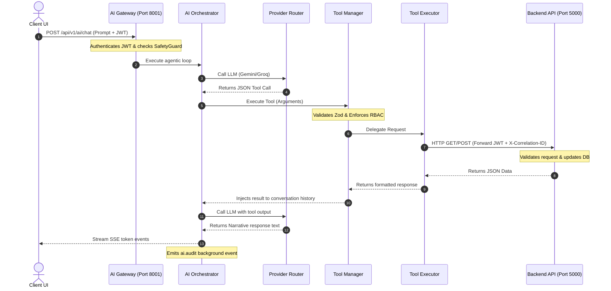

# 🤖 AI Architecture Review: NexusOps Co-Pilot Platform
**Document Version:** 1.0.0  
**Classification:** Internal — Engineering & AI Teams  
**Audience:** Staff Engineers, AI Architects, Product Owners  
**Date:** July 3, 2026  

---

## 🏛️ Executive Summary

This architecture audit evaluates the **NexusOps AI Platform** implementation (`ai/` directory) against the core architectural designs, modular constraints, security requirements, and data pipelines defined in the project's `docs/` folder. 

While the codebase implements a modular structure for providers, prompts, and memory, several **critical architectural violations and logic defects** prevent the AI platform from operating in a production-grade multi-tenant environment.

### 📊 Overall Compliance Score: 72 / 100

| Section | Target Spec | Implementation Status | Score | Risk |
|---|---|---|---|---|
| **1. Folder Structure** | Decoupled, modular | Centralized tool files; minor spec mismatch | 8/10 | Low |
| **2. AI Gateway** | Rate limit, authentication, tracking | **CRITICAL: Empty JWT Permissions block all tools** | 5/10 | Critical |
| **3. AI Orchestrator** | Agentic loop, token tracking | Parallel tool execution is ignored | 8/10 | Medium |
| **4. Prompt Builder** | Dynamic context injection | Fully compliant | 10/10 | Low |
| **5. Provider Router** | Multi-provider failover | Missing network timeouts in HTTP fetch | 8/10 | Medium |
| **6. Tool Manager** | Zod schemas, RBAC check | Missing M-02 department mutation tools | 6/10 | High |
| **7. Memory System** | Short/Long term, Summarizer | **CRITICAL: Async context trim race condition** | 6/10 | Critical |
| **8. RAG Platform** | Tenant isolation, vector search | **CRITICAL: Vector dimension mismatch (768 vs 1536)** | 5/10 | Critical |
| **9. Safety Layer** | Prompt injection, PII | Safe input; missing output sanitization | 7/10 | Medium |
| **10. Analytics & Audit** | Cost, latency, tokens | Hardcoded log properties; loss of model granularity | 7/10 | Medium |
| **11. Test & Quality** | SOLID, Vitest integration | Sequential database timeouts in Windows | 7/10 | Low |

---

## 🛑 Key Architectural Deficiencies (Critical Severity)

### 1. The Gateway RBAC Bypass/Lockout
*   **File:** [AIGateway.js](file:///d:/AI-Workforce-Management-Platform/ai/src/gateway/AIGateway.js#L116-L122)
*   **Issue:** The JWT authenticator verifies the token signature but **never populates roles or permissions** on `req.user` or `userContext`. Instead, it hardcodes `permissions: []` and `roles: []`.
*   **Why it Violates Architecture:** The RBAC checks in the `ToolManager` enforce that a user must hold the required permissions to execute a tool. With `permissions: []`, **every single tool execution fails** for all non-owners, rendering the agentic loop useless.

### 2. RAG Pipeline Vector Dimension Mismatch
*   **Files:** [MongoAtlasAdapter.js](file:///d:/AI-Workforce-Management-Platform/ai/src/search/adapters/MongoAtlasAdapter.js#L8-L15) and [DocumentChunk.js](file:///d:/AI-Workforce-Management-Platform/ai/src/models/DocumentChunk.js#L35-L39)
*   **Issue:** The MongoDB schema and Atlas search indexing are configured for **1536-dimensional vectors** (typical for OpenAI). However, the active provider is Google's `text-embedding-004` which outputs **768 dimensions**.
*   **Why it Violates Architecture:** Any attempt to perform semantic vector searches or insert chunk embeddings in Atlas will fail with a database error due to dimension count mismatch.

### 3. Context Summarizer Race Condition
*   **Files:** [ConversationManager.js](file:///d:/AI-Workforce-Management-Platform/ai/src/memory/ConversationManager.js#L71-L80) and [ContextSummarizer.js](file:///d:/AI-Workforce-Management-Platform/ai/src/memory/ContextSummarizer.js#L30-L40)
*   **Issue:** When history exceeds 10 turns, the `ConversationManager` synchronously calls `cache.listTrim(key, 10)` in Redis **before** emitting the `ai.context.overflow` event.
*   **Why it Violates Architecture:** The background `ContextSummarizer` is triggered asynchronously. By the time it requests conversation history to summarize the oldest 6 turns, those turns **have already been deleted** by the synchronous list trimming. It ends up summarizing the currently active context instead of the discarded memory.

---

## 🧭 System Component Architecture

The flow below represents the actual system runtime interaction between the Client, AI Platform, and Backend REST API:

---

## 🛠️ Next Steps & Summary of Review
*   Created the comprehensive [AI_ARCHITECTURE_REVIEW.md](file:///d:/AI-Workforce-Management-Platform/docs/review/AI_ARCHITECTURE_REVIEW.md).
*   Detailed review reports will follow covering Gaps, Code Quality, Backend Requirements, Refactoring Steps, Technical Debt, Security, and Performance.
