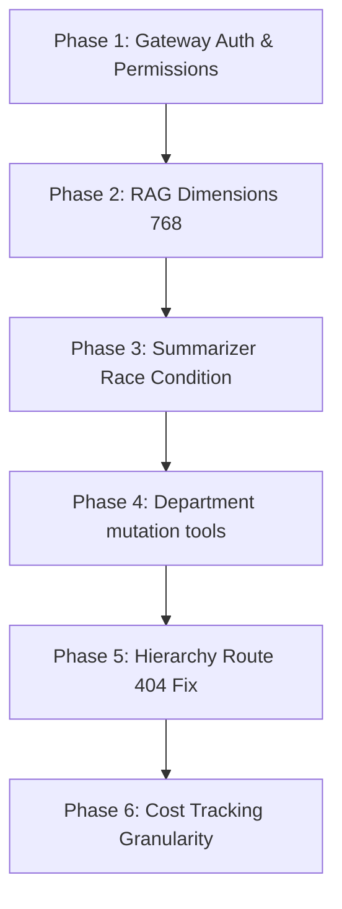

# 🛠️ AI Refactor Plan: Step-by-Step Recovery
**Document Version:** 1.0.0  
**Classification:** Internal — AI & Engineering Teams  
**Date:** July 3, 2026  

---

## 1. Overview
This refactoring plan outlines the step-by-step changes required to align the AI Platform with the documented architecture, resolve critical bugs, and complete the integration for the frozen Module M-02 (Departments).

---

## 2. Refactoring Phases & Execution Steps

### 🗺️ Refactor Roadmap



---

### Phase 1: Gateway Auth & Permissions (Immediate Priority)
*   **Target File:** [AIGateway.js](file:///d:/AI-Workforce-Management-Platform/ai/src/gateway/AIGateway.js)
*   **Description:** Fetch the user's effective permissions from the backend on request intake so the local `ToolManager` can validate access.
*   **Action Steps:**
    1. Update the `authenticate` middleware to fetch profile details from `/api/v1/auth/me` using the client's Bearer JWT:
       ```javascript
       const profileRes = await ToolExecutor.get('/api/v1/auth/me', {}, token, 'auth-init');
       if (profileRes.success) {
         req.user.permissions = profileRes.data.permissions || [];
         req.user.roles = profileRes.data.user.roles || [];
       }
       ```
    2. Map `req.user.permissions` into the `userContext` sent to the Orchestrator.

---

### Phase 2: RAG Vector Dimensions Realignment (High Priority)
*   **Target Files:** [DocumentChunk.js](file:///d:/AI-Workforce-Management-Platform/ai/src/models/DocumentChunk.js), [MongoAtlasAdapter.js](file:///d:/AI-Workforce-Management-Platform/ai/src/search/adapters/MongoAtlasAdapter.js), [env.js](file:///d:/AI-Workforce-Management-Platform/ai/src/config/env.js)
*   **Description:** Align vector configurations with Google's `text-embedding-004` (768 dimensions).
*   **Action Steps:**
    1. In `env.js`, change the default `RAG_VECTOR_DIMENSIONS` from `1536` to `768`.
    2. Update the comments and documentation inside `DocumentChunk.js` and `MongoAtlasAdapter.js` to state `768` dimensions.
    3. Update the Atlas Vector Search Index definition to use `numDimensions: 768`.

---

### Phase 3: Summarizer Race Condition Fix (High Priority)
*   **Target Files:** [ConversationManager.js](file:///d:/AI-Workforce-Management-Platform/ai/src/memory/ConversationManager.js), [ContextSummarizer.js](file:///d:/AI-Workforce-Management-Platform/ai/src/memory/ContextSummarizer.js)
*   **Description:** Prevent context trimming from deleting history before the background worker summarizes it.
*   **Action Steps:**
    1. In `ConversationManager.appendMessage`, fetch the oldest 6 turns *before* performing the `cache.listTrim`:
       ```javascript
       const history = await this.getHistory(orgId, userId, sessionId);
       const turnsToSummarize = history.slice(0, 6);
       ```
    2. Pass `turnsToSummarize` as part of the payload emitted to `ai.context.overflow`:
       ```javascript
       EventBus.emit('ai.context.overflow', { orgId, userId, sessionId, turnsToSummarize });
       ```
    3. In `ContextSummarizer.summarize`, read the turns directly from the event payload rather than querying Redis again.

---

### Phase 4: Create M-02 Department Mutation Tools (Medium Priority)
*   **Target Files:** Create [department.tools.js](file:///d:/AI-Workforce-Management-Platform/ai/src/tools/definitions/department.tools.js) (NEW)
*   **Description:** Implement tools for creating, updating, and moving departments, matching `docs/ai/departments.md`.
*   **Action Steps:**
    1. Define `createDepartment`, `updateDepartment`, and `moveDepartment` tools.
    2. Register them in the root registry (`ai/src/index.js`).
    3. Validate inputs via Zod.

---

### Phase 5: Resolve Hierarchy Map Route 404 (Medium Priority)
*   **Target File:** [organization.tools.js](file:///d:/AI-Workforce-Management-Platform/ai/src/tools/definitions/organization.tools.js)
*   **Description:** Redirect hierarchy requests from `/hierarchy` to the working `/tree` endpoint.
*   **Action Steps:**
    1. Change `getHierarchyMap` execution handler to request `GET /api/v1/departments/tree` from the backend.
    2. Formulate the response into a hierarchy format in the tool adapter if a department filter is specified.

---

### Phase 6: Refactor Provider Log Granularity (Low Priority)
*   **Target Files:** [BaseProvider.js](file:///d:/AI-Workforce-Management-Platform/ai/src/providers/BaseProvider.js), [AIOrchestrator.js](file:///d:/AI-Workforce-Management-Platform/ai/src/orchestrator/AIOrchestrator.js), [auditListener.js](file:///d:/AI-Workforce-Management-Platform/ai/src/events/listeners/auditListener.js)
*   **Description:** Record model and provider details on every turn to fix usage ledger tracking.
*   **Action Steps:**
    1. Have providers yield `provider` and `model` fields in the `done` event.
    2. Instruct `AIOrchestrator` to extract these and forward them in `ai.audit` event payloads.
    3. Instruct `auditListener` to upsert using the specific provider/model rather than hardcoding `auto` and `mixed`.
