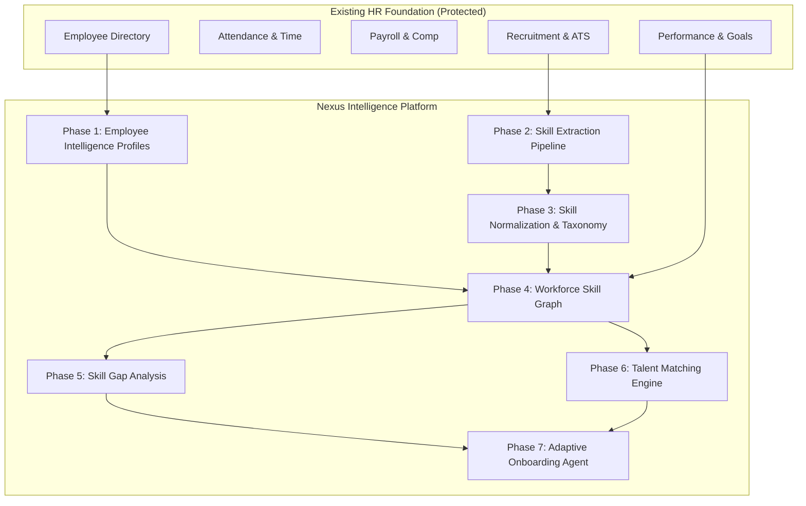

# NEXUS — Workforce Intelligence Platform: Development Phases

> **Platform Mission**: *Connect workforce capabilities to the skills required for what's next.*

---

## 🏛️ Guiding Architectural Principles

1. **Extend, Don't Replace**: All existing People Flow HR dashboards, directory tables, recruitment pipelines, time & absence trackers, and payroll modules remain 100% active and functional.
2. **Zero-Duplicate Data**: Nexus intelligence layers build directly upon existing `Employee`, `User`, `Department`, `Project`, and `PerformanceReview` models.
3. **Modular AI Strategy**: AI extraction and normalization run through pluggable service interfaces (`SkillExtractionService`) with built-in rule/heuristic fallbacks, ensuring high availability even if external AI models are offline.
4. **Explainable Intelligence**: Skill matches, gap analyses, and recommendations are always accompanied by transparent reasoning for HR decision support.
5. **Glassmorphic Aesthetic Continuity**: All new Nexus views seamlessly adopt the existing Vanilla CSS glassmorphic design system (`.glass-panel`, `.glass-cutout`, `.btn-glass`).

---



---

## 📋 Phase Breakdown

### 🔹 Phase 1: Employee Intelligence Profiles
**Objective**: Transform static employee records into 360° unified intelligence profiles without altering the existing schema or directory tables.

* **Backend Models & Schemas**:
  - `EmployeeProfileExtended`: One-to-one extension linked to `Employee._id` storing technical & soft skills, past projects, verified certifications, and career aspirations.
  - Fields:
    - `skills`: `[{ skillId, name, category, proficiency, yearsOfExp, source, confidence, verificationStatus }]`
    - `experience`: `[{ title, company, duration, responsibilities, technologies }]`
    - `projects`: `[{ name, role, description, technologies, startDate, endDate }]`
    - `certifications`: `[{ name, issuer, issueDate, expiryDate, credentialUrl, verificationStatus }]`
    - `careerPreferences`: `{ desiredRoles: [], targetSkills: [], interestDomains: [] }`
* **API Endpoints**:
  - `GET /api/v1/nexus/employees/:id/profile` — Fetch unified intelligence profile.
  - `PUT /api/v1/nexus/employees/:id/profile` — Update experience, projects, certifications, and career goals.
  - `POST /api/v1/nexus/employees/:id/skills` — Add skill with proficiency, source, and initial verification status.
  - `PATCH /api/v1/nexus/employees/:id/skills/:skillId` — Update skill proficiency or verification state (`VERIFIED`, `REJECTED`, `CONFIRMED`).
* **Frontend Components & Views**:
  - Extend [EmployeeManagementView.tsx](file:///d:/Projects/NEXUS/frontend/src/components/EmployeeManagementView.tsx) Profile Modal & Self-Service with tabbed navigation:
    - **Overview**: Core badges, role, department, tenure, direct reports.
    - **Skills Matrix**: Visual proficiency meters (Beginner $\rightarrow$ Expert), confidence scores, and verification tags.
    - **Experience & Projects**: Interactive timeline with tech stack badges.
    - **Certifications**: Credential preview cards and verification status indicators.
    - **Career Preferences**: Desired roles and learning goals.
* **Verification & Acceptance Criteria**:
  - [ ] Existing Employee Directory search, filter, and onboarding/offboarding remain intact.
  - [ ] Employee profile displays accurate data from both base `Employee` and extended `EmployeeProfileExtended`.
  - [ ] Standard Employee and HR Manager roles can view and update skills smoothly.

---

### 🔹 Phase 2: Skill Extraction Pipeline
**Objective**: Automatically extract candidate and employee skills from unstructured text (resumes, job histories, project descriptions, certifications) with human-in-the-loop verification.

* **Architecture & Service**:
  - `SkillExtractionService`: Modular service interface with pluggable provider support (Hugging Face / LLM / Regex & Keyword matcher fallback).
  - Processing flow: `Raw Text` $\rightarrow$ `Entity Recognition / Skill Parsing` $\rightarrow$ `Candidate Skills` $\rightarrow$ `Confidence Scoring` $\rightarrow$ `Human Verification Queue`.
* **API Endpoints**:
  - `POST /api/v1/nexus/skills/extract` — Extract skills from raw text or document payload.
  - `POST /api/v1/nexus/employees/:id/extract-from-text` — Extract and stage candidate skills for an employee.
  - `POST /api/v1/nexus/employees/:id/skills/confirm-batch` — Batch confirm, edit, or reject staged skills.
* **Frontend UI**:
  - Skill Extraction Studio with text/resume parser drawer.
  - Human Verification Queue with action buttons: `[Confirm]`, `[Edit]`, `[Reject]`.
  - Confidence percentage badges and highlighted source snippet viewer.
* **Verification & Acceptance Criteria**:
  - [ ] AI failure fallback gracefully switches to rule-based keyword extraction or manual entry.
  - [ ] Extracted skills are flagged as `PENDING_VERIFICATION` until confirmed by HR or manager.

---

### 🔹 Phase 3: Skill Normalization & Taxonomy
**Objective**: Build a canonical skill taxonomy to eliminate duplicates, aliases, and fragmentation (e.g., merging "React.js", "ReactJS", and "React" into `React`).

* **Backend Models**:
  - `Skill`:
    - `canonicalName`: String (Unique, e.g., "React")
    - `aliases`: `[String]` (e.g., `["React.js", "ReactJS", "React 18"]`)
    - `category`: Enum (`FRONTEND`, `BACKEND`, `CLOUD_DEVOPS`, `DATA_AI`, `SECURITY`, `MANAGEMENT`, `DESIGN`, `DOMAIN`)
    - `description`: String
    - `parentSkill`: ObjectId (ref `Skill`, optional)
    - `relatedSkills`: `[ObjectId]` (ref `Skill`)
* **API Endpoints**:
  - `GET /api/v1/nexus/skills` — Search and retrieve canonical skills and aliases.
  - `POST /api/v1/nexus/skills` — Create canonical skill definition.
  - `POST /api/v1/nexus/skills/normalize` — Normalize an arbitrary array of strings into canonical skill IDs.
* **Frontend UI**:
  - Interactive Skill Taxonomy Directory with category pills, alias search, and hierarchy tree.
* **Verification & Acceptance Criteria**:
  - [ ] Aliased skill inputs automatically resolve to their canonical representation.
  - [ ] No duplicate skills created in the database.

---

### 🔹 Phase 4: Workforce Skill Graph
**Objective**: Build multi-dimensional capability relationships connecting employees, skills, proficiencies, departments, and projects into a queryable workforce graph.

* **Relationships Modeled (Relational MongoDB Schema)**:
  - `Employee` $\longleftrightarrow$ `Skill` (via `EmployeeSkill` with proficiency weight $1-5$)
  - `Skill` $\longleftrightarrow$ `Project` (via `Project.requiredSkills` / `technologies`)
  - `Department` $\longleftrightarrow$ `SkillDistribution` (aggregated capability density)
* **API Endpoints**:
  - `GET /api/v1/nexus/graph/workforce` — Aggregated workforce capability distribution by department and role.
  - `GET /api/v1/nexus/graph/skill/:skillId` — Skill node inspection showing certified employees, related skills, and active project dependencies.
* **Frontend UI**:
  - Interactive Workforce Skill Graph View (`/nexus/skill-graph`):
    - Capability matrix heatmap across departments.
    - Department skill coverage radar charts and depth metrics.
* **Verification & Acceptance Criteria**:
  - [ ] Fast indexed aggregation across workforce skills without performance bottlenecks.
  - [ ] Visual charts accurately reflect verified employee proficiencies.

---

### 🔹 Phase 5: Skill Gap Analysis
**Objective**: Enable HR and department managers to benchmark required project or departmental capabilities against existing workforce proficiencies to pinpoint gaps.

* **Backend Models**:
  - `SkillGapAnalysis`:
    - `targetType`: Enum (`PROJECT`, `ROLE`, `DEPARTMENT`)
    - `targetId`: ObjectId
    - `requiredSkills`: `[{ skillId, minProficiency, requiredCount }]`
    - `results`: `{ available: [], partial: [], missing: [], gapScore: Number }`
* **API Endpoints**:
  - `POST /api/v1/nexus/skill-gaps/analyze` — Run instant gap benchmark against a project or role specification.
  - `GET /api/v1/nexus/skill-gaps/summary` — Company-wide high-risk skill deficits report.
* **Frontend UI**:
  - Skill Gap Analysis Studio (`/nexus/skill-gaps`):
    - Requirement builder (select Project/Role and define required skill proficiencies).
    - Real-time gap diagnostic cards:
      - ✅ **Available Capabilities** (fully staffed)
      - ⚠️ **Partial Capabilities** (proficiency deficit or under-allocated)
      - ❌ **Missing Capabilities** (zero coverage in organization)
    - Actionable remediation suggestions (upskill existing staff vs. initiate recruitment requisition).
* **Verification & Acceptance Criteria**:
  - [ ] Gap calculation correctly handles multiple employee proficiency levels.
  - [ ] Instant link to open a recruitment requisition or trigger an upskilling path.

---

### 🔹 Phase 6: Talent Matching Engine
**Objective**: Provide an explainable decision-support engine that matches employees to projects, open internal roles, and transition paths.

* **Matching Algorithm**:
  - Weighted multi-criteria scoring:
    - Skill Match Score ($45\%$)
    - Proficiency Depth Score ($25\%$)
    - Experience & Project History ($15\%$)
    - Availability / Current Capacity ($15\%$)
* **API Endpoints**:
  - `POST /api/v1/nexus/talent/match` — Match candidates/employees to project requirements with detailed explainability breakdown.
* **Frontend UI**:
  - Talent Matching Hub (`/nexus/talent-matching`):
    - Interactive candidate ranked cards with match percentage.
    - Match Explanation Accordion (Strong Matches, Partial Overlaps, Gaps, and "Why Surfaced" summary).
* **Verification & Acceptance Criteria**:
  - [ ] Transparent scoring rationale displayed for every matched employee.
  - [ ] No automated autonomous decisions — clear decision-support UI for managers.

---

### 🔹 Phase 7: Adaptive Onboarding Agent
**Objective**: Generate personalized, milestone-driven onboarding roadmaps tailored to an employee's existing skill baseline and their target role requirements.

* **Backend Models**:
  - `OnboardingJourney`:
    - `employeeId`: ObjectId (ref `Employee`)
    - `role`: String
    - `departmentId`: ObjectId (ref `Department`)
    - `baselineSkills`: `[ObjectId]`
    - `targetSkills`: `[ObjectId]`
    - `phases`: `[{ week: Number, title: String, milestones: [{ title, description, priority, dueDate, status, learningResources }] }]`
    - `overallProgress`: Number
* **API Endpoints**:
  - `GET /api/v1/nexus/onboarding/:employeeId` — Fetch tailored onboarding journey.
  - `POST /api/v1/nexus/onboarding/:employeeId/generate` — Generate adaptive onboarding plan.
  - `PATCH /api/v1/nexus/onboarding/:employeeId/tasks/:taskId` — Update milestone completion state.
* **Frontend UI**:
  - Adaptive Onboarding Journey View (`/nexus/onboarding` and within Employee Profile):
    - Week-by-week interactive roadmap timeline.
    - Recommended learning modules and project onboarding checklists.
    - Real-time progress tracker with animated completion meters.
* **Verification & Acceptance Criteria**:
  - [ ] Role-based template fallback functions immediately if AI generation is delayed or offline.
  - [ ] Progress status persists across user sessions and updates employee status upon full completion.

---

## 🧭 Navigation & UI Integration Plan

The existing top navigation bar will be enhanced with a dedicated **Nexus** intelligence menu pill and sub-route entries:

```text
Header Navigation
├── 📊 Dashboard
├── ⏱️ Time & Absence
├── 📁 Projects
├── 📇 Directory (Extended with Nexus Profile Tabs)
├── 🎧 Help Desk
├── 🤖 AI Assistant
└── 🌐 Nexus Intelligence (NEW)
    ├── 🌟 Skills Taxonomy (/nexus/skills)
    ├── 🕸️ Workforce Skill Graph (/nexus/skill-graph)
    ├── ⚠️ Skill Gap Analysis (/nexus/skill-gaps)
    ├── 🎯 Talent Matching (/nexus/talent-matching)
    └── 🚀 Adaptive Onboarding (/nexus/onboarding)
```

---

## 🛡️ Non-Destructive Quality Assurance Checklist

Before concluding any phase, the following regression test suite must be verified:

| Module | Verification Target | Status |
|---|---|---|
| **Authentication** | Login, Token Refresh, Role Switching, Workspace Creation | ✅ Required |
| **Employee Directory** | List, Search, Filter, Pagination, Archive, Onboarding Modal | ✅ Required |
| **Time & Absence** | Clock-in/out, GPS check, Leave requests & manager approvals | ✅ Required |
| **Recruitment / ATS** | Requisitions, Candidate applications, Interview scoring | ✅ Required |
| **Payroll & Finance** | Cycle view, Payout engine, Payslip generation | ✅ Required |
| **Performance** | Reviews, Goals, Feedback rating distribution | ✅ Required |
| **Org Chart** | Dynamic hierarchy rendering | ✅ Required |
| **Nexus Extension** | No console errors, seamless styling, responsive layout | ✅ Required |
