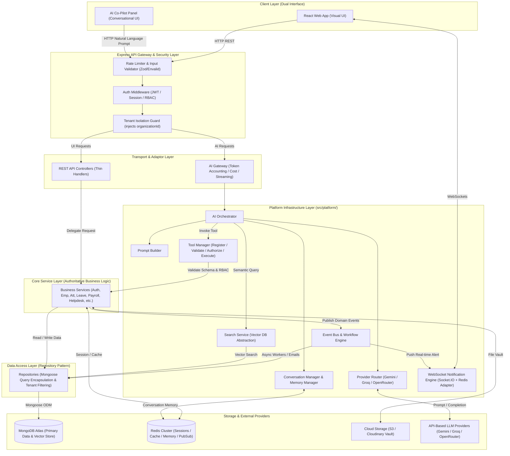
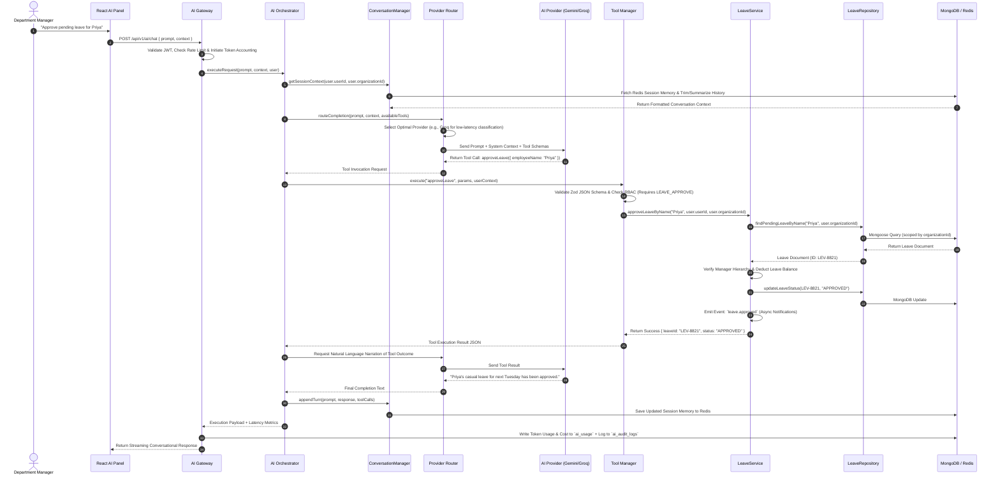
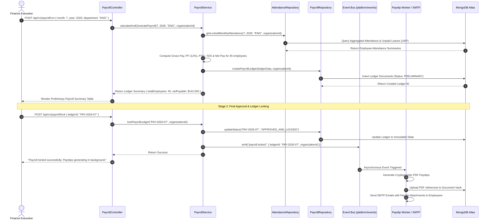
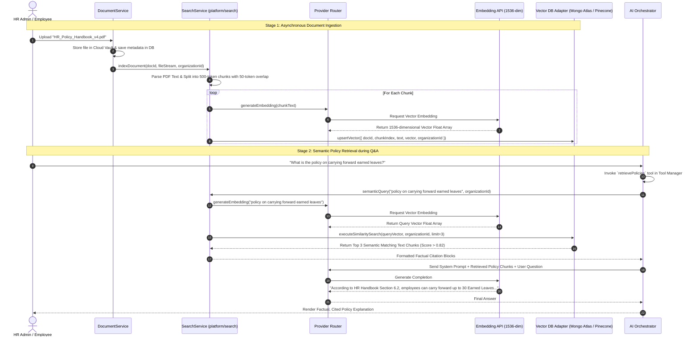
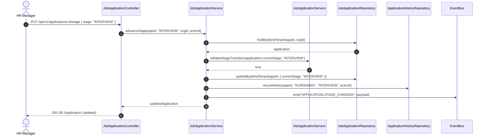
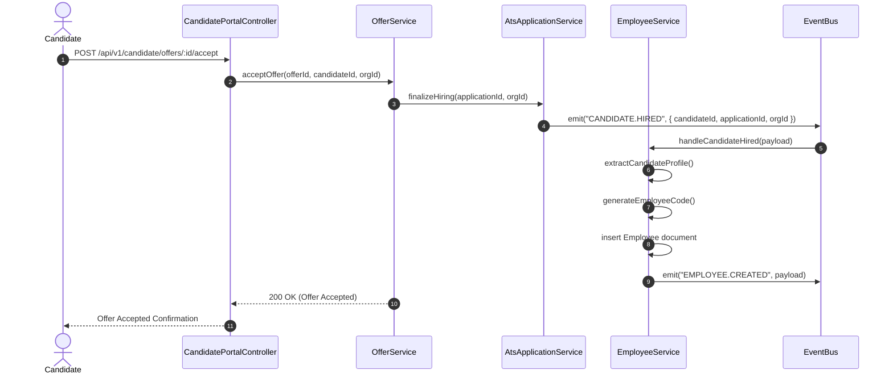

# Technical Design Document (TDD)
# NexusOps — AI-Native Enterprise Workforce Management Platform
*Synchronized with Backend Architecture (M-01 to M-06 FROZEN)*
---

## Table of Contents
1. [Executive Summary & Architectural Philosophy](#1-executive-summary--architectural-philosophy)
2. [Overall System Architecture](#2-overall-system-architecture)
   - [2.1 High-Level Component Diagram](#21-high-level-component-diagram)
   - [2.2 The Dual Interface & Shared Service Layer](#22-the-dual-interface--shared-service-layer)
3. [Sequence Diagrams & Core Flows](#3-sequence-diagrams--core-flows)
   - [3.1 Conversational AI Gateway & Tool Execution Flow](#31-conversational-ai-gateway--tool-execution-flow)
   - [3.2 Automated Payroll Processing & Event Emitting Flow](#32-automated-payroll-processing--event-emitting-flow)
   - [3.3 RAG Document Ingestion & Search Service Flow](#33-rag-document-ingestion--search-service-flow)
4. [Project Directory & Modular Monolith Structure (`src/platform/`)](#4-project-directory--modular-monolith-structure-srcplatform)
5. [Backend Layered Architecture (`AGENTS.md` Adherence)](#5-backend-layered-architecture-agentsmd-adherence)
6. [Database & Multi-Tenancy Design](#6-database--multi-tenancy-design)
   - [6.1 Tenant Isolation Strategy (`organizationId`)](#61-tenant-isolation-strategy-organizationid)
   - [6.2 Mongoose ODM & Connection Pooling](#62-mongoose-odm--connection-pooling)
   - [6.3 Enterprise Feature Flags](#63-enterprise-feature-flags)
7. [Comprehensive Collection Schema Design](#7-comprehensive-collection-schema-design)
8. [API Design & Security Middleware](#8-api-design--security-middleware)
9. [The Service Layer: The Authoritative Core](#9-the-service-layer-the-authoritative-core)
10. [AI Platform Architecture: Clean Separation of Concerns](#10-ai-platform-architecture-clean-separation-of-concerns)
    - [10.1 AI Gateway & Token Accounting](#101-ai-gateway--token-accounting)
    - [10.2 Provider Router & Fallback Strategy](#102-provider-router--fallback-strategy)
    - [10.3 Tool Manager (Registration, Schema & RBAC)](#103-tool-manager-registration-schema--rbac)
    - [10.4 AI Orchestrator & Prompt Builder](#104-ai-orchestrator--prompt-builder)
11. [Conversation & Memory Architecture](#11-conversation--memory-architecture)
    - [11.1 ConversationManager (Context Trimming & Summary)](#111-conversationmanager-context-trimming--summary)
    - [11.2 Three-Tier Memory Infrastructure](#112-three-tier-memory-infrastructure)
12. [Search Service & RAG Vector Pipeline](#12-search-service--rag-vector-pipeline)
13. [Event Bus & Workflow Engine](#13-event-bus--workflow-engine)
14. [Real-Time WebSocket Architecture (Socket.IO)](#14-real-time-websocket-architecture-socketio)
15. [Redis Caching & Session Architecture](#15-redis-caching--session-architecture)
16. [Authentication, RBAC & Security Engineering](#16-authentication-rbac--security-engineering)
17. [Observability: Logging, Monitoring & Dedicated AI Audit](#17-observability-logging-monitoring--dedicated-ai-audit)
18. [Deployment & Modular Monolith Scalability](#18-deployment--modular-monolith-scalability)

---

## 1. Executive Summary & Architectural Philosophy

The Technical Design Document (TDD) defines the formal software architecture, data structures, execution pipelines, and engineering conventions required to build **NexusOps**, an **AI-Native Enterprise Workforce Management Platform**. 

NexusOps is designed as a clean **modular monolith** running on a **stateless, horizontally scalable Node.js/Express backend** written in native ES Modules (`"type": "module"`), leveraging **MongoDB Atlas** for primary multi-tenant document storage, **Redis Cluster** for distributed session management and high-frequency caching, and **Cloudinary/S3** for secure document vaulting.

### Core Architectural Pillars:
1. **The Service Layer as the Heart of the System:** To fulfill the PRD's **Dual Interface Principle**, all application business logic, validation rules, state transitions, and event emissions are encapsulated within reusable, deterministic service modules (`src/services/`). Neither controllers nor AI tools implement business logic; both act purely as transport adaptors that delegate to the service layer.
2. **Platform Layer Separation (`src/platform/`):** To prevent cross-cutting infrastructure concerns from polluting business modules, all AI orchestration, caching hierarchies, vector search adapters, real-time WebSockets, and asynchronous event buses are isolated inside a dedicated `platform/` namespace.
3. **Dedicated AI Gateway & Provider Router:** The conversational AI pipeline is decoupled into single-responsibility layers: `AI Gateway -> Prompt Builder -> Provider Router -> Tool Manager -> Memory Manager -> AI Orchestrator`. This ensures token accounting, streaming, cost tracking, dynamic model selection, and strict RBAC enforcement are cleanly managed.
4. **Zero-Trust Multi-Tenancy & Feature Flags:** Every database query, repository operation, and AI tool execution is scoped by an immutable `organizationId` injected at the authentication middleware layer. Enterprise feature flags (`feature_flags`) allow granular tenant-level capability toggling.
5. **MCP-Forward Tool Manager:** All AI callable operations are registered in a centralized **Tool Manager** (`ToolManager`) that registers, validates schemas (Zod), checks RBAC scopes, and executes service methods, providing seamless forward compatibility with the **Model Context Protocol (MCP)**.
6. **Operational Graceful Degradation:** Core HR, payroll, attendance, and ticketing workflows are decoupled from external LLM providers. If AI services experience outages, standard UI REST endpoints continue to execute with 100% reliability.

---

## 2. Overall System Architecture

### 2.1 High-Level Component Diagram
The following Mermaid diagram illustrates the boundaries, transport layers, platform infrastructure, and data flow across the NexusOps modular monolith:



### 2.2 The Dual Interface & Shared Service Layer
The architecture eliminates code duplication between the graphical React UI and the conversational AI Co-Pilot by isolating all domain logic within `src/services/`.
- When a manager clicks **"Approve Leave"** on the React UI, `LeaveController.approveLeave()` extracts parameters from `req.body` and invokes `LeaveService.approveLeave(leaveId, managerId, organizationId)`.
- When a manager types *"Approve Priya's leave"* into the AI Co-Pilot, the request passes through the `AIGateway` to the `AIOrchestrator`. The orchestrator matches the intent to the `approveLeave` tool in the `ToolManager`. The Tool Manager validates the schema and RBAC, then invokes the exact same `LeaveService.approveLeave(leaveId, managerId, organizationId)`.

---

## 3. Sequence Diagrams & Core Flows

### 3.1 Conversational AI Gateway & Tool Execution Flow
This sequence diagram demonstrates how a natural language prompt traverses the AI Gateway, Provider Router, Tool Manager, and Shared Service Layer:



### 3.2 Automated Payroll Processing & Event Emitting Flow
This sequence illustrates how the synchronous service layer initiates payroll and delegates background tasks (payslip PDF generation, email delivery) to the asynchronous Event Bus:



### 3.3 RAG Document Ingestion & Search Service Flow
This flow demonstrates how unstructured organizational policy documents are ingested, vectorized, and retrieved via the decoupled `SearchService`:




### 3.4 Hiring Pipeline & Application Stage Advancement Flow (M-04)



### 3.5 Offer Generation & Hiring Completion Flow (M-04 -> M-03)



---

## 4. Project Directory & Modular Monolith Structure (`src/platform/`)

To enforce strict separation between cross-cutting platform infrastructure and business domain modules, the backend repository is structured as a clean **modular monolith**:

```text
backend/
├── migrations/                     # Version-controlled schema migrations (migrate-mongo)
├── scripts/                        # Utility maintenance and database seeding scripts
├── src/
│   ├── api/                        # HTTP API layer: versioned routers (v1) and global error handlers
│   ├── config/                     # Configuration and environment loaders (envalid strict schema)
│   ├── core/                       # Shared enterprise primitives (BaseRepository, middleware, errors, utils, constants, events)
│   ├── modules/                    # Domain business modules
│   │   ├── audit/                  # Audit log management
│   │   ├── auth/                   # M-01: Authentication, registration, JWT
│   │   ├── candidate/              # M-04: Candidate profiles and authentication
│   │   ├── departments/            # M-02: Organization hierarchy
│   │   ├── employees/              # M-03: Employee lifecycle and history
│   │   ├── invitations/            # M-01: Cryptographic invitation workflows
│   │   ├── organization/           # M-01/M-02: Tenant settings
│   │   ├── recruitment/            # M-04: Job Requisitions, Applications, Interviews, Offers
│   │   ├── roles/                  # M-01: RBAC and Delegation policies
│   │   └── users/                  # M-01: User accounts
│   ├── platform/                   # Infrastructure drivers
│   │   ├── cache/                  # RedisCacheManager.js
│   │   ├── database/               # Mongoose Atlas connection pool
│   │   ├── logger/                 # Pino structured logging
│   │   └── ai/                     # AI Pipeline, orchestrator, and tools
│   ├── app.js                      # Express app initialization, CORS & middleware mounting
│   └── server.js                   # Entry point: loads env, connects DB, starts HTTP server
├── tests/                          # Automated unit, integration, and E2E test suites
├── AGENTS.md                       # Strict engineering & architectural rules
└── package.json
```

---

## 5. Backend Layered Architecture (`AGENTS.md` Adherence)

To ensure consistency and prevent architectural drift, the engineering team and automated AI assistants must strictly follow the conventions outlined in `AGENTS.md`:

### 5.1 Strict Responsibility Boundaries
1. **Routes (`src/routes/`):** Responsible solely for HTTP verb binding (GET, POST, PUT, DELETE), endpoint URL path definitions, and attaching security/validation/feature-flag middleware. **Never place business logic or database calls in routes.**
2. **Controllers (`src/controllers/`):** Must remain **thin**. Responsibilities are restricted to:
   - Extracting parameters, query strings, and body payloads from Express `req`.
   - Extracting user context (`req.user.userId`, `req.user.organizationId`, `req.user.role`).
   - Invoking the appropriate service layer method.
   - Formatting standard HTTP JSON responses and mapping domain errors to appropriate HTTP status codes (e.g., `400 Bad Request`, `401 Unauthorized`, `403 Forbidden`, `404 Not Found`, `409 Conflict`).
3. **Services (`src/services/`):** The **authoritative domain layer**. All business rules, calculations, workflows, authorization checks, and event emissions live exclusively here. Services are framework-agnostic and do not accept raw Express `req` or `res` objects.
4. **Repositories (`src/repositories/`):** The **data access encapsulation layer**. Responsible for constructing Mongoose queries, aggregations, database transactions, and enforcing multi-tenant `organizationId` scoping. Services call repositories; services **never** invoke raw Mongoose models directly.
5. **Mongoose Models (`src/models/`):** Define MongoDB document schemas, field validation rules, default values, and database indexes. **Never create MongoDB collections manually via scripts or migrations; collections must only be initialized through Mongoose models.**

### 5.2 Mandatory Conventions
- **ES Modules Everywhere:** All files must utilize `import`/`export` syntax (`"type": "module"` in `package.json`). CommonJS (`require`) is strictly prohibited. Use path aliases (`#@/*` or `@/*`) pointing to `./src/*`.
- **Structured Pino Logging:** Use `import logger from '#@/utils/logger.js'`. Raw `console.log`, `console.info`, or `console.error` calls are prohibited across the entire codebase.
- **Strict Environment Validation:** All environment variables must be validated at application startup using `envalid` in `src/config/env.js`. Accessing `process.env` directly outside of `env.js` is prohibited.
- **Async/Await:** Promise chaining (`.then().catch()`) is prohibited in application logic; use clean `async`/`await` blocks with structured try/catch error handling.

---

## 6. Database & Multi-Tenancy Design

### 6.1 Tenant Isolation Strategy (`organizationId`)
NexusOps implements a **Shared Database, Shared Schema** multi-tenant architecture. To prevent data leakage across organizations:
1. Every MongoDB schema (except the global `Organization` master table) must define an indexed `organizationId` field referencing the tenant.
2. An Express middleware (`src/middleware/tenant.js`) extracts the `organizationId` from the authenticated user's JWT and attaches it to `req.tenantContext`.
3. The abstract `BaseRepository` class automatically injects `organizationId: this.tenantId` into every `find()`, `findOne()`, `findOneAndUpdate()`, `countDocuments()`, and `aggregate()` query predicate.
4. If an API controller or AI tool attempts to query a record without providing a valid `organizationId`, the repository throws a fatal `TenantIsolationError`.

### 6.2 Mongoose ODM & Connection Pooling
Database connections are managed in `src/config/db.js` using Mongoose:
- **Connection Pooling:** Configured with `maxPoolSize: 20` and `minPoolSize: 5` to maintain active socket connections under concurrent load.
- **Server Selection Timeout:** Configured with `serverSelectionTimeoutMS: 5000` to fail fast during network partitions.
- **Lifecycle Monitoring:** Event listeners log `connected`, `disconnected`, and `error` states via Pino, with graceful socket closure upon receiving `SIGINT` or `SIGTERM`.

### 6.3 Enterprise Feature Flags (`feature_flags` Collection)
To support modular tier pricing and staged rollouts, capabilities are governed by tenant feature flags stored in `feature_flags`:
```json
{
  "organizationId": "64b8f0129a...",
  "payrollEnabled": true,
  "aiEnabled": true,
  "helpdeskEnabled": true,
  "recruitmentAiScoringEnabled": false
}
```
A route middleware (`src/middleware/featureFlag.js("payrollEnabled")`) checks the tenant's flag in Redis cache before allowing route or AI tool execution, throwing a `403 Feature Disabled` error if inactive.

---

## 7. Comprehensive Collection Schema Design

The following table documents the structure, primary fields, relational references, and indexing strategies for all seventeen Mongoose collections:

| Collection Name | Primary Document Purpose | Key Schema Fields & Data Types | Relational References (`ObjectId`) | Indexing Strategy |
|---|---|---|---|---|
| **organizations** | Master tenant profile & configurations | `name` (String, required)<br>`code` (String, unique)<br>`domain` (String)<br>`settings` (Object: currency, timezone)<br>`status` (Enum: ACTIVE, SUSPENDED) | None | `code` (unique)<br>`domain` (index) |
| **users** | Authentication credentials & RBAC profile | `organizationId` (ObjectId, required)<br>`email` (String, required)<br>`passwordHash` (String, required)<br>`role` (Enum: SUPER_ADMIN, HR_MANAGER, etc.)<br>`permissions` ([String])<br>`status` (Enum: ACTIVE, LOCKED, EXITED) | `organizationId` &rarr; Organization | `{ organizationId: 1, email: 1 }` (unique)<br>`role` (index) |
| **departments** | Structural departmental hierarchy | `organizationId` (ObjectId, required)<br>`name` (String, required)<br>`code` (String, required)<br>`parentDepartmentId` (ObjectId, null)<br>`managerId` (ObjectId)<br>`status` (Enum: ACTIVE, ARCHIVED) | `organizationId` &rarr; Organization<br>`parentDepartmentId` &rarr; Department<br>`managerId` &rarr; Employee | `{ organizationId: 1, code: 1 }` (unique)<br>`managerId` (index) |
| **designations** | Job roles & compensation pay bands | `organizationId` (ObjectId, required)<br>`title` (String, required)<br>`level` (String: L1, L2, L3)<br>`minSalaryBand` (Number)<br>`maxSalaryBand` (Number) | `organizationId` &rarr; Organization | `{ organizationId: 1, title: 1 }` (unique) |
| **employees** | Authoritative 360&deg; workforce personnel record | `organizationId` (ObjectId, required)<br>`userId` (ObjectId, unique)<br>`employeeId` (String, required: NEX-EMP-001)<br>`firstName` (String)<br>`lastName` (String)<br>`email` (String)<br>`joiningDate` (Date)<br>`salaryBasic` (Number, encrypted)<br>`status` (Enum: ACTIVE, PROBATION, EXITED) | `organizationId` &rarr; Organization<br>`userId` &rarr; User<br>`departmentId` &rarr; Department<br>`designationId` &rarr; Designation<br>`reportingManagerId` &rarr; Employee | `{ organizationId: 1, employeeId: 1 }` (unique)<br>`departmentId` (index)<br>`reportingManagerId` (index) |
| **attendances** | Daily clock-in/out timestamps & working hours | `organizationId` (ObjectId, required)<br>`employeeId` (ObjectId, required)<br>`date` (String: YYYY-MM-DD)<br>`clockIn` (Date)<br>`clockOut` (Date)<br>`netWorkingHours` (Number)<br>`status` (Enum: PRESENT, ABSENT, HALF_DAY, LATE)<br>`overtimeHours` (Number) | `organizationId` &rarr; Organization<br>`employeeId` &rarr; Employee | `{ organizationId: 1, employeeId: 1, date: 1 }` (unique)<br>`{ organizationId: 1, date: 1 }` (index) |
| **leaves** | Leave applications & balance ledgers | `organizationId` (ObjectId, required)<br>`employeeId` (ObjectId, required)<br>`leaveType` (Enum: CL, SL, EL, MATERNITY)<br>`startDate` (Date)<br>`endDate` (Date)<br>`totalDays` (Number)<br>`reason` (String)<br>`status` (Enum: PENDING, APPROVED, REJECTED)<br>`approvedById` (ObjectId) | `organizationId` &rarr; Organization<br>`employeeId` &rarr; Employee<br>`approvedById` &rarr; Employee | `{ organizationId: 1, employeeId: 1, status: 1 }` (index)<br>`startDate` (index) |
| **payrolls** | Monthly salary calculations & statutory deductions | `organizationId` (ObjectId, required)<br>`employeeId` (ObjectId, required)<br>`month` (Number: 1-12)<br>`year` (Number: 2026)<br>`basicPay` (Number)<br>`hra` (Number)<br>`overtimePay` (Number)<br>`pfDeduction` (Number)<br>`taxTDS` (Number)<br>`netPayable` (Number)<br>`status` (Enum: PRELIMINARY, APPROVED_AND_LOCKED) | `organizationId` &rarr; Organization<br>`employeeId` &rarr; Employee | `{ organizationId: 1, employeeId: 1, month: 1, year: 1 }` (unique)<br>`status` (index) |
| **performances**| Quarterly SMART goals & 360&deg; review scorecards | `organizationId` (ObjectId, required)<br>`employeeId` (ObjectId, required)<br>`reviewCycle` (String: Q2-2026)<br>`goals` ([Object: title, kpi, weight, achieved])<br>`selfRating` (Number: 1-5)<br>`managerRating` (Number: 1-5)<br>`finalNormalizedRating` (Number)<br>`status` (Enum: GOALS_SET, SELF_REVIEW, COMPLETED) | `organizationId` &rarr; Organization<br>`employeeId` &rarr; Employee<br>`reviewedById` &rarr; Employee | `{ organizationId: 1, employeeId: 1, reviewCycle: 1 }` (unique) |
| **projects** | Project scopes, budgets & resource allocations | `organizationId` (ObjectId, required)<br>`name` (String, required)<br>`code` (String, required)<br>`startDate` (Date)<br>`deadline` (Date)<br>`budgetHours` (Number)<br>`status` (Enum: PLANNING, IN_PROGRESS, COMPLETED) | `organizationId` &rarr; Organization<br>`projectManagerId` &rarr; Employee<br>`assignedTeamIds` &rarr; [Employee] | `{ organizationId: 1, code: 1 }` (unique)<br>`status` (index) |
| **tasks** | Kanban task boards & sprint time-tracking | `organizationId` (ObjectId, required)<br>`projectId` (ObjectId, required)<br>`title` (String, required)<br>`priority` (Enum: LOW, MEDIUM, HIGH, CRITICAL)<br>`status` (Enum: TO_DO, IN_PROGRESS, REVIEW, COMPLETED)<br>`loggedHours` (Number)<br>`deadline` (Date) | `organizationId` &rarr; Organization<br>`projectId` &rarr; Project<br>`assignedToId` &rarr; Employee | `{ organizationId: 1, projectId: 1, status: 1 }` (index)<br>`assignedToId` (index) |
| **assets** | Hardware/software inventory & employee allocations | `organizationId` (ObjectId, required)<br>`assetTag` (String, required: AST-9921)<br>`category` (Enum: LAPTOP, MONITOR, LICENSE)<br>`serialNumber` (String)<br>`condition` (Enum: NEW, GOOD, DAMAGED)<br>`status` (Enum: IN_STOCK, ASSIGNED, IN_REPAIR) | `organizationId` &rarr; Organization<br>`assignedToId` &rarr; Employee | `{ organizationId: 1, assetTag: 1 }` (unique)<br>`assignedToId` (index) |
| **tickets** | Internal IT/HR support ticketing & SLA clocks | `organizationId` (ObjectId, required)<br>`ticketNumber` (String, required: TKT-1004)<br>`category` (Enum: IT_HARDWARE, HR_POLICY, PAYROLL)<br>`priority` (Enum: LOW, MEDIUM, HIGH, CRITICAL)<br>`subject` (String)<br>`slaDeadline` (Date)<br>`status` (Enum: OPEN, IN_PROGRESS, RESOLVED, CLOSED) | `organizationId` &rarr; Organization<br>`raisedById` &rarr; Employee<br>`assignedAgentId` &rarr; Employee | `{ organizationId: 1, ticketNumber: 1 }` (unique)<br>`{ organizationId: 1, status: 1, slaDeadline: 1 }` (index) |
| **documents** | Corporate knowledge vault & RAG vector storage | `organizationId` (ObjectId, required)<br>`title` (String, required)<br>`category` (Enum: POLICY, SOP, CONTRACT, RESUME)<br>`fileUrl` (String)<br>`fileType` (String: pdf/docx)<br>`version` (Number)<br>`accessRoleScope` ([String]) | `organizationId` &rarr; Organization<br>`uploadedById` &rarr; Employee | `{ organizationId: 1, category: 1 }` (index)<br>`title` (text index) |
| **feature_flags** | Tenant-level modular capability toggles | `organizationId` (ObjectId, required, unique)<br>`payrollEnabled` (Boolean, default: true)<br>`aiEnabled` (Boolean, default: true)<br>`helpdeskEnabled` (Boolean, default: true) | `organizationId` &rarr; Organization | `organizationId` (unique) |
| **ai_usage** | **[MUST HAVE]** Token accounting, latency & cost tracking | `organizationId` (ObjectId, required)<br>`userId` (ObjectId, required)<br>`sessionId` (String)<br>`provider` (String: Gemini, Groq)<br>`model` (String)<br>`inputTokens` (Number)<br>`outputTokens` (Number)<br>`totalTokens` (Number)<br>`latencyMs` (Number)<br>`costUsd` (Number)<br>`toolCalls` ([String])<br>`timestamp` (Date, default: now) | `organizationId` &rarr; Organization<br>`userId` &rarr; User | `{ organizationId: 1, timestamp: -1 }` (index)<br>`{ userId: 1, timestamp: -1 }` (index) |
| **ai_audit_logs**| Dedicated AI prompt/response/tool execution log | `organizationId` (ObjectId, required)<br>`userId` (ObjectId, required)<br>`sessionId` (String)<br>`promptText` (String)<br>`responseText` (String)<br>`toolsInvoked` ([Object: name, args, result])<br>`provider` (String)<br>`executionStatus` (Enum: SUCCESS, ERROR)<br>`timestamp` (Date, default: now) | `organizationId` &rarr; Organization<br>`userId` &rarr; User | `{ organizationId: 1, timestamp: -1 }` (index)<br>`executionStatus` (index) |
| **audit_logs** | Immutable general system event audit logs | `organizationId` (ObjectId, required)<br>`actorId` (ObjectId)<br>`actionType` (String: EMP_CREATED, PAYROLL_LOCKED)<br>`targetResource` (String)<br>`targetId` (String)<br>`ipAddress` (String)<br>`payload` (Object)<br>`timestamp` (Date, default: now) | `organizationId` &rarr; Organization<br>`actorId` &rarr; User | `{ organizationId: 1, timestamp: -1 }` (index)<br>`actionType` (index) |

---

## 8. API Design & Security Middleware

### 8.1 RESTful API Conventions
All HTTP endpoints follow strict RESTful resource naming, versioning (`/api/v1/`), and stateless execution:
- `GET /api/v1/employees` — List employees (supports pagination `?page=1&limit=20` and filtering).
- `POST /api/v1/employees` — Create a new employee profile.
- `GET /api/v1/employees/:id` — Retrieve specific employee by ID.
- `PATCH /api/v1/employees/:id/manager` — Update specific employee resource attribute.
- `POST /api/v1/ai/chat` — Send conversational prompt to AI Gateway.

### 8.2 Standardized Error Responses
Controllers catch all domain errors and return a standardized JSON structure:
```json
{
  "success": false,
  "error": {
    "code": "INSUFFICIENT_LEAVE_BALANCE",
    "message": "Requested 3.0 days of Casual Leave, but employee only has 1.5 days remaining.",
    "status": 400,
    "timestamp": "2026-07-01T10:45:12.331Z",
    "path": "/api/v1/leaves/apply"
  }
}
```

### 8.3 Security Middleware Stack
Every protected route passes through a sequential middleware chain:
1. **`rateLimiter.js`**: Redis-backed sliding window rate limiter (100 req/15m for standard APIs; 20 req/15m for `/api/v1/ai/chat`).
2. **`auth.js`**: Verifies Bearer JWT Access Token using `crypto.js`. Decodes payload and verifies session existence in Redis. Attaches `{ userId, organizationId, role, permissions }` to `req.user`.
3. **`tenant.js`**: Enforces tenant boundary by injecting `req.user.organizationId` into `req.tenantContext`.
4. **`featureFlag.js("moduleName")`**: Checks `feature_flags` in Redis cache to ensure the tenant has access to the requested module.
5. **`hasPermission(PERMISSIONS.LEAVE.APPROVE)`**: Evaluates dynamic RBAC permissions against `req.user.permissions` using constants from the Centralized Permission Registry (`src/core/constants/permissions/`). Throws `ForbiddenError (403)` on failure.
6. **`validator.js(schema)`**: Validates incoming `req.body`, `req.params`, or `req.query` against Envalid/Zod schemas. Throws `ValidationError (400)` if malformed.

---

## 9. The Service Layer: The Authoritative Core

The Service Layer (`src/services/`) contains 100% of the application's business rules. Neither React UI controllers nor AI Tool adaptors execute state changes independently; both call service classes.

### 9.1 Example: `LeaveService.js` Implementation Pattern
```javascript
import logger from '#@/utils/logger.js';
import LeaveRepository from '#@/repositories/LeaveRepository.js';
import EmployeeRepository from '#@/repositories/EmployeeRepository.js';
import EventBus from '#@/platform/events/EventBus.js';
import { ForbiddenError, ValidationError, NotFoundError } from '#@/utils/errors.js';

export class LeaveService {
  /**
   * Approves a pending leave application.
   * Called identically by LeaveController (UI) and approveLeaveTool (AI Tool Manager).
   */
  async approveLeave(leaveId, actorUserId, organizationId) {
    logger.info({ leaveId, actorUserId, organizationId }, 'Executing approveLeave service');

    // 1. Fetch leave document via tenant-scoped repository
    const leave = await LeaveRepository.findByIdAndTenant(leaveId, organizationId);
    if (!leave) throw new NotFoundError('Leave application not found in this organization.');
    if (leave.status !== 'PENDING') throw new ValidationError(`Leave is already ${leave.status}.`);

    // 2. Fetch employee and actor profiles
    const employee = await EmployeeRepository.findByIdAndTenant(leave.employeeId, organizationId);
    const actor = await EmployeeRepository.findByUserIdAndTenant(actorUserId, organizationId);

    // 3. Authoritative Business Rule: Only direct reporting manager or HR Manager can approve
    const isDirectManager = employee.reportingManagerId.toString() === actor._id.toString();
    const isHrManager = actor.role === 'HR_MANAGER' || actor.role === 'SUPER_ADMIN';

    if (!isDirectManager && !isHrManager) {
      logger.warn({ leaveId, actorId: actor._id }, 'RBAC violation: Actor is not direct manager');
      throw new ForbiddenError('Only the employee\'s direct reporting manager or HR can approve this leave.');
    }

    // 4. Validate leave balance ledger
    const balanceField = `${leave.leaveType.toLowerCase()}Balance`;
    if (employee[balanceField] < leave.totalDays) {
      throw new ValidationError(`Insufficient balance. Available: ${employee[balanceField]} days.`);
    }

    // 5. Execute state transition and balance deduction atomically
    leave.status = 'APPROVED';
    leave.approvedById = actor._id;
    await LeaveRepository.save(leave);

    employee[balanceField] -= leave.totalDays;
    await EmployeeRepository.save(employee);

    // 6. Emit asynchronous domain event for email notification and audit logging
    EventBus.emit('leave.approved', {
      leaveId: leave._id,
      employeeId: employee._id,
      approvedById: actor._id,
      organizationId,
      totalDays: leave.totalDays,
      leaveType: leave.leaveType
    });

    logger.info({ leaveId, status: 'APPROVED' }, 'Leave approved successfully');
    return leave;
  }
}
export default new LeaveService();
```

### 9.1 Transaction Boundaries (M-03 & M-04 Workflows)

NexusOps relies on explicit transaction boundaries to guarantee data consistency.

- **Hire Candidate (M-04 &rarr; M-03):** 
  - **Type:** ACID Transaction + Event Driven.
  - **Behavior:** Accepts Offer and sets JobApplication to `HIRED` inside a MongoDB transaction. Emits `CANDIDATE.HIRED`. `EmployeeService` handles the event asynchronously to create the Employee profile (Eventually Consistent).
  - **Idempotency:** Yes, protected by `currentStageId` and Offer status checks.

- **Reject Candidate (M-04):**
  - **Type:** ACID Transaction.
  - **Behavior:** Updates JobApplication to `REJECTED`, writes to `ApplicationHistory`, and creates `AuditLog` in a single Mongoose session.

- **Approve Requisition (M-04):**
  - **Type:** ACID Transaction.
  - **Behavior:** Updates `ApprovalInstance` to `APPROVED`, writes to `RequisitionHistory`. If it is the final tier, updates `JobRequisition.approvalStatus` to `APPROVED`.

- **Publish Job (M-04):**
  - **Type:** Event Driven.
  - **Behavior:** Updates `JobPosting.status` to `PUBLISHED` (ACID), then asynchronously emits `JOB.PUBLISHED` for third-party job boards.

- **Generate Offer (M-04):**
  - **Type:** ACID Transaction.
  - **Behavior:** Creates the `Offer` document, sets Application stage to `OFFER`, writes `ApplicationHistory`, and logs `AuditLog` simultaneously.

---

## 10. AI Platform Architecture: Clean Separation of Concerns

To ensure enterprise scalability and observability, the AI infrastructure (`src/platform/ai/`) is split into six single-responsibility components:

```text
┌────────────────────────────────────────────────────────────────────────┐
│                        AI Gateway (`AIGateway.js`)                     │
│  Rate limiting, token accounting, streaming, cost tracking & logging   │
└───────────────────────────────────┬────────────────────────────────────┘
                                    │
                                    ▼
┌────────────────────────────────────────────────────────────────────────┐
│                    Prompt Builder (`PromptBuilder.js`)                 │
│  Assembles system instructions, tenant metadata, UI context & schemas  │
└───────────────────────────────────┬────────────────────────────────────┘
                                    │
                                    ▼
┌────────────────────────────────────────────────────────────────────────┐
│                   Provider Router (`ProviderRouter.js`)                │
│  Selects optimal model (Gemini/Groq/OpenRouter), handles fallbacks     │
└───────────────────────────────────┬────────────────────────────────────┘
                                    │
                                    ▼
┌────────────────────────────────────────────────────────────────────────┐
│                     Tool Manager (`ToolManager.js`)                    │
│  Registers tools, validates Zod schemas, enforces RBAC, calls services │
└───────────────────────────────────┬────────────────────────────────────┘
                                    │
                                    ▼
┌────────────────────────────────────────────────────────────────────────┐
│              Conversation & Memory Manager (`src/platform/ai/memory/`) │
│  Manages Redis context windows, trimming, summarization & user prefs   │
└───────────────────────────────────┬────────────────────────────────────┘
                                    │
                                    ▼
┌────────────────────────────────────────────────────────────────────────┐
│                  AI Orchestrator (`AIOrchestrator.js`)                 │
│  Coordinates execution loops between Completion, Tools & Narration     │
└────────────────────────────────────────────────────────────────────────┘
```

### 10.1 AI Gateway & Token Accounting (`AIGateway.js`) — **[MUST HAVE]**
The AI Gateway serves as the secure entry point for all conversational interactions (`POST /api/v1/ai/chat`).
- **Responsibilities:** Enforces tenant rate limits, initiates server-sent event (SSE) streaming connections, and logs prompt execution.
- **Token Accounting & Cost Tracking:** Calculates input and output tokens consumed by the LLM response using provider-specific pricing tables (e.g., Gemini 1.5 Pro: $3.50/1M input, $10.50/1M output tokens).
- **Usage Persistence:** Automatically writes a transaction record to the `ai_usage` MongoDB collection and records the full conversational turn in `ai_audit_logs`.

### 10.2 Provider Router & Fallback Strategy (`ProviderRouter.js`) — **[MUST HAVE]**
Instead of hardcoding a single AI vendor, `ProviderRouter` dynamically routes requests based on task requirements, latency SLA, and provider availability:
- **Fast Intent Classification & Simple Q&A:** Routes to **GroqProvider (Llama-3-70B)** for ultra-low-latency (~300ms) responses.
- **Complex Multi-Tool Orchestration & RAG Synthesis:** Routes to **GeminiProvider (Gemini 1.5 Pro)** to leverage large context windows and native tool calling accuracy.
- **Automated Fallback Engine:** If Gemini throws an HTTP 429 (Rate Limit) or 503 (Service Unavailable) error, the Router catches the exception, logs a warning via Pino, and immediately re-routes the completion request to **OpenRouterProvider (Claude 3.5 Sonnet / GPT-4o)**, guaranteeing 100% platform uptime.

### 10.3 Tool Manager (`ToolManager.js`) — **[MUST HAVE]**
Renamed from Tool Registry to accurately reflect its four active responsibilities: **Register, Validate, Authorize, and Execute**.

#### Tool Definition Example (`approveLeaveTool`)
```javascript
import { z } from 'zod';
import LeaveService from '#@/services/LeaveService.js';
import LeaveRepository from '#@/repositories/LeaveRepository.js';

export const approveLeaveTool = {
  name: 'approveLeave',
  description: 'Approves a pending leave application for a direct subordinate employee.',
  requiredPermissions: ['LEAVE_APPROVE'],
  
  // Strict JSON input schema (compatible with OpenAI/Gemini function calling & MCP)
  inputSchema: z.object({
    employeeName: z.string().describe('The first or last name of the employee requesting leave.'),
    leaveType: z.enum(['CL', 'SL', 'EL']).optional().describe('Optional filter for leave type.')
  }),

  /**
   * Tool Execution Adaptor
   * Receives LLM extracted arguments and injects authenticated user security context.
   */
  execute: async (args, userContext) => {
    const { employeeName, leaveType } = args;
    const { userId, organizationId } = userContext;

    // 1. Locate pending leave by employee name within tenant scope
    const pendingLeave = await LeaveRepository.findPendingByName(employeeName, leaveType, organizationId);
    if (!pendingLeave) {
      return { success: false, message: `No pending leave found for employee matching "${employeeName}".` };
    }

    // 2. Delegate authoritative execution to Shared Service Layer
    try {
      const approvedLeave = await LeaveService.approveLeave(pendingLeave._id, userId, organizationId);
      return {
        success: true,
        leaveId: approvedLeave._id,
        status: 'APPROVED',
        message: `Successfully approved ${approvedLeave.totalDays} days of ${approvedLeave.leaveType} for ${employeeName}.`
      };
    } catch (error) {
      // Return structured error to AI Orchestrator for natural language explanation
      return { success: false, errorType: error.name, message: error.message };
    }
  }
};
```

#### Tool Manager Engine Implementation (`ToolManager.js`)
```javascript
import logger from '#@/utils/logger.js';
import { ForbiddenError, ValidationError } from '#@/utils/errors.js';
import { zodToJsonSchema } from 'zod-to-json-schema';

class ToolManager {
  constructor() {
    this.tools = new Map();
  }

  register(tool) {
    this.tools.set(tool.name, tool);
    logger.info(`Registered AI Tool in ToolManager: [${tool.name}]`);
  }

  getToolDefinitionsForLLM(userRole, userPermissions) {
    const definitions = [];
    for (const [name, tool] of this.tools.entries()) {
      // Only expose tools to the LLM that the user is authorized to call
      const isAuthorized = tool.requiredPermissions.every(perm => userPermissions.includes(perm));
      if (isAuthorized || userRole === 'SUPER_ADMIN') {
        definitions.push({
          name: tool.name,
          description: tool.description,
          parameters: zodToJsonSchema(tool.inputSchema) // Converts Zod to standard JSON Schema for MCP/LLMs
        });
      }
    }
    return definitions;
  }

  async execute(toolName, args, userContext) {
    const tool = this.tools.get(toolName);
    if (!tool) throw new Error(`Tool [${toolName}] is not registered in ToolManager.`);

    // 1. Enforce Zod Schema Validation
    const parseResult = tool.inputSchema.safeParse(args);
    if (!parseResult.success) {
      logger.warn({ toolName, errors: parseResult.error }, 'AI Tool Zod schema validation failed');
      throw new ValidationError(`Malformed arguments for tool ${toolName}: ${parseResult.error.message}`);
    }

    // 2. Enforce strict RBAC validation prior to service invocation
    const hasPermission = tool.requiredPermissions.every(perm => userContext.permissions.includes(perm));
    if (!hasPermission && userContext.role !== 'SUPER_ADMIN') {
      logger.warn({ toolName, userId: userContext.userId }, 'AI Tool RBAC execution denied');
      throw new ForbiddenError(`You lack the [${tool.requiredPermissions.join(', ')}] permission required to execute ${toolName}.`);
    }

    // 3. Delegate to tool execution adaptor
    return await tool.execute(parseResult.data, userContext);
  }
}
export default new ToolManager();
```

### 10.4 AI Orchestrator & Prompt Builder (`AIOrchestrator.js`)
The Orchestrator coordinates the lifecycle loop between the `PromptBuilder` (which injects the user's current UI screen URL and selected department into the system prompt), the `ProviderRouter`, and the `ToolManager`, ensuring seamless tool calling execution without implementing domain logic.

---

## 11. Conversation & Memory Architecture

### 11.1 ConversationManager (Context Trimming & Summary)
To prevent long conversational threads from exceeding LLM token context windows while maintaining multi-turn continuity, `src/platform/ai/memory/ConversationManager.js` handles state windowing:
- **Active Windowing:** Maintains the latest **10 conversational turns** in full detail.
- **Automated Summarization:** When the 11th turn is reached, `ConversationManager` triggers a background asynchronous call to GroqProvider to summarize turns 1 through 5 into a compact 150-word context paragraph, replacing the oldest turns with `{ role: 'system', content: 'Previous context summary: ...' }`.

### 11.2 Three-Tier Memory Infrastructure
```text
┌────────────────────────────────────────────────────────────────────────┐
│                      Tier 1: Short-Term Session Memory                 │
│  Store: Redis Cluster | TTL: 24 Hours | Scope: User Session Key      │
│  Content: Active conversation window, previous tool results, UI state  │
└───────────────────────────────────┬────────────────────────────────────┘
                                    │ (Summary Archived on Session Expiry)
                                    ▼
┌────────────────────────────────────────────────────────────────────────┐
│                      Tier 2: Long-Term User Memory                     │
│  Store: MongoDB (`users` collection) | TTL: Persistent                 │
│  Content: Custom UI themes, notification preferences, default filters  │
└───────────────────────────────────┬────────────────────────────────────┘
                                    │ (Separated by organizationId boundary)
                                    ▼
┌────────────────────────────────────────────────────────────────────────┐
│                   Tier 3: Organizational Knowledge (RAG)               │
│  Store: Vector DB via SearchService | TTL: Persistent (Versioned)      │
│  Content: 1536-dim vector embeddings of HR handbooks, SOPs, contracts  │
└────────────────────────────────────────────────────────────────────────┘
```

---

## 12. Search Service & RAG Vector Pipeline (`src/platform/search/`)

To decouple vector similarity search from a specific database implementation, NexusOps implements a unified **Search Service** abstraction (`SearchService.js`).

### 12.1 Pluggable Vector DB Adapter Architecture
Instead of calling Mongoose Atlas Vector Search directly inside business modules, `DocumentService` and `knowledgeTools` invoke `SearchService.semanticQuery(query, organizationId)`.
- **Primary Adapter:** Implements MongoDB Atlas `$vectorSearch` aggregation pipelines over the `documents` collection.
- **Future Extensibility:** Allowing the infrastructure team to swap the underlying storage engine to dedicated vector databases (**Pinecone**, **Weaviate**, or **Milvus**) by simply creating a new adapter class implementing the `SearchAdapter` interface without modifying a single line of business code.

### 12.2 Chunking & Ingestion Algorithm
When an administrator uploads an official document (`HR_Handbook_2026.pdf`):
1. **Text Extraction:** `pdf-parse` extracts text streams from Cloud storage.
2. **Segmentation:** Text is split into target chunks of **500 tokens** (~2,000 characters) with a mandatory **50-token overlap** (~200 characters) between consecutive chunks to prevent cutting context across sentences.
3. **Vector Generation:** Each chunk is sent to `ProviderRouter.generateEmbedding(chunkText)`, returning a **1536-dimensional float vector**.
4. **Tenant-Scoped Indexing:** Chunks are inserted into the vector storage with strict index tagging: `{ organizationId, documentTitle, chunkIndex, textContent, embeddingVector: [...], accessRoleScope: ["ALL_EMPLOYEES"] }`.

---

## 13. Event Bus & Workflow Engine (`src/platform/events/`)

To decouple synchronous service execution from high-latency background operations and complex multi-step processes, NexusOps implements an **Event Bus** and a **Workflow Engine**.

### 13.1 Event Bus Architecture (`EventBus.js`)
- **Local Development:** Utilizes native Node.js `EventEmitter` for lightweight in-memory event dispatching.
- **Production Cluster:** Leverages **Redis Pub/Sub** or **BullMQ** job queues. When `LeaveService` emits `leave.approved` on Server Instance 1, Redis broadcasts the event to dedicated background worker threads across all clustered instances.

### 13.2 Core Domain Event Catalog & Listener Mapping

| Domain Event Name | Emitting Service | Subscribed Async Listeners | Background Execution Tasks |
|---|---|---|---|
| `employee.created` | `EmployeeService` | `emailListener`<br>`auditListener`<br>`websocketListener` | 1. Send SMTP Welcome Email with temporary credentials.<br>2. Insert system audit log into MongoDB.<br>3. Push real-time WebSocket alert to HR dashboard. |
| `leave.approved` | `LeaveService` | `emailListener`<br>`attendanceListener`<br>`websocketListener` | 1. Send leave approval email to employee.<br>2. Update attendance calendar records to `ON_LEAVE`.<br>3. Push WebSocket notification to employee UI. |
| `attendance.geofence_violation`| `AttendanceService` | `websocketListener`<br>`auditListener` | 1. Push immediate WebSocket & email alert to reporting manager.<br>2. Log compliance violation event in audit trail. |
| `payroll.locked` | `PayrollService` | `payslipListener`<br>`emailListener`<br>`auditListener` | 1. Trigger PDF generator worker to compile 45 payslips.<br>2. Upload PDFs to Cloud vault.<br>3. Email payslip attachments to all employees.<br>4. Write ledger lock event to audit log. |
| `ticket.sla_breach`| `HelpdeskService` (Cron)| `websocketListener`<br>`emailListener` | 1. Escalate ticket priority to `CRITICAL`.<br>2. Notify IT Director and assigned agent via WebSocket and email. |
| `document.uploaded`| `DocumentService` | `ragListener` | 1. Trigger asynchronous background text extraction.<br>2. Execute chunking algorithm.<br>3. Generate 1536-dim embeddings via Provider Router and insert into vector store. |

### 13.3 Multi-Step Workflow Engine (`WorkflowEngine.js`)
While simple tasks require a single tool call, enterprise operations often require orchestrating long-running state machine sequences. `WorkflowEngine` manages these multi-step sequences cleanly:
```text
[Initiate Employee Onboarding Workflow]
                  │
                  ▼
[Step 1: Create Employee Profile (`EmployeeService.create`)]
                  │
                  ▼
[Step 2: Assign IT Hardware Asset (`AssetService.allocate`)]
                  │
                  ▼
[Step 3: Provision Helpdesk Welcome Ticket (`HelpdeskService.create`)]
                  │
                  ▼
[Step 4: Emit `onboarding.completed` Event]
```
If Step 2 fails (e.g., no laptops in stock), `WorkflowEngine` pauses the workflow state in Redis, alerts IT support via WebSockets, and allows resuming execution once stock is replenished, without losing transaction state.

---

## 14. Real-Time WebSocket Architecture (Socket.IO)

To deliver instant operational awareness without client polling, NexusOps incorporates a dedicated real-time notification engine inside `src/platform/websockets/SocketIOEngine.js`.

### 14.1 Architecture & Redis Adapter Scaling
```text
[Service Layer Emits Event] ──> [Event Bus] ──> [websocketListener]
                                                        │
                                                        ▼
                                         [Redis PubSub WebSocket Channel]
                                                        │
                         ┌──────────────────────────────┴──────────────────────────────┐
                         ▼                                                             ▼
            [Express Server Instance 1]                                   [Express Server Instance 2]
         (Socket.IO + RedisAdapter Intercepts)                         (Socket.IO + RedisAdapter Intercepts)
                         │                                                             │
                         ▼                                                             ▼
           [Connected Browser Client A]                                  [Connected Browser Client B]
```
- **Connection Authentication:** When a React browser client initiates a WebSocket handshake (`/socket.io`), authentication middleware intercepts the connection, verifies the JWT access token in the handshake query/auth headers, and attaches `socket.userId` and `socket.organizationId`.
- **Tenant Room Joining:** Upon connection, sockets automatically join isolated Socket.IO rooms matching their identity: `room:org:{orgId}`, `room:dept:{deptId}`, and `room:user:{userId}`.
- **Redis Pub/Sub Adapter (`@socket.io/redis-adapter`):** Enables horizontal scaling across multiple load-balanced Node.js server instances. When `websocketListener` publishes an alert to `room:user:EMP-01`, Redis broadcasts the payload to all server nodes, and only the specific server holding that employee's active TCP socket pushes the payload to their browser.

---

## 15. Redis Caching & Session Architecture (`src/platform/cache/`)

Redis (`src/config/redis.js`) serves as the primary high-speed data grid, managed by `RedisCacheManager.js`, performing three critical functions:

### 15.1 Key Naming Conventions & TTL Hierarchies
All Redis keys enforce strict namespace prefixes and tenant scoping:
- **Active User Sessions:** `tenant:{orgId}:session:{userId}:{tokenUuid}`
  - **Value:** JSON `{ userId, role, email, ip, loginTime }`
  - **TTL:** 604,800 seconds (7 days; matches refresh token expiry).
- **Cached Tenant Feature Flags:** `tenant:{orgId}:features`
  - **Value:** Serialized JSON object from `feature_flags` collection.
  - **TTL:** 3,600 seconds (1 hour; invalidated immediately upon admin flag update).
- **Cached Organization Hierarchies:** `tenant:{orgId}:cache:departments`
  - **Value:** Serialized JSON tree of all active departments and manager IDs.
  - **TTL:** 3,600 seconds (1 hour; invalidated immediately upon department creation/update).
- **Cached Holiday Calendars:** `tenant:{orgId}:cache:holidays:{year}`
  - **Value:** Array of date strings and holiday names.
  - **TTL:** 86,400 seconds (24 hours).
- **API Rate Limiting Buckets:** `ratelimit:{ip}:{endpoint}`
  - **Value:** Integer request counter.
  - **TTL:** 900 seconds (15 minutes sliding window).

---

## 16. Authentication, RBAC & Security Engineering

### 16.1 Token Lifecycle & Cookie Rotation
```text
[Browser Client] ───────────────────(1) POST /api/v1/auth/login ───────────────────> [AuthController]
                 <───(2) Return JSON: AccessToken (15m) + Set-Cookie: RefreshToken ───
                 
                 ───(3) Standard API Request (Authorization: Bearer AccessToken) ───> [Protected Route]
                 <───(4) Return Data (Valid AccessToken) ────────────────────────────
                 
                 ───(5) API Request after 15m (AccessToken Expired -> 401) ──────────> [Protected Route]
                 <───(6) 401 Unauthorized ───────────────────────────────────────────
                 
                 ───(7) POST /api/v1/auth/refresh (Sends HttpOnly Cookie) ──────────> [AuthController]
                 <───(8) Return NEW AccessToken (15m) + Rotate RefreshToken Cookie ───
```
1. **Access Token:** Short-lived JWT (15-minute TTL) signed with RS256 private key. Sent by browser in `Authorization: Bearer <token>` header. Never stored in localStorage.
2. **Refresh Token:** Cryptographically secure UUIDv4 string stored in an `HttpOnly, Secure, SameSite=Strict` browser cookie (7-day TTL). Stored concurrently in Redis session registry.
3. **Token Rotation:** Upon calling `/api/v1/auth/refresh`, the old refresh token is invalidated in Redis and rotated for a new UUIDv4 cookie, preventing token replay attacks.

### 16.2 Attribute-Based RBAC Permission Matrix
Permissions are verified at both the route middleware (`rbac.js`) and tool execution layer (`ToolManager.js`):

| Permission Scope | Super Admin | Org Admin | HR Manager | Dept Manager | Team Lead | Employee | Finance Exec | IT Admin |
|---|:---:|:---:|:---:|:---:|:---:|:---:|:---:|:---:|
| `ORG_MANAGE` | &check; | &check; | &cross; | &cross; | &cross; | &cross; | &cross; | &cross; |
| `EMP_CREATE` | &check; | &check; | &check; | &cross; | &cross; | &cross; | &cross; | &cross; |
| `EMP_READ_ALL` | &check; | &check; | &check; | &cross; | &cross; | &cross; | &check; | &check; |
| `EMP_READ_DEPT`| &check; | &check; | &check; | &check; | &check; | &cross; | &check; | &check; |
| `EMP_READ_SELF`| &check; | &check; | &check; | &check; | &check; | &check; | &check; | &check; |
| `LEAVE_APPROVE`| &check; | &check; | &check; | &check;* | &cross; | &cross; | &cross; | &cross; |
| `PAYROLL_RUN` | &check; | &cross; | &check; | &cross; | &cross; | &cross; | &check; | &cross; |
| `PAYROLL_LOCK` | &check; | &cross; | &check; | &cross; | &cross; | &cross; | &cross; | &cross; |
| `TICKET_RESOLVE`| &check; | &cross; | &check; (HR)| &cross; | &cross; | &cross; | &cross; | &check; (IT)|
| `AI_TOOL_EXEC` | &check; | &check; | &check; | &check; | &check; | &check; | &check; | &check; |

*(Note: `LEAVE_APPROVE*` for Department Managers is dynamically scoped by service logic to check `employee.reportingManagerId === actor._id`).*

### 16.3 Security Hardening & Encryption
- **Field-Level Encryption:** Employee bank account numbers and statutory tax IDs (PAN/SSN) are encrypted before MongoDB insertion using Node's native `crypto.createCipheriv('aes-256-gcm', key, iv)`.
- **HTTP Security Headers:** Express application mounts `helmet()` middleware to enforce HSTS, X-Content-Type-Options, X-Frame-Options (DENY), and strict Content Security Policy (CSP).
- **CORS Configuration:** Strictly restricted to explicitly whitelisted frontend domains (`env.CLIENT_URL`) with `credentials: true`.

---

## 17. Observability: Logging, Monitoring & Dedicated AI Audit

### 17.1 Structured Pino Logging & Correlation IDs
To provide traceability across distributed async executions, every HTTP request and AI tool invocation is assigned a unique UUIDv4 **Correlation ID** (`req.id` or `x-correlation-id` header).
All Pino log entries automatically bind this correlation ID:
```json
{
  "level": 30,
  "time": "2026-07-01T10:55:01.104Z",
  "pid": 1842,
  "hostname": "nexusops-prod-api-01",
  "correlationId": "8b12f94a-3c11-4a82-9a22-1b11034f9812",
  "tenantId": "64b8f0129a...",
  "userId": "64c910238b...",
  "module": "LeaveService",
  "msg": "Leave application LEV-8821 approved successfully"
}
```

### 17.2 Dedicated AI Audit Logging (`ai_audit_logs`) — **[MUST HAVE]**
To prevent high-volume conversational chatter from cluttering general system compliance audit logs (`audit_logs`), all AI operations are logged to a dedicated `ai_audit_logs` collection:
```json
{
  "organizationId": "64b8f0129a...",
  "userId": "64c910238b...",
  "sessionId": "sess_9921ab...",
  "promptText": "Approve Priya's casual leave for next Tuesday",
  "responseText": "Priya's casual leave for next Tuesday has been approved.",
  "provider": "GeminiProvider",
  "model": "gemini-1.5-pro",
  "toolsInvoked": [
    {
      "name": "approveLeave",
      "args": { "employeeName": "Priya" },
      "result": { "success": true, "leaveId": "LEV-8821", "status": "APPROVED" },
      "executionTimeMs": 42
    }
  ],
  "executionStatus": "SUCCESS",
  "totalLatencyMs": 1140,
  "timestamp": "2026-07-01T10:55:02.000Z"
}
```

### 17.3 Error Handling Architecture (`errorHandler.js`)
All custom application errors extend a base `AppError` class:
```javascript
export class AppError extends Error {
  constructor(message, statusCode, errorCode) {
    super(message);
    this.statusCode = statusCode;
    this.errorCode = errorCode;
    this.isOperational = true;
    Error.captureStackTrace(this, this.constructor);
  }
}
export class ForbiddenError extends AppError {
  constructor(msg = 'Forbidden: Access denied by RBAC policy.') { super(msg, 403, 'ERR_FORBIDDEN'); }
}
export class TenantIsolationError extends AppError {
  constructor(msg = 'Fatal: Cross-tenant query attempt intercepted.') { super(msg, 403, 'ERR_TENANT_BREACH'); }
}
```
The global Express error middleware catches all thrown errors. If `err.isOperational === true`, it returns a clean JSON error response. If `err.isOperational === false` (e.g., unexpected null pointer or database driver syntax error), it logs a critical Pino alert with stack trace and returns a generic `500 Internal Server Error` without exposing sensitive server stack details to the client.

### 17.4 Health Checks & Prometheus Metrics
The server exposes an unauthenticated monitoring endpoint at `GET /health` returning:
```json
{
  "status": "HEALTHY",
  "uptimeSeconds": 348210,
  "timestamp": "2026-07-01T10:55:10.000Z",
  "dependencies": {
    "mongodb": { "status": "CONNECTED", "poolSize": 18, "latencyMs": 4 },
    "redis": { "status": "CONNECTED", "latencyMs": 1 },
    "aiProviderRouter": { "activeProvider": "GeminiProvider", "fallbackAvailable": true, "status": "ONLINE" }
  },
  "memoryUsageMb": { "rss": 142.5, "heapUsed": 84.2 }
}
```

---

## 18. Deployment & Modular Monolith Scalability

### 18.1 Horizontal Scaling & Process Management
NexusOps is engineered to run seamlessly as a **modular monolith** across multi-zone cloud servers without microservice complexity:
- **Stateless Application Tier:** Express containers store zero local file or session state. All state is offloaded to MongoDB Atlas and Redis Cluster.
- **Node Process Manager:** Production instances run under **PM2 in Cluster Mode** (`pm2 start src/server.js -i max`), spawning one Node.js worker thread per physical CPU core to maximize multi-core server throughput.

### 18.2 Database Scaling & Read Preferences
- **MongoDB Atlas Replica Sets:** Primary database utilizes a 3-node replica set across AWS availability zones.
- **Read/Write Splitting:** High-frequency, read-only analytical queries (e.g., Module M-14 Reports & Executive Dashboards) configure Mongoose query execution with `readPreference: 'secondaryPreferred'`, offloading read IOPS from the primary read/write database node.

### 18.3 Asynchronous Worker Scaling
To prevent long-running background tasks from blocking Express HTTP threads:
- **Dedicated Worker Dynos/Containers:** Background event listeners (`payslipListener`, `ragListener`, `emailListener`) run on dedicated Node.js background worker instances consuming tasks from Redis queues (BullMQ).
- **Auto-Scaling Rules:** When the `ragListener` queue depth exceeds 500 pending document embeddings, cloud auto-scalers automatically spin up additional background worker instances until the ingestion backlog is cleared.

---

*End of Technical Design Document v2.1.0*  
**Next Deliverable:** Backend API Specification v2.0.0
