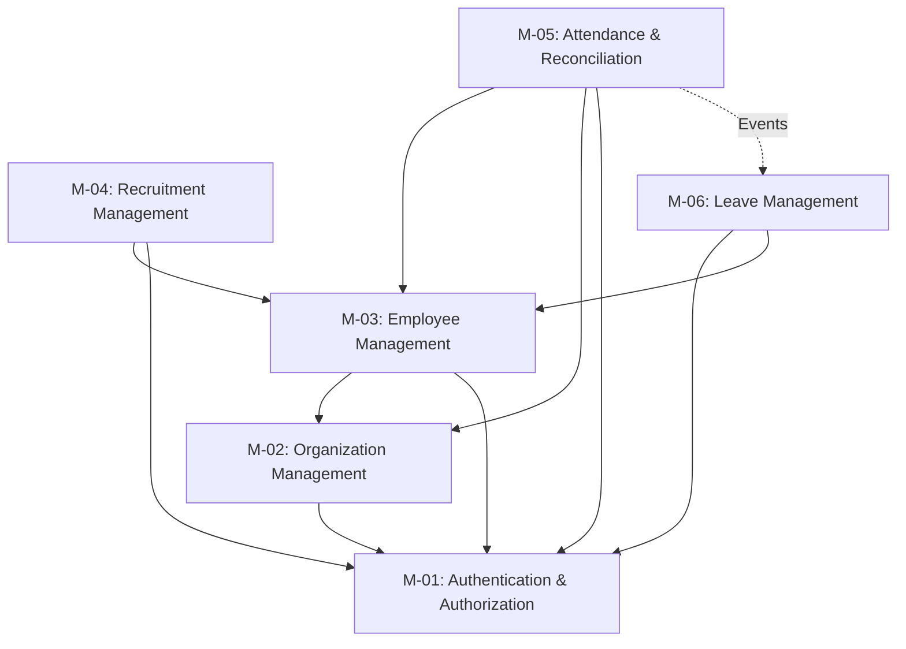

# Modules & Domain Areas

*Synchronized with Backend Architecture (M-01 to M-05 FROZEN)*

## Architectural Philosophy
NexusOps is built as a **Modular Monolith**. The system is divided into sequential domain modules. Lower modules (e.g., M-01) serve as the foundation. Higher modules (e.g., M-06) may depend on lower modules, but lower modules must never depend on higher modules. All cross-module communication happens either through the Service layer (synchronous) or the EventBus (asynchronous).

---

## Structural Dependency Diagram

**Service-Level Dependencies Example:**
`RecruitmentService` ➔ `EmployeeService` ➔ `OrganizationService` (or `DepartmentService`) ➔ `AuthService`

This strict unidirectional dependency prevents circular dependencies.

---

## M-01: Authentication & Authorization Foundation [FROZEN]
**Status:** COMPLETE & FROZEN  
**Purpose:** Centralized identity management, multi-tenancy foundation, JWT session issuance, and dynamic RBAC evaluation.

### Responsibilities
- Organization onboarding and bootstrap execution.
- Cryptographic invitation workflows.
- User registration and password hashing.
- JWT and Refresh Token issuance and rotation.
- Role management and Role Delegation Policy enforcement.
- RBAC permission evaluation via Upstash Redis cache.

### Public API (Controllers)
- `AuthController`: login, register, refresh, logout.
- `RoleController`: createRole, getRoles, updateRole.
- `RoleDelegationController`: define policies.
- `UserRoleController`: assign/revoke roles.
- `InviteController`: createInvite, validateInvite, revokeInvite.
- `OrganizationController`: createOrganization.

### Core Services
- `AuthService`, `RoleService`, `RbacService`, `RoleDelegationService`, `InviteService`, `OrganizationService`, `UserService`.

### Events Emitted
- `EVENTS.TENANT_PROVISIONED`: Triggers module bootstrap handlers.
- `EVENTS.USER_REGISTERED`: Triggers welcome emails.
- `EVENTS.ROLE_ASSIGNED`: Invalidates RBAC cache.

### Dependencies & Extension Points
- Zero dependencies.
- **Extension Point:** Exposes `OrganizationBootstrapRegistry` for future modules to seed tenant defaults upon `TENANT_PROVISIONED`.

---

## M-02: Departments & Organization Hierarchy [FROZEN]
**Status:** COMPLETE & FROZEN  
**Purpose:** Structural definition of the organization, reporting lines, and cost centers.

### Responsibilities
- Managing a materialized path tree for department hierarchy.
- Preventing circular dependency loops during department moves.
- Validating unique immutable department codes.

### Public API (Controllers)
- `DepartmentController`: createDepartment, updateDepartment, moveDepartment, getDepartmentTree.

### Core Services
- `DepartmentService`.

### Events Emitted
- `EVENTS.DEPARTMENT_CREATED`
- `EVENTS.DEPARTMENT_MOVED`

### Events Consumed
- Consumes `EVENTS.TENANT_PROVISIONED` to seed the default "HQ" department.

### Dependencies
- Depends on M-01 `UserService` for `managerId` validation.

---

## M-03: Employee Management [FROZEN]
**Status:** COMPLETE & FROZEN  
**Purpose:** Centralized 360-degree employee profiles, onboarding workflows, and historical timeline tracking.

### Responsibilities
- Managing employee profiles, statuses, and timeline history.
- Handling the employee onboarding workflow.
- Managing manager assignments.

### Public API (Controllers)
- `EmployeeController`: getEmployees, getEmployeeById, createEmployee, updateProfile, archiveEmployee, restoreEmployee, changeStatus, changeManager.

### Core Services
- `EmployeeService`.

### Events Emitted
- `EMPLOYEE.CREATED`
- `EMPLOYEE.UPDATED`
- `EMPLOYEE.STATUS_CHANGED`
- `EMPLOYEE.MANAGER_CHANGED`
- `EMPLOYEE.INVITED`
- `EMPLOYEE.USER_LINKED`
- `EMPLOYEE.ARCHIVED`
- `EMPLOYEE.RESTORED`

### Events Consumed
- None directly in the bootstrap phase (relies on M-01).

### Dependencies
- Depends on M-01 (`UserService`, `InviteService`) for authentication mapping and invitations.
- Depends on M-02 (`DepartmentService`) for structural assignment validation.

---

## M-04: Recruitment Management [FROZEN]
**Status:** COMPLETE & FROZEN  
**Purpose:** Job Requisitions, Candidate Funnel, Interview scheduling, Offer management, and Hiring pipeline orchestration.

### Responsibilities
- Managing Job Requisitions and approval workflows.
- Managing Candidate profiles, authentications, and documents.
- Orchestrating the Application lifecycle (ATS pipeline).
- Coordinating Interviews and Offers.

### Public API (Controllers)
- `JobRequisitionController`, `JobPostingController`, `JobApplicationController`, `AtsApplicationController`, `InterviewController`, `OfferController`.
- Candidate Portal: `CandidateAuthController`, `CandidateProfileController`.

### Core Services
- `JobRequisitionService`, `JobPostingService`, `JobApplicationService`, `AtsApplicationService`, `InterviewService`, `OfferService`, `CandidateAuthService`, `CandidateProfileService`.

### Events Emitted
- Emits events throughout the Application lifecycle (e.g., stage advances, offer acceptance, candidate hired).

### Events Consumed
- Consumes candidate hiring events to finalize application completion and seed employee profile initialization.

### Dependencies
- Depends on M-01 for RBAC and access control.
- Depends on M-02 for department linkages on requisitions.
- Depends on M-03 to generate Employee profiles upon successful hiring via `OfferService` / `AtsApplicationService`.

---

## M-05: Attendance Management & Reconciliation [FROZEN]
**Status:** COMPLETE & FROZEN  
**Detailed Architecture:** See [Attendance Module Architecture](file:///d:/Programming/Intern/Xebia/MainProject/docs/architecture/attendance.md)  
**Purpose:** Shift scheduling, clock-in tracking, overtime calculation, geofencing, reporting, analytics, regularization workflows, and payroll reconciliation.

### Responsibilities
- Managing Daily Attendance Records (clock-ins, clock-outs).
- Managing Attendance Policies (grace periods, half-day rules, maximum open hours).
- Processing Regularization requests and timeline corrections.
- Reconciling stale open attendance sessions automatically.
- Atomically finalizing pay periods and locking attendance records for payroll.
- Generating universal paginated reports, leaderboards, and executive dashboards.
- Direct-to-buffer binary streaming for CSV and Excel data exports.
- Emitting transaction-safe events upon timeline modifications and finalization.

### Public API (Controllers)
- `AttendanceController` (Operational: `/clock-in`, `/clock-out`, `/today`, `/me`).
- `AttendanceReportController` (Analytical: `/reports`, `/dashboard`, `/export`).
- `RegularizationController` (Workflow: `/regularizations`).
- `AttendancePolicyController` (Configuration: `/attendance-policies`).
- `AttendanceReconciliationController` (Reconciliation & Finalization: `/finalize`, `/reconciliation/stale`, `/reconciliation/payroll-feed`).

### Core Services
- `AttendanceClockService`, `AttendanceReportService`, `AttendanceDashboardService`, `AttendanceRegularizationService`, `AttendancePolicyService`, `AttendanceCalculationService`, `AttendanceReconciliationService`.

### Events Emitted
- `ATTENDANCE.RECORD_CREATED`, `ATTENDANCE.CLOCKED_IN`, `ATTENDANCE.CLOCKED_OUT`, `ATTENDANCE.REGULARIZATION_REQUESTED`, `ATTENDANCE.REGULARIZATION_APPROVED`, `ATTENDANCE.REGULARIZATION_REJECTED`, `ATTENDANCE.RECORD_UPDATED`, `ATTENDANCE.RECORD_RECONCILED`, `ATTENDANCE.RECONCILIATION_COMPLETED`, `ATTENDANCE.PAY_PERIOD_FINALIZED`, `ATTENDANCE.PAYROLL_PROCESSING_STARTED`, `ATTENDANCE.PAYROLL_PROCESSED`, `ATTENDANCE.PAYROLL_LOCKED`, `ATTENDANCE.PAYROLL_STATE_VALIDATION_FAILED`.

### Dependencies
- Depends on M-01 for RBAC and access control.
- Depends on M-02 for Location and Shift data.
- Depends on M-03 for Employee data.

---

## Future Roadmap (M-06 to M-15)

### M-06: Leave Management [FROZEN]
**Status:** COMPLETE & FROZEN  
**Purpose:** Policy enforcement, leave accruals, holiday calendars, approval workflows, balance tracking, and immutable payroll snapshotting.

#### Responsibilities
- Managing versioned Leave Policies (Accrual, carry-forward, min/max limits).
- Providing an append-only Leave Balance Ledger ensuring strict auditability.
- Snapshotting employee balances by Payroll Cycle (`cycleIdentifier`) for M-07 Payroll Engine.
- Resolving operational attendance conflicts (`SPLIT_DAY`, `KEEP_LEAVE`) without mutating the ledger silently.
- Supporting global and departmental Holiday Calendars.

#### Public API (Controllers)
- `LeavePolicyController`, `LeaveRequestController`, `LeaveBalanceController`, `LeaveSnapshotController`, `LeaveReportController`.
- `CalendarController` (Holiday calendars).

#### Core Services
- `LeavePolicyService`, `LeaveRequestService`, `LeaveBalanceService`, `LeaveSnapshotService`, `CalendarService`.

#### Events Emitted
- `LEAVE_REQUESTED`, `LEAVE_APPROVED`, `LEAVE_REJECTED`, `LEAVE_CANCELLED`, `LEAVE_CANCELLED_BY_CONFLICT`, `LEAVE_SPLIT_BY_CONFLICT`, `LEAVE_SNAPSHOT_CREATED`.

#### Events Consumed
- Consumes `ATTENDANCE.CONFLICT_RESOLVED` (via `LeaveEventListener`) to execute ledger mutations for resolved attendance conflicts.

#### Dependencies
- Depends on M-01 for RBAC (`LEAVE.*` permissions, `CALENDAR.*` permissions).
- Depends on M-03 for Employee data.
- Provides a stable synchronous `LeaveSyncService` API solely for Attendance usage (to mark/remove leaves in the Attendance ledger).

### M-07: Payroll Management [NEXT]
- **Purpose:** Automated salary calculation, statutory deductions, tax calculation, and automated cryptographic payslip generation.

### M-08: Performance Management [PLANNED]
- **Purpose:** SMART goals, KPI tracking, multi-source reviews, and promotion workflows.

### M-09: Project & Task Management [PLANNED]
- **Purpose:** Project portfolios, Kanban boards, sprint tracking, and timesheets.

### M-10: Asset Management [PLANNED]
- **Purpose:** Hardware/software inventory, allocation tracking, and condition audits.

### M-11: Help Desk [PLANNED]
- **Purpose:** Support ticketing, automated routing, SLA enforcement, and resolution tracking.

### M-12: Document Management [PLANNED]
- **Purpose:** Corporate repository, employee contracts, policy sign-offs, semantic search, and versioning.

### M-13: Notification System [PLANNED]
- **Purpose:** Centralized Notification Engine (In-app alerts, transactional emails, interactive alert center).

### M-14: Reports & Analytics [PLANNED]
- **Purpose:** Executive dashboards, departmental insights, CSV/PDF export.

### M-15: AI Operations Assistant [PLANNED]
- **Purpose:** Conversational Co-Pilot, tool registry execution, and autonomous HR agent workflows.
