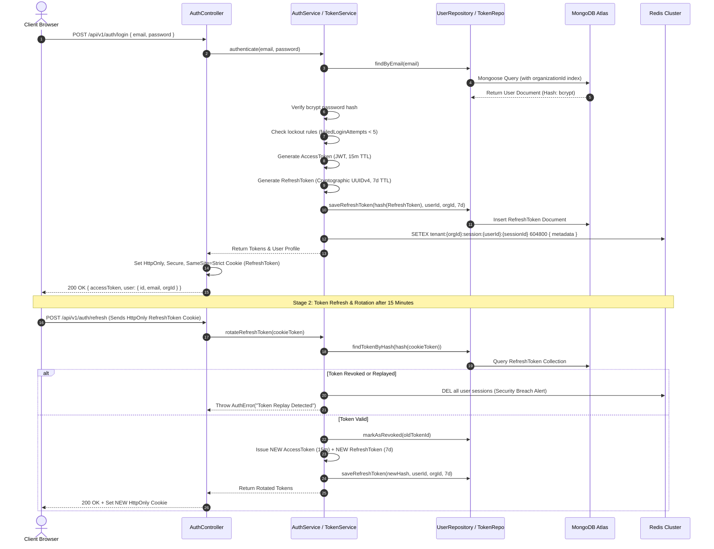
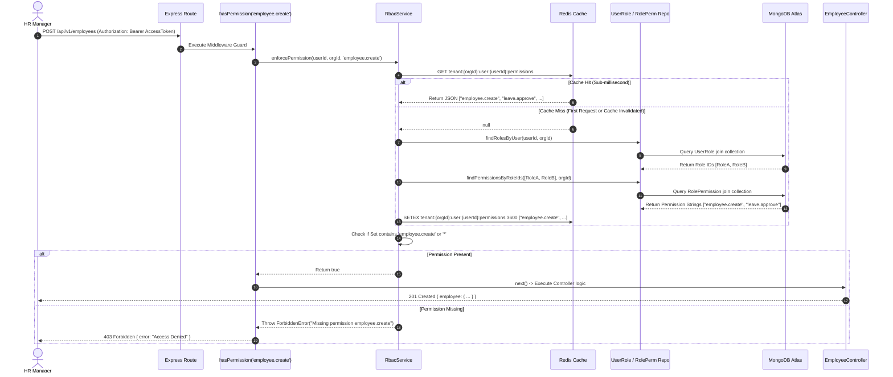
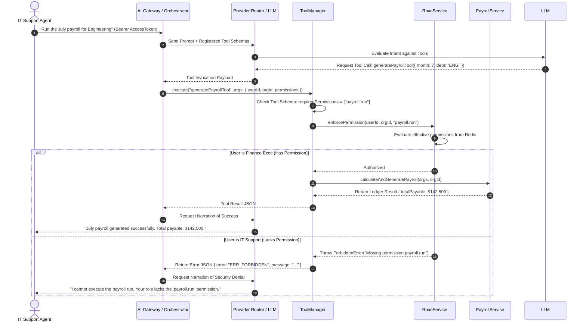
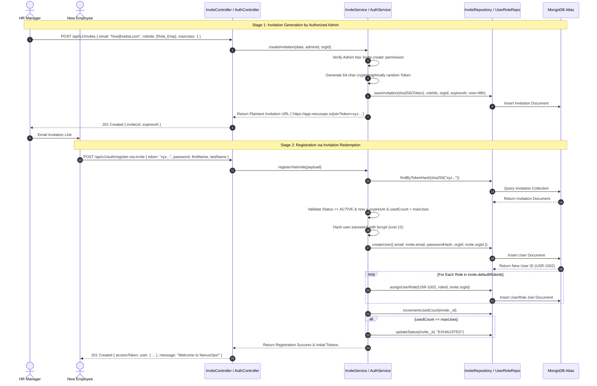

# Authentication, Authorization & Security Architecture

## 1. Zero-Trust Architecture
NexusOps operates on a Zero-Trust principle. Every request, regardless of origin (UI, internal microservice, or AI Co-Pilot), must explicitly prove its identity and authorization before executing any state change or data retrieval.

## 2. Authentication Lifecycle

### JWT Access Tokens
- **Type**: Stateless JSON Web Token.
- **Signing**: HMAC SHA-256 with a high-entropy secret.
- **Payload**: Contains `userId`, `organizationId`, and `sessionId`.
- **Expiration**: Short-lived (e.g., 15-60 minutes).
- **Transport**: Passed exclusively via the `Authorization: Bearer <token>` HTTP header.

### Refresh Tokens
- **Type**: Opaque cryptographic string.
- **Storage**: Stored in the `refreshtokens` MongoDB collection and mirrored in Redis.
- **Expiration**: Long-lived (e.g., 7 days).
- **Security**: Bound to a specific device fingerprint. Employs Automatic Token Rotation (each refresh yields a new access and refresh token pair, invalidating the old refresh token).

### Active Session Management
Active sessions are maintained in Upstash Redis. Logging out instantly deletes the Redis session key and revokes the refresh token. The `auth.js` middleware validates the `sessionId` from the JWT against Redis; if missing, the JWT is functionally voided despite not being expired cryptographically.

## 3. Dynamic Role-Based Access Control (RBAC)

Organizations define their own hierarchical permission structures.

### Roles & Permissions
- Roles are dynamic records in the `Role` model.
- Each Role contains an array of permission strings (e.g., `invite.create`, `payroll.run`).
- Hardcoded permission strings are prohibited; developers must import from `src/core/constants/permissions/`.

### Permission Evaluation (`RbacService`)
- Users are assigned roles via the `UserRole` junction collection.
- `RbacService.getEffectivePermissions` aggregates the union of all permissions assigned to the user.
- The resulting `Set` is cached in Redis (`rbac:<orgId>:<userId>`).
- Super Admins hold the wildcard `'*'` permission, bypassing granular checks.

## 4. Enterprise Role Delegation
To prevent privilege escalation, NexusOps enforces **Role Delegation Policies**:
- A department manager might have `role.assign` permission, but they should not be able to assign a "Super Admin" role to an intern.
- `RoleDelegationPolicy` maps which source roles are allowed to assign which target roles.
- `RoleDelegationService` validates these boundaries during invitations and role assignments.

## 5. Multi-Tenant Isolation
- **AsyncLocalStorage Guard**: The `tenant.js` middleware extracts `organizationId` from the JWT and binds it to a request-scoped context (`TenantContext`).
- **BaseRepository Enforcement**: The `BaseRepository` overrides all Mongoose operations (`find`, `update`, etc.). It automatically appends `{ organizationId: TenantContext.get().organizationId }` to the query predicate. Any attempt to bypass this results in a fatal `TenantIsolationError`.

## 6. Attack Prevention
- **Brute-Force**: Redis-backed rate limiting per IP and per user account.
- **Account Lockout**: 5 consecutive failed logins transition the `User` status to `LOCKED`.
- **Suspension Enforcement**: Active JWTs belonging to a suspended account are blocked by the `auth.js` middleware intercepting the session validation.
- **Audit Logging**: All security actions generate immutable records.


--- 

## 7. Extended Architecture Details (Migrated from legacy design)

### 2. Authentication vs. Authorization Separation

In NexusOps, Authentication (AuthN) and Authorization (AuthZ) operate as distinct, decoupled architectural layers:

```text
ΓöîΓöÇΓöÇΓöÇΓöÇΓöÇΓöÇΓöÇΓöÇΓöÇΓöÇΓöÇΓöÇΓöÇΓöÇΓöÇΓöÇΓöÇΓöÇΓöÇΓöÇΓöÇΓöÇΓöÇΓöÇΓöÇΓöÇΓöÇΓöÇΓöÇΓöÇΓöÇΓöÇΓöÇΓöÇΓöÇΓöÇΓöÇΓöÇΓöÇΓöÇΓöÇΓöÇΓöÇΓöÇΓöÇΓöÇΓöÇΓöÇΓöÇΓöÇΓöÇΓöÇΓöÇΓöÇΓöÇΓöÇΓöÇΓöÇΓöÇΓöÇΓöÇΓöÇΓöÇΓöÇΓöÇΓöÇΓöÇΓöÇΓöÇΓöÇΓöÇΓöÇΓöÉ
Γöé                        AUTHENTICATION (AuthN)                          Γöé
Γöé  "Who are you?"                                                        Γöé
Γöé  - Verifies credentials (Email / Password bcrypt hash comparison)      Γöé
Γöé  - Issues short-lived JWT Access Token (15m TTL, signed via RS256)     Γöé
Γöé  - Establishes persistent session in Redis + rotated Refresh Token     Γöé
ΓööΓöÇΓöÇΓöÇΓöÇΓöÇΓöÇΓöÇΓöÇΓöÇΓöÇΓöÇΓöÇΓöÇΓöÇΓöÇΓöÇΓöÇΓöÇΓöÇΓöÇΓöÇΓöÇΓöÇΓöÇΓöÇΓöÇΓöÇΓöÇΓöÇΓöÇΓöÇΓöÇΓöÇΓöÇΓöÇΓö¼ΓöÇΓöÇΓöÇΓöÇΓöÇΓöÇΓöÇΓöÇΓöÇΓöÇΓöÇΓöÇΓöÇΓöÇΓöÇΓöÇΓöÇΓöÇΓöÇΓöÇΓöÇΓöÇΓöÇΓöÇΓöÇΓöÇΓöÇΓöÇΓöÇΓöÇΓöÇΓöÇΓöÇΓöÇΓöÇΓöÇΓöÿ
                                    Γöé (Attaches `{ userId, organizationId }` to `req.user`)
                                    Γû╝
ΓöîΓöÇΓöÇΓöÇΓöÇΓöÇΓöÇΓöÇΓöÇΓöÇΓöÇΓöÇΓöÇΓöÇΓöÇΓöÇΓöÇΓöÇΓöÇΓöÇΓöÇΓöÇΓöÇΓöÇΓöÇΓöÇΓöÇΓöÇΓöÇΓöÇΓöÇΓöÇΓöÇΓöÇΓöÇΓöÇΓöÇΓöÇΓöÇΓöÇΓöÇΓöÇΓöÇΓöÇΓöÇΓöÇΓöÇΓöÇΓöÇΓöÇΓöÇΓöÇΓöÇΓöÇΓöÇΓöÇΓöÇΓöÇΓöÇΓöÇΓöÇΓöÇΓöÇΓöÇΓöÇΓöÇΓöÇΓöÇΓöÇΓöÇΓöÇΓöÇΓöÇΓöÉ
Γöé                        AUTHORIZATION (AuthZ)                           Γöé
Γöé  "What are you allowed to do?"                                         Γöé
Γöé  - Queries effective permission set from Redis cache / MongoDB         Γöé
Γöé  - Enforces `hasPermission("leave.approve")` across REST & AI tools    Γöé
Γöé  - Prevents privilege escalation & cross-tenant operations             Γöé
ΓööΓöÇΓöÇΓöÇΓöÇΓöÇΓöÇΓöÇΓöÇΓöÇΓöÇΓöÇΓöÇΓöÇΓöÇΓöÇΓöÇΓöÇΓöÇΓöÇΓöÇΓöÇΓöÇΓöÇΓöÇΓöÇΓöÇΓöÇΓöÇΓöÇΓöÇΓöÇΓöÇΓöÇΓöÇΓöÇΓöÇΓöÇΓöÇΓöÇΓöÇΓöÇΓöÇΓöÇΓöÇΓöÇΓöÇΓöÇΓöÇΓöÇΓöÇΓöÇΓöÇΓöÇΓöÇΓöÇΓöÇΓöÇΓöÇΓöÇΓöÇΓöÇΓöÇΓöÇΓöÇΓöÇΓöÇΓöÇΓöÇΓöÇΓöÇΓöÇΓöÇΓöÿ
```

- **Authentication Layer (`AuthService` / `auth.js` middleware):** Knows nothing about business rules or permissions. Its sole job is to authenticate the principal, validate session liveness in Redis, and attach the principal's identity (`userId`, `organizationId`, `email`) to the HTTP request context.
- **Authorization Layer (`RbacService` / `hasPermission.js` middleware):** Knows nothing about passwords, cookies, or login workflows. It receives an authenticated principal's identity, computes their union of permissions across all assigned dynamic roles, and renders a deterministic boolean access decision ($O(1)$ lookup via Redis caching).

---

## 3. Multi-Tenant Data Boundary (`organizationId`)

NexusOps implements a **Shared Database, Shared Schema** multi-tenant model. To guarantee total tenant isolation:
1. Every MongoDB schema in the security subsystem (`User`, `Role`, `UserRole`, `RolePermission`, `Invitation`, `RefreshToken`) includes an indexed `organizationId` field.
2. The `tenant.js` middleware extracts `req.user.organizationId` and binds it to `req.tenantContext`.
3. The abstract `BaseRepository` automatically injects `{ organizationId: req.tenantContext.organizationId }` into all database queries.
4. **Global System Permissions:** The atomic `Permission` catalog (e.g., `employee.create`) is stored in a global table shared across tenants, but the *binding* of permissions to roles (`RolePermission`) and roles to users (`UserRole`) is strictly scoped by `organizationId`.

---

## 4. Discord-Inspired Dynamic RBAC Architecture

To achieve the flexibility seen in platforms like Discord, NexusOps separates Users, Roles, and Permissions into an explicit relational schema using many-to-many mapping collections.

### 4.1 Core Entities & Relational Mapping

```text
ΓöîΓöÇΓöÇΓöÇΓöÇΓöÇΓöÇΓöÇΓöÇΓöÇΓöÇΓöÇΓöÇΓöÇΓöÇΓöÉ         ΓöîΓöÇΓöÇΓöÇΓöÇΓöÇΓöÇΓöÇΓöÇΓöÇΓöÇΓöÇΓöÇΓöÇΓöÇΓöÇΓöÇΓöÇΓöÇΓöÉ         ΓöîΓöÇΓöÇΓöÇΓöÇΓöÇΓöÇΓöÇΓöÇΓöÇΓöÇΓöÇΓöÇΓöÇΓöÇΓöÉ
Γöé     User     Γöé 1     N Γöé     UserRole     Γöé N     1 Γöé     Role     Γöé
Γöé  (Tenant A)  Γö£ΓöÇΓöÇΓöÇΓöÇΓöÇΓöÇΓöÇΓöÇΓöÇΓû║  (Join Table)    ΓùäΓöÇΓöÇΓöÇΓöÇΓöÇΓöÇΓöÇΓöÇΓöÇΓöñ  (Tenant A)  Γöé
ΓööΓöÇΓöÇΓöÇΓöÇΓöÇΓöÇΓöÇΓöÇΓöÇΓöÇΓöÇΓöÇΓöÇΓöÇΓöÿ         ΓööΓöÇΓöÇΓöÇΓöÇΓöÇΓöÇΓöÇΓöÇΓöÇΓöÇΓöÇΓöÇΓöÇΓöÇΓöÇΓöÇΓöÇΓöÇΓöÿ         ΓööΓöÇΓöÇΓöÇΓöÇΓöÇΓöÇΓö¼ΓöÇΓöÇΓöÇΓöÇΓöÇΓöÇΓöÇΓöÿ
                                                             Γöé 1
                                                             Γöé
                                                             Γû╝ N
                         ΓöîΓöÇΓöÇΓöÇΓöÇΓöÇΓöÇΓöÇΓöÇΓöÇΓöÇΓöÇΓöÇΓöÇΓöÇΓöÉ         ΓöîΓöÇΓöÇΓöÇΓöÇΓöÇΓöÇΓöÇΓöÇΓöÇΓöÇΓöÇΓöÇΓöÇΓöÇΓöÇΓöÇΓöÇΓöÇΓöÉ
                         Γöé  Permission  Γöé 1     N Γöé  RolePermission  Γöé
                         Γöé (Global Cat) Γö£ΓöÇΓöÇΓöÇΓöÇΓöÇΓöÇΓöÇΓöÇΓöÇΓû║  (Join Table)    Γöé
                         ΓööΓöÇΓöÇΓöÇΓöÇΓöÇΓöÇΓöÇΓöÇΓöÇΓöÇΓöÇΓöÇΓöÇΓöÇΓöÿ         ΓööΓöÇΓöÇΓöÇΓöÇΓöÇΓöÇΓöÇΓöÇΓöÇΓöÇΓöÇΓöÇΓöÇΓöÇΓöÇΓöÇΓöÇΓöÇΓöÿ
```

- **User:** Represents an individual identity within an organization.
- **Role:** A named container (e.g., "Engineering Lead", "Tier-2 Helpdesk") created within an organization. Roles have a `priority` integer (hierarchy level) used to govern editing privileges.
- **Permission:** An immutable, fine-grained system capability string formatted as `resource.action` (e.g., `payroll.lock`).
- **UserRole:** Many-to-many join collection linking a `userId` to a `roleId` within an `organizationId`. A user can hold multiple roles simultaneously.
- **RolePermission:** Many-to-many join collection linking a `roleId` to a `permissionId` within an `organizationId`.

### 4.2 Granular Permission Namespace Catalog & Centralized Registry
All atomic permission strings in the platform are strictly centralized inside the **Permission Registry** (`src/core/constants/permissions/`). Hardcoded strings are prohibited in application services, middleware, and testsΓÇödevelopers must always import constants from this registry (e.g., `PERMISSIONS.USER.CREATE`).

In alignment with enterprise workforce platform conventions, user identity and personnel profiles are standardized under the `user` namespace. The complete baseline system catalog includes:

| Namespace | Action | Permission String | Description & Scope |
|---|---|---|---|
| **org** | `manage` | `org.manage` | Full control over organization settings, shifts, locations, and branding. |
| **user** | `create`<br>`read`<br>`read_self`<br>`update`<br>`delete`<br>`manage` | `user.create`<br>`user.read`<br>`user.read_self`<br>`user.update`<br>`user.delete`<br>`user.manage` | Lifecycle management of workforce personnel profiles, credentials, and document vaults. |
| **attendance**| `mark`<br>`approve`<br>`regularize`| `attendance.mark`<br>`attendance.approve`<br>`attendance.regularize` | Clock-in/out marking, overtime approval, and geofence exception regularizations. |
| **leave** | `apply`<br>`approve`<br>`override`| `leave.apply`<br>`leave.approve`<br>`leave.override` | Leave submission, managerial approval, and HR balance override adjustments. |
| **payroll** | `run`<br>`lock`<br>`view_salary`| `payroll.run`<br>`payroll.lock`<br>`payroll.view_salary`| Salary calculation execution, immutable ledger locking, and confidential pay viewing. |
| **role** | `create`<br>`read`<br>`update`<br>`delete`<br>`assign` | `role.create`<br>`role.read`<br>`role.update`<br>`role.delete`<br>`role.assign` | Dynamic creation, reading, cloning, modification, and assignment of RBAC roles. |
| **invite** | `create`<br>`read`<br>`revoke` | `invite.create`<br>`invite.read`<br>`invite.revoke` | Generation, reading, and cancellation of tenant registration invitation tokens. |
| **ai** | `use`<br>`execute_tool`<br>`admin` | `ai.use`<br>`ai.execute_tool`<br>`ai.admin` | Access to AI Co-Pilot, backend tool execution, and token/cost analytics dashboards. |

### 4.3 Dynamic Role Management & System Templates
Organizations can create, edit, clone, archive, and delete custom roles. To accelerate tenant onboarding, NexusOps provides five pre-configured **System Role Templates** during initial organization provisioning:
1. **Super Admin Template:** Granted `*` (wildcard access to all permissions).
2. **HR Manager Template:** Granted `user.*`, `attendance.*`, `leave.*`, `role.assign`, `role.read`, `invite.create`, `invite.read`, `ai.use`.
3. **Finance Executive Template:** Granted `payroll.*`, `user.read`, `attendance.read`, `leave.read`, `ai.use`.
4. **Department Manager Template:** Granted `attendance.approve`, `leave.approve`, `user.read`, `ai.use`.
5. **Standard Employee Template:** Granted `attendance.mark`, `leave.apply`, `user.read_self`, `ai.use`.

*Note: While templates provide starting points, tenant administrators can freely modify or duplicate them into custom roles (e.g., "Senior HR Recruiter").*

### 4.4 Prevention of Privilege Escalation
To maintain security integrity, the system enforces strict mathematical hierarchy rules during role administration:
1. **Hierarchy Priority:** Every role has a `priority` integer (0 = highest/Super Admin; 100 = default Employee).
2. **Modification Guard:** A user can only edit, delete, or assign a role if their own highest role priority is *strictly greater* (numerically lower) than the target role's priority.
3. **Permission Grant Guard:** A user cannot add a permission to a role unless they currently possess that exact permission themselves. An HR Manager cannot grant `payroll.lock` to a custom role if they lack `payroll.lock`.

---

## 5. The Invitation System (Secret-Key-Free Registration)

To eliminate security vulnerabilities associated with shared corporate secret keys or open registration endpoints, NexusOps implements a cryptographic **Invitation System**.

```text
[Manager / Admin] ΓöÇΓöÇ(1. POST /api/v1/invites)ΓöÇΓöÇ> [InviteService]
                                                       Γöé
                                            (2. Generate Secure Token)
                                                       Γöé
                                                       Γû╝
[Candidate / New Hire] <ΓöÇΓöÇ(3. Send Email/Link with Token)ΓöÇΓöÇΓöÇ [MongoDB: invitations]
        Γöé
        Γû╝
(4. POST /api/v1/auth/register-via-invite { token, password, firstName, lastName })
        Γöé
        Γû╝
[AuthService] ΓöÇΓöÇ> Validates Token Expiry & Max Uses ΓöÇΓöÇ> Creates User ΓöÇΓöÇ> Binds Default Roles via UserRole ΓöÇΓöÇ> Increments Use Count
```

### Invitation Properties:
- **`token`**: Cryptographically random 64-character URL-safe string (sha256 hashed in database).
- **`organizationId`**: Binds the registrant strictly to the issuer's tenant.
- **`defaultRoleIds`**: Array of `ObjectId`s (e.g., standard "Employee" role) automatically attached upon redemption.
- **`expiresAt`**: Timestamp enforcing strict time expiration (e.g., 48 hours from issuance).
- **`maxUses` & `usedCount`**: Supports single-use links for specific hires or multi-use links (`maxUses: 50`) for bulk campus onboarding.
- **`status`**: State machine tracking (`ACTIVE`, `EXPIRED`, `REVOKED`, `EXHAUSTED`).

---

## 6. Comprehensive MongoDB Schema Design

The following Mongoose schema definitions represent the complete authentication and dynamic RBAC persistence layer:

```javascript
// ==========================================
// 1. Permission Schema (Global Catalog)
// ==========================================
import mongoose from 'mongoose';

const permissionSchema = new mongoose.Schema({
  namespace: { type: String, required: true, index: true }, // e.g., 'employee'
  action: { type: String, required: true },                 // e.g., 'create'
  permissionString: { type: String, required: true, unique: true }, // e.g., 'employee.create'
  description: { type: String, required: true },
  isSystem: { type: Boolean, default: true }
}, { timestamps: true });

export const Permission = mongoose.model('Permission', permissionSchema);

// ==========================================
// 2. Role Schema (Tenant Scoped & Dynamic with Embedded Permission Strings)
// ==========================================
// Embedding permission strings directly inside the Role document reduces query complexity,
// eliminates many-to-many join collections for permissions, and fits MongoDB document modeling best practices.
const roleSchema = new mongoose.Schema({
  organizationId: { type: mongoose.Schema.Types.ObjectId, ref: 'Organization', required: true, index: true },
  name: { type: String, required: true },
  description: { type: String },
  priority: { type: Number, required: true, default: 50 }, // 0 = Highest, 100 = Lowest
  permissions: [{ type: String, required: true }],          // Embedded array of atomic capability strings (e.g., 'employee.create')
  isSystemTemplate: { type: Boolean, default: false },
  status: { type: String, enum: ['ACTIVE', 'ARCHIVED'], default: 'ACTIVE' }
}, { timestamps: true });

roleSchema.index({ organizationId: 1, name: 1 }, { unique: true });
roleSchema.index({ organizationId: 1, priority: 1 });
export const Role = mongoose.model('Role', roleSchema);

// ==========================================
// 3. User Schema (Tenant Scoped Principal)
// ==========================================
const userSchema = new mongoose.Schema({
  organizationId: { type: mongoose.Schema.Types.ObjectId, ref: 'Organization', required: true, index: true },
  email: { type: String, required: true, lowercase: true, trim: true },
  passwordHash: { type: String, required: true },
  firstName: { type: String, required: true },
  lastName: { type: String, required: true },
  status: { type: String, enum: ['ACTIVE', 'LOCKED', 'SUSPENDED'], default: 'ACTIVE' },
  failedLoginAttempts: { type: Number, default: 0 },
  lockoutUntil: { type: Date, default: null },
  lastLoginAt: { type: Date }
}, { timestamps: true });

userSchema.index({ organizationId: 1, email: 1 }, { unique: true });
export const User = mongoose.model('User', userSchema);

// ==========================================
// 4. UserRole Join Schema (Many-to-Many)
// ==========================================
const userRoleSchema = new mongoose.Schema({
  organizationId: { type: mongoose.Schema.Types.ObjectId, ref: 'Organization', required: true, index: true },
  userId: { type: mongoose.Schema.Types.ObjectId, ref: 'User', required: true, index: true },
  roleId: { type: mongoose.Schema.Types.ObjectId, ref: 'Role', required: true, index: true },
  assignedBy: { type: mongoose.Schema.Types.ObjectId, ref: 'User' }
}, { timestamps: true });

userRoleSchema.index({ organizationId: 1, userId: 1, roleId: 1 }, { unique: true });
export const UserRole = mongoose.model('UserRole', userRoleSchema);

// Note: With MongoDB document modeling best practices, atomic permission strings are embedded
// directly in the Role document (Role.permissions), eliminating the need for a separate RolePermission join table.

// ==========================================
// 5. Invitation Schema (Onboarding Engine)
// ==========================================
const invitationSchema = new mongoose.Schema({
  organizationId: { type: mongoose.Schema.Types.ObjectId, ref: 'Organization', required: true, index: true },
  tokenHash: { type: String, required: true, unique: true }, // SHA-256 hash of plaintext token
  email: { type: String, lowercase: true, trim: true },      // Optional: restrict to specific email
  defaultRoleIds: [{ type: mongoose.Schema.Types.ObjectId, ref: 'Role', required: true }],
  issuedBy: { type: mongoose.Schema.Types.ObjectId, ref: 'User', required: true },
  maxUses: { type: Number, required: true, default: 1 },
  usedCount: { type: Number, required: true, default: 0 },
  status: { type: String, enum: ['ACTIVE', 'EXPIRED', 'REVOKED', 'EXHAUSTED'], default: 'ACTIVE' },
  expiresAt: { type: Date, required: true, index: true }
}, { timestamps: true });

invitationSchema.index({ organizationId: 1, status: 1 });
export const Invitation = mongoose.model('Invitation', invitationSchema);

// ==========================================
// 7. RefreshToken / Session Schema
// ==========================================
const refreshTokenSchema = new mongoose.Schema({
  organizationId: { type: mongoose.Schema.Types.ObjectId, ref: 'Organization', required: true },
  userId: { type: mongoose.Schema.Types.ObjectId, ref: 'User', required: true, index: true },
  tokenHash: { type: String, required: true, unique: true },
  deviceIp: { type: String },
  userAgent: { type: String },
  isRevoked: { type: Boolean, default: false },
  expiresAt: { type: Date, required: true, index: true }
}, { timestamps: true });

refreshTokenSchema.index({ userId: 1, isRevoked: 1 });
export const RefreshToken = mongoose.model('RefreshToken', refreshTokenSchema);
```

---

## 7. Modular Folder Structure (`AGENTS.md` Adherence)

The authentication and authorization codebase strictly follows the clean layered architecture mandated by `AGENTS.md`:

```text
backend/src/
Γö£ΓöÇΓöÇ controllers/
Γöé   Γö£ΓöÇΓöÇ AuthController.js           # Handlers for login, refresh, logout, password reset
Γöé   Γö£ΓöÇΓöÇ RoleController.js           # Handlers for CRUD, cloning, archiving dynamic roles
Γöé   Γö£ΓöÇΓöÇ PermissionController.js     # Handlers for querying system permission catalogs
Γöé   ΓööΓöÇΓöÇ InviteController.js         # Handlers for generating and revoking invite tokens
Γö£ΓöÇΓöÇ middleware/
Γöé   Γö£ΓöÇΓöÇ auth.js                     # Verifies JWT Access Token & session liveness
Γöé   Γö£ΓöÇΓöÇ tenant.js                   # Enforces organizationId scoping on request context
Γöé   Γö£ΓöÇΓöÇ hasPermission.js            # Evaluates dynamic RBAC permissions (e.g., hasPermission('ai.use'))
Γöé   Γö£ΓöÇΓöÇ rateLimiter.js              # Redis sliding-window brute-force defense
Γöé   ΓööΓöÇΓöÇ validator.js                # Zod / Envalid input request validation
Γö£ΓöÇΓöÇ models/
Γöé   Γö£ΓöÇΓöÇ User.js
Γöé   Γö£ΓöÇΓöÇ Role.js
Γöé   Γö£ΓöÇΓöÇ Permission.js
Γöé   Γö£ΓöÇΓöÇ UserRole.js
Γöé   Γö£ΓöÇΓöÇ RolePermission.js
Γöé   Γö£ΓöÇΓöÇ Invitation.js
Γöé   ΓööΓöÇΓöÇ RefreshToken.js
Γö£ΓöÇΓöÇ repositories/
Γöé   Γö£ΓöÇΓöÇ BaseRepository.js           # Abstract repository with automatic organizationId injection
Γöé   Γö£ΓöÇΓöÇ UserRepository.js
Γöé   Γö£ΓöÇΓöÇ RoleRepository.js
Γöé   Γö£ΓöÇΓöÇ PermissionRepository.js
Γöé   Γö£ΓöÇΓöÇ UserRoleRepository.js
Γöé   Γö£ΓöÇΓöÇ RolePermissionRepository.js
Γöé   Γö£ΓöÇΓöÇ InviteRepository.js
Γöé   ΓööΓöÇΓöÇ TokenRepository.js
Γö£ΓöÇΓöÇ services/
Γöé   Γö£ΓöÇΓöÇ AuthService.js              # Identity authentication, lockout rules, password hashing
Γöé   Γö£ΓöÇΓöÇ TokenService.js             # JWT generation, RSA signing, refresh token rotation
Γöé   Γö£ΓöÇΓöÇ RbacService.js              # Effective permission computation, hierarchy verification & Redis caching
Γöé   Γö£ΓöÇΓöÇ RoleService.js              # Dynamic role lifecycle, cloning, and template provisioning
Γöé   ΓööΓöÇΓöÇ InviteService.js            # Token cryptography, redemption validation, role binding
ΓööΓöÇΓöÇ utils/
    Γö£ΓöÇΓöÇ logger.js                   # Pino structured JSON logger
    Γö£ΓöÇΓöÇ errors.js                   # Custom domain exceptions (AuthError, ForbiddenError, etc.)
    ΓööΓöÇΓöÇ crypto.js                   # Bcrypt/Argon2 hashing and token cryptographic helpers
```

---

## 8. The Service Layer: Business Logic & Security Orchestration

The service layer encapsulates 100% of identity and permission workflows. Below is the authoritative implementation of `RbacService.js`, illustrating how dynamic permissions are resolved and cached in Redis for sub-millisecond evaluation.

```javascript
// src/services/RbacService.js
import logger from '#@/utils/logger.js';
import redisClient from '#@/config/redis.js';
import UserRoleRepository from '#@/repositories/UserRoleRepository.js';
import RolePermissionRepository from '#@/repositories/RolePermissionRepository.js';
import RoleRepository from '#@/repositories/RoleRepository.js';
import PermissionRepository from '#@/repositories/PermissionRepository.js';
import { ForbiddenError } from '#@/utils/errors.js';

export class RbacService {
  /**
   * Computes the complete union of effective permissions for a user within a tenant.
   * Leverages Redis caching with a 1-hour TTL, invalidated instantly on role modification.
   * @param {String} userId
   * @param {String} organizationId
   * @returns {Promise<Set<String>>} Set of permission strings (e.g., Set {'employee.read', 'ai.use'})
   */
  async getEffectivePermissions(userId, organizationId) {
    const cacheKey = `tenant:${organizationId}:user:${userId}:permissions`;
    
    // 1. Try serving from high-speed Redis cache
    const cachedPerms = await redisClient.get(cacheKey);
    if (cachedPerms) {
      return new Set(JSON.parse(cachedPerms));
    }

    logger.debug({ userId, organizationId }, 'Cache miss: Computing effective RBAC permissions from DB');

    // 2. Fetch all dynamic roles assigned to the user in this organization
    const userRoles = await UserRoleRepository.findRolesByUser(userId, organizationId);
    if (!userRoles || userRoles.length === 0) {
      return new Set();
    }

    const roleIds = userRoles.map(ur => ur.roleId._id || ur.roleId);

    // 3. Check for Super Admin wildcard override (Priority 0 or wildcard permission)
    const roles = await RoleRepository.findByIds(roleIds, organizationId);
    const isSuperAdmin = roles.some(role => role.priority === 0 || role.name === 'Super Admin');

    if (isSuperAdmin) {
      const allPerms = await PermissionRepository.findAll();
      const allPermStrings = new Set(allPerms.map(p => p.permissionString));
      allPermStrings.add('*'); // Add explicit wildcard
      
      await redisClient.setex(cacheKey, 3600, JSON.stringify(Array.from(allPermStrings)));
      return allPermStrings;
    }

    // 4. Query many-to-many join table for all permissions linked to these roles
    const rolePerms = await RolePermissionRepository.findPermissionsByRoleIds(roleIds, organizationId);
    const effectiveSet = new Set(rolePerms.map(rp => rp.permissionId.permissionString));

    // 5. Cache the resolved permission set in Redis
    await redisClient.setex(cacheKey, 3600, JSON.stringify(Array.from(effectiveSet)));
    
    logger.info({ userId, permCount: effectiveSet.size }, 'Computed and cached effective RBAC permissions');
    return effectiveSet;
  }

  /**
   * Verifies if a user possesses a specific permission. Throws ForbiddenError if denied.
   */
  async enforcePermission(userId, organizationId, requiredPermission) {
    const permissions = await this.getEffectivePermissions(userId, organizationId);
    
    const hasAccess = permissions.has('*') || permissions.has(requiredPermission);
    if (!hasAccess) {
      logger.warn({ userId, organizationId, requiredPermission }, 'RBAC Authorization Denied');
      throw new ForbiddenError(`Access denied: Required permission [${requiredPermission}] is missing.`);
    }
    return true;
  }

  /**
   * Invalidates a user's permission cache. Called when roles or permissions are updated.
   */
  async invalidateUserCache(userId, organizationId) {
    const cacheKey = `tenant:${organizationId}:user:${userId}:permissions`;
    await redisClient.del(cacheKey);
    logger.debug({ userId, organizationId }, 'Invalidated user RBAC permission cache');
  }
}

export default new RbacService();
```

---

## 9. The Repository Layer: Data Access & Tenant Scoping

To strictly enforce multi-tenancy and prevent database injection, repositories encapsulate all Mongoose queries and automatically inject `organizationId` predicates.

```javascript
// src/repositories/BaseRepository.js
import { TenantIsolationError } from '#@/utils/errors.js';

export class BaseRepository {
  constructor(model) {
    this.model = model;
  }

  /**
   * Generates a tenant-scoped query filter. Throws fatal error if organizationId is missing.
   */
  _scopeFilter(filter = {}, organizationId) {
    if (!organizationId) {
      throw new TenantIsolationError('Fatal: Database query attempted without organizationId scope.');
    }
    return { ...filter, organizationId };
  }

  async findByIdAndTenant(id, organizationId) {
    return await this.model.findOne(this._scopeFilter({ _id: id }, organizationId));
  }

  async find(filter = {}, organizationId, options = {}) {
    return await this.model.find(this._scopeFilter(filter, organizationId), null, options);
  }

  async createScoped(data, organizationId) {
    if (!organizationId) throw new TenantIsolationError('Cannot create document without organizationId.');
    const doc = new this.model({ ...data, organizationId });
    return await doc.save();
  }
}
```

---

## 10. Thin Controllers & Standardized HTTP Responses

Controllers act purely as transport adaptors: they extract HTTP payloads, invoke services, and format standard JSON responses without embedding authorization logic.

```javascript
// src/controllers/RoleController.js
import RoleService from '#@/services/RoleService.js';
import logger from '#@/utils/logger.js';

export class RoleController {
  async createRole(req, res, next) {
    try {
      const { name, description, priority, permissionIds } = req.body;
      const { userId, organizationId } = req.user;

      // Delegate authoritative execution to RoleService
      const newRole = await RoleService.createCustomRole({
        name,
        description,
        priority,
        permissionIds,
        creatorId: userId,
        organizationId
      });

      res.status(201).json({
        success: true,
        data: newRole,
        message: `Role '${newRole.name}' created successfully with ${permissionIds.length} permissions.`
      });
    } catch (error) {
      next(error);
    }
  }

  async assignRole(req, res, next) {
    try {
      const { targetUserId, roleId } = req.body;
      const { userId, organizationId } = req.user;

      const assignment = await RoleService.assignRoleToUser(targetUserId, roleId, userId, organizationId);
      
      res.status(200).json({
        success: true,
        data: assignment,
        message: 'Role assigned successfully.'
      });
    } catch (error) {
      next(error);
    }
  }
}
export default new RoleController();
```

---

## 11. Security Middleware Stack (`auth.js`, `tenant.js`, `hasPermission.js`)

The security middleware chain intercepts every protected request, verifying identity, isolating tenant data, and evaluating dynamic permissions before route execution.

### 11.1 Authentication Middleware (`auth.js`)
```javascript
// src/middleware/auth.js
import jwt from 'jsonwebtoken';
import env from '#@/config/env.js';
import redisClient from '#@/config/redis.js';
import { AuthError } from '#@/utils/errors.js';

export const authenticate = async (req, res, next) => {
  try {
    const authHeader = req.headers.authorization;
    if (!authHeader || !authHeader.startsWith('Bearer ')) {
      throw new AuthError('Missing or malformed Authorization Bearer header.', 401);
    }

    const token = authHeader.split(' ')[1];
    
    // 1. Verify JWT signature and expiration
    const decoded = jwt.verify(token, env.JWT_ACCESS_SECRET);

    // 2. Verify session existence in Redis (catches revoked tokens / logged out users immediately)
    const sessionKey = `tenant:${decoded.organizationId}:session:${decoded.userId}:${decoded.sessionId}`;
    const sessionExists = await redisClient.exists(sessionKey);
    if (!sessionExists) {
      throw new AuthError('Session expired or revoked. Please log in again.', 401);
    }

    // 3. Attach identity payload to request
    req.user = {
      userId: decoded.userId,
      organizationId: decoded.organizationId,
      email: decoded.email,
      sessionId: decoded.sessionId
    };

    next();
  } catch (error) {
    if (error.name === 'TokenExpiredError') {
      next(new AuthError('Access token expired.', 401, 'ERR_TOKEN_EXPIRED'));
    } else {
      next(new AuthError(error.message || 'Authentication failed.', 401));
    }
  }
};
```

### 11.2 Permission Evaluation Middleware (`hasPermission.js`)
```javascript
// src/middleware/hasPermission.js
import RbacService from '#@/services/RbacService.js';
import { ForbiddenError } from '#@/utils/errors.js';

/**
 * Middleware factory that enforces dynamic RBAC permissions.
 * Never checks role names; checks atomic capabilities.
 * @param {String} requiredPermission - Permission string (e.g., 'employee.create')
 */
export const hasPermission = (requiredPermission) => {
  return async (req, res, next) => {
    try {
      const { userId, organizationId } = req.user;
      if (!userId || !organizationId) {
        throw new ForbiddenError('Security context missing from request.');
      }

      // Evaluates effective permissions via high-speed Redis cache / database
      await RbacService.enforcePermission(userId, organizationId, requiredPermission);
      next();
    } catch (error) {
      next(error);
    }
  };
};
```

---

## 12. Unified UI & AI Authorization Integration

A critical vulnerability in modern enterprise software occurs when AI chatbots operate with elevated system privileges, allowing users to bypass UI security rules via prompt engineering. 

In NexusOps, **the AI Co-Pilot shares the exact same authorization boundary as the React UI**.

```text
ΓöîΓöÇΓöÇΓöÇΓöÇΓöÇΓöÇΓöÇΓöÇΓöÇΓöÇΓöÇΓöÇΓöÇΓöÇΓöÇΓöÇΓöÇΓöÇΓöÇΓöÇΓöÇΓöÇΓöÇΓöÇΓöÇΓöÇΓöÇΓöÇΓöÇΓöÇΓöÇΓöÇΓöÉ         ΓöîΓöÇΓöÇΓöÇΓöÇΓöÇΓöÇΓöÇΓöÇΓöÇΓöÇΓöÇΓöÇΓöÇΓöÇΓöÇΓöÇΓöÇΓöÇΓöÇΓöÇΓöÇΓöÇΓöÇΓöÇΓöÇΓöÇΓöÇΓöÇΓöÇΓöÇΓöÇΓöÇΓöÉ
Γöé      React Web Dashboard       Γöé         Γöé      AI Co-Pilot Panel         Γöé
Γöé   (Clicks "Create Employee")   Γöé         Γöé  ("Create employee John Doe")  Γöé
ΓööΓöÇΓöÇΓöÇΓöÇΓöÇΓöÇΓöÇΓöÇΓöÇΓöÇΓöÇΓöÇΓöÇΓöÇΓöÇΓö¼ΓöÇΓöÇΓöÇΓöÇΓöÇΓöÇΓöÇΓöÇΓöÇΓöÇΓöÇΓöÇΓöÇΓöÇΓöÇΓöÇΓöÿ         ΓööΓöÇΓöÇΓöÇΓöÇΓöÇΓöÇΓöÇΓöÇΓöÇΓöÇΓöÇΓöÇΓöÇΓöÇΓöÇΓöÇΓö¼ΓöÇΓöÇΓöÇΓöÇΓöÇΓöÇΓöÇΓöÇΓöÇΓöÇΓöÇΓöÇΓöÇΓöÇΓöÇΓöÿ
                Γöé                                           Γöé
                Γû╝                                           Γû╝
[POST /api/v1/employees]                   [POST /api/v1/ai/chat]
                Γöé                                           Γöé
                Γû╝                                           Γû╝
      [hasPermission("employee.create")]          [AI Gateway & Orchestrator]
                Γöé                                           Γöé
                Γöé                                           Γû╝
                Γöé                          [ToolManager.execute("createEmployee")]
                Γöé                                           Γöé
                ΓööΓöÇΓöÇΓöÇΓöÇΓöÇΓöÇΓöÇΓöÇΓöÇΓöÇΓöÇΓöÇΓöÇΓöÇΓöÇΓöÇΓöÇΓöÇΓöÇΓöÇΓöÇΓö¼ΓöÇΓöÇΓöÇΓöÇΓöÇΓöÇΓöÇΓöÇΓöÇΓöÇΓöÇΓöÇΓöÇΓöÇΓöÇΓöÇΓöÇΓöÇΓöÇΓöÇΓöÇΓöÿ
                                      Γû╝
                  ΓöîΓöÇΓöÇΓöÇΓöÇΓöÇΓöÇΓöÇΓöÇΓöÇΓöÇΓöÇΓöÇΓöÇΓöÇΓöÇΓöÇΓöÇΓöÇΓöÇΓöÇΓöÇΓöÇΓöÇΓöÇΓöÇΓöÇΓöÇΓöÇΓöÇΓöÇΓöÇΓöÇΓöÇΓöÇΓöÇΓöÇΓöÇΓöÇΓöÇΓöÉ
                  Γöé      RbacService.enforcePermission    Γöé
                  Γöé   (`userId`, `orgId`, `employee.create`)Γöé
                  ΓööΓöÇΓöÇΓöÇΓöÇΓöÇΓöÇΓöÇΓöÇΓöÇΓöÇΓöÇΓöÇΓöÇΓöÇΓöÇΓöÇΓöÇΓöÇΓöÇΓö¼ΓöÇΓöÇΓöÇΓöÇΓöÇΓöÇΓöÇΓöÇΓöÇΓöÇΓöÇΓöÇΓöÇΓöÇΓöÇΓöÇΓöÇΓöÇΓöÇΓöÿ
                                      Γöé
                         ΓöîΓöÇΓöÇΓöÇΓöÇΓöÇΓöÇΓöÇΓöÇΓöÇΓöÇΓöÇΓöÇΓö┤ΓöÇΓöÇΓöÇΓöÇΓöÇΓöÇΓöÇΓöÇΓöÇΓöÇΓöÇΓöÇΓöÉ
                         Γû╝                         Γû╝
                   (Authorized)              (Unauthorized)
                         Γöé                         Γöé
                         Γû╝                         Γû╝
               [EmployeeService]         [Throw ForbiddenError (403)]
```

### 12.1 AI Tool Manager Authorization Guard
Before executing any tool, `ToolManager.js` intercepts the request and invokes `RbacService.enforcePermission()` using the authenticated user's JWT credentials:

```javascript
// src/platform/ai/tools/ToolManager.js
import RbacService from '#@/services/RbacService.js';
import logger from '#@/utils/logger.js';
import { ForbiddenError } from '#@/utils/errors.js';

class ToolManager {
  async execute(toolName, args, userContext) {
    const tool = this.tools.get(toolName);
    if (!tool) throw new Error(`Tool [${toolName}] not found.`);

    const { userId, organizationId } = userContext;

    // MANDATORY SECURITY CHECK: Verify user possesses EVERY permission required by the tool
    for (const requiredPerm of tool.requiredPermissions) {
      await RbacService.enforcePermission(userId, organizationId, requiredPerm);
    }

    logger.info({ toolName, userId, organizationId }, 'AI Tool RBAC authorized; executing tool adaptor');
    return await tool.execute(args, userContext);
  }
}
```
If a Level-1 IT Support Agent asks the AI: *"Generate the July payroll for Engineering"*, the AI matches the prompt to `generatePayrollTool`. However, when `ToolManager` attempts execution, `RbacService.enforcePermission(userId, orgId, "payroll.run")` evaluates to `false` and throws a `ForbiddenError (403)`. The AI intercepts this domain error and responds conversationally: *"I cannot generate the July payroll. Your current role lacks the `payroll.run` authorization permission."*

---

## 13. Sequence Diagrams

### 13.1 JWT Issuance & Refresh Token Rotation Flow


### 13.2 Dynamic RBAC Permission Evaluation Flow


### 13.3 AI Tool Execution Permission Validation Flow


### 13.4 Invitation Creation & Redemption Registration Flow


---

## 14. REST API Endpoint Specification

The following RESTful endpoints manage identity, dynamic roles, permissions, and tenant invitations:

| HTTP Verb | Endpoint Path | Required Permission | Request Payload Summary | Response Summary |
|---|---|---|---|---|
| **POST** | `/api/v1/auth/login` | None (Public) | `{ "email": "user@xebia.com", "password": "Secret123!" }` | `200 OK`: AccessToken JWT + HttpOnly RefreshToken Cookie. |
| **POST** | `/api/v1/auth/refresh` | None (Requires Cookie)| None (Extracts RefreshToken from HttpOnly Cookie) | `200 OK`: Rotated AccessToken + Rotated RefreshToken Cookie. |
| **POST** | `/api/v1/auth/logout` | Authenticated | None | `200 OK`: Invalidates Redis session & clears RefreshToken cookie. |
| **POST** | `/api/v1/auth/register-invite`| None (Public + Token)| `{ "token": "xyz...", "password": "...", "firstName": "...", "lastName": "..." }` | `201 Created`: User profile + initial JWT access token. |
| **GET** | `/api/v1/permissions` | `role.create` / `role.read` | None | `200 OK`: List of all system baseline permission strings grouped by namespace. |
| **GET** | `/api/v1/roles` | `role.read` | Query params: `?page=1&limit=20&status=ACTIVE` | `200 OK`: Paginated list of dynamic roles owned by the tenant. |
| **POST** | `/api/v1/roles` | `role.create` | `{ "name": "Senior HR Lead", "priority": 30, "permissionIds": ["64b...", "64c..."] }` | `201 Created`: Created role object with bound permission mappings. |
| **PUT** | `/api/v1/roles/:id` | `role.update` | `{ "name": "...", "priority": 25, "permissionIds": [...] }` | `200 OK`: Updated role object. Automatically invalidates affected Redis user caches. |
| **DELETE**| `/api/v1/roles/:id` | `role.delete` | None | `200 OK`: Archives role if not assigned to active users. |
| **POST** | `/api/v1/roles/assign` | `role.assign` | `{ "targetUserId": "64d...", "roleId": "64b..." }` | `200 OK`: Creates `UserRole` join document and clears target user's Redis cache. |
| **POST** | `/api/v1/invites` | `invite.create` | `{ "email": "new@xebia.com", "roleIds": ["..."], "expiresInHours": 48, "maxUses": 1 }` | `201 Created`: Plaintext invitation URL string and expiration timestamp. |
| **GET** | `/api/v1/invites` | `invite.create` | Query params: `?status=ACTIVE` | `200 OK`: List of generated invitations with redemption counts. |
| **DELETE**| `/api/v1/invites/:id` | `invite.revoke` | None | `200 OK`: Changes invitation status to `REVOKED`. |

---

## 15. Input Validation Rules (Zod / Envalid Schemas)

All incoming request payloads are rigorously validated by Express middleware before reaching controllers:

```javascript
// src/middleware/validatorSchemas.js
import { z } from 'zod';

export const loginSchema = z.object({
  body: z.object({
    email: z.string().email('Invalid email address format.'),
    password: z.string().min(8, 'Password must be at least 8 characters long.')
  })
});

export const registerViaInviteSchema = z.object({
  body: z.object({
    token: z.string().length(64, 'Invitation token must be exactly 64 characters.'),
    email: z.string().email().optional(),
    password: z.string()
      .min(8, 'Password must be at least 8 characters.')
      .regex(/[A-Z]/, 'Password must contain at least one uppercase letter.')
      .regex(/[a-z]/, 'Password must contain at least one lowercase letter.')
      .regex(/[0-9]/, 'Password must contain at least one number.')
      .regex(/[^A-Za-z0-9]/, 'Password must contain at least one special character.'),
    firstName: z.string().min(2, 'First name is required.'),
    lastName: z.string().min(2, 'Last name is required.')
  })
});

export const createRoleSchema = z.object({
  body: z.object({
    name: z.string().min(3, 'Role name must be at least 3 characters.').max(50),
    description: z.string().max(255).optional(),
    priority: z.number().int().min(1, 'Priority must be between 1 and 100.').max(100),
    permissionIds: z.array(z.string().regex(/^[0-9a-fA-F]{24}$/, 'Invalid MongoDB ObjectId.')).min(1, 'A role must contain at least one permission.')
  })
});

export const createInviteSchema = z.object({
  body: z.object({
    email: z.string().email().optional(),
    roleIds: z.array(z.string().regex(/^[0-9a-fA-F]{24}$/)).min(1, 'At least one default role ID is required.'),
    expiresInHours: z.number().int().min(1).max(720).default(48),
    maxUses: z.number().int().min(1).max(500).default(1)
  })
});
```

---

## 16. Security Best Practices & Hardening

To guarantee enterprise-grade resilience against cyber threats, the authentication and authorization subsystem incorporates the following security controls:

### 16.1 Cryptographic Password & Token Hashing
- **Password Storage:** Passwords are never stored in plaintext. The system utilizes **bcrypt** with a work factor cost of **12** (or **Argon2id** where CPU memory budgets allow).
- **Token Storage:** Refresh tokens and invitation tokens are transmitted to users in plaintext once, but only stored in MongoDB as **SHA-256 cryptographic digests**. If the database is compromised, active refresh tokens and invites cannot be reverse-engineered or used by attackers.

### 16.2 Brute-Force & Denial-of-Service Defense
- **Account Lockout:** If an account accumulates 5 consecutive failed login attempts within a 15-minute window, `AuthService` sets `status: 'LOCKED'` and `lockoutUntil: new Date(Date.now() + 15*60*1000)`. Any login attempts during lockout are rejected instantly without performing bcrypt comparisons.
- **Sliding-Window Rate Limiting:** Redis-backed rate limiters restrict `/api/v1/auth/login` to a maximum of 10 requests per minute per IP address.

### 16.3 Immediate Access Revocation via Redis Sessions
In stateless JWT architectures, revoking an employee's access before their token expires is notoriously difficult. NexusOps solves this by validating a **Redis Session Key** (`tenant:{orgId}:session:{userId}:{sessionId}`) on every request:
- When an HR Manager terminates or suspends an employee, `AuthService.revokeAllSessions(userId)` issues a Redis `DEL` command for all session keys belonging to that user.
- Within **0 milliseconds**, any subsequent API request or AI tool invocation made by that employee fails at `auth.js` with `401 Unauthorized`, even if their JWT Access Token still has 14 minutes of validity remaining.

### 16.4 Defense Against Privilege Escalation
- **Self-Modification Block:** Users are programmatically restricted from altering their own assigned roles or modifying the permissions of roles they currently hold.
- **Strict Hierarchy Boundary:** When assigning a role to a subordinate or editing a role's permissions, `RoleService` checks: `actor.highestRolePriority < targetRole.priority`. An HR Manager (Priority 20) can never modify a Super Admin role (Priority 0) or assign someone to a Priority 10 role.

---

## 17. M-06: Leave Management Security & Authorization

The Leave Management module introduces several critical security boundaries, focusing heavily on financial integrity and authorization boundaries.

### 17.1 Leave Authorization Model
Leave requests are tied directly to an employee. Access controls enforce the following:
- **Self-Service Restrictions:** Employees can only view and cancel their *own* leave applications.
- **Reporting Line Enforcement:** The `Manager` role does not grant global leave visibility. A manager can only view, approve, or reject leave requests belonging to employees within their materialized reporting hierarchy (as defined in M-03).
- **HR Override:** Users with `leave.override` or Super Admin privileges can view and manage all requests across the tenant.

### 17.2 Ledger Immutability Guarantees
Leave balances directly impact financial payroll processing. To guarantee auditability and prevent tampering:
- The `LeaveBalanceLedger` collection operates as a **strict append-only ledger**.
- Mongoose pre-save and pre-update hooks are implemented to throw a fatal error if any attempt is made to mutate or delete a historical ledger entry.
- Current real-time balances (`LeaveBalance`) are calculated by summing the immutable ledger, meaning the balance can always be mathematically reconstructed if tampering is suspected.

### 17.3 Snapshot Access Restrictions
Leave Balance Snapshots represent the finalized financial data sent to Payroll.
- Creating a snapshot requires the `leave.snapshot.run` permission (typically reserved for Finance and Super Admins).
- Snapshots are idempotent and upserted based on the `cycleIdentifier` to prevent duplicate accrual calculations, but once a cycle is formally locked, snapshots become fully immutable.

### 17.4 Conflict Resolution Authorization
When a leave application conflicts with a physical attendance punch, an `AttendanceConflict` is generated.
- Resolving conflicts requires the `attendance.conflict.resolve` permission (typically HR).
- Automatic silent resolution is prohibited. The system requires an authorized human actor to explicitly choose a resolution strategy (`KEEP_LEAVE`, `KEEP_ATTENDANCE`, `SPLIT_DAY`), generating a permanent audit trail.

---

## 18. Future Scalability Considerations (Bitfields & SSO)

As NexusOps scales to support organizations with tens of thousands of employees and millions of AI tool invocations, the authorization subsystem is architected to evolve seamlessly:

### 17.1 Bitfield Permission Optimization ($O(1)$ Bitwise Math)
While string matching (`permissions.has("employee.create")`) is clean and readable, storing arrays of strings incurs memory overhead. In future high-throughput versions, the permission catalog can be mapped to a **64-bit integer bitfield mask** (identical to Discord's underlying architecture):
- `org.manage` = $2^0$ (`0x00000001`)
- `employee.create` = $2^1$ (`0x00000002`)
- `employee.read` = $2^2$ (`0x00000004`)
- `payroll.run` = $2^3$ (`0x00000008`)

A user's effective permissions become a single 64-bit integer stored in Redis (e.g., `0x0000000E` represents possessing permissions 1, 2, and 3). Evaluating authorization in middleware or AI tools reduces to an ultra-fast bitwise AND operation:
```javascript
const hasPermission = (userPermMask, requiredPermBit) => {
  return (userPermMask & requiredPermBit) === requiredPermBit;
};
```

### 17.2 Enterprise Federation (SAML 2.0 / OAuth 2.0 / OIDC)
To support Fortune 500 enterprise onboarding, Module M-01 is structured to accept external Identity Provider (IdP) federation:
- **SSO Integration:** Integrating **Passport.js** or dedicated SAML/OIDC middleware allowing tenant users to authenticate via Microsoft Entra ID (Azure AD), Okta, or Google Workspace.
- **Just-In-Time (JIT) Provisioning:** When a user authenticates via corporate SSO for the first time, `AuthService` parses the SAML assertion attributes, automatically creates their user profile in MongoDB under the tenant's `organizationId`, and binds default rolesΓÇöeliminating manual invitations entirely for enterprise SSO tenants.

---

*End of Enterprise Authentication & Authorization Architecture Design v1.0.0*  
**Related Architecture Documents:** Product Requirements Document (`prd.md`), Technical Design Document (`backend-architecture.md`)

---

## 18. Leave Management Security Model

### Leave Authorization Model
Access to the Leave domain is governed by strict granular permissions:
- `leave.read`: View leave policies, balances, and public utilization reports.
- `leave.create`: Create base leave requests.
- `leave.cancel`: Cancel one's own pending or approved leave requests.
- `leave.approve`: Review, approve, or reject pending leave requests submitted by subordinates.
- `leave.update`: Modify existing leave policy parameters.
- `leave.snapshot`: Execute the creation of payroll-cycle leave snapshots.

### Approval Authorization 
Leave approval follows a defined hierarchical model. A user holding the `leave.approve` permission is authorized to evaluate a request ONLY IF they are within the direct reporting line of the requestor or hold organization-wide administrative privileges (such as HR Manager or Super Admin). Attempting to approve a request outside of this hierarchical boundary results in a `403 Forbidden` Exception.

### Ledger Immutability Guarantees
The `LeaveLedger` operates strictly as an append-only collection.
- **Pre-Update Guard**: Mongoose `pre('update')`, `pre('findOneAndUpdate')`, and `pre('updateOne')` middleware strictly prohibit modifying existing ledger entries.
- **Pre-Delete Guard**: Mongoose `pre('delete')`, `pre('findOneAndDelete')`, and `pre('deleteOne')` middleware throw a fatal `SecurityViolationError` if any deletion is attempted.
- **Data Integrity**: All balance computations (`LeaveBalanceProjectionService`) are derived dynamically by summing ledger entries up to a specific effective date. No manual balance overrides are permitted. Balance adjustments must be created as new `ADJUSTMENT` entries in the ledger, fully documented with a reason and the actor ID.

### Snapshot Access Restrictions
Payroll snapshots (`LeaveBalanceSnapshot`) contain highly sensitive, finalized financial data.
- **Immutable**: Once a snapshot is run for a `cycleIdentifier`, its documents cannot be modified. Subsequent runs for the same cycle will perform an idempotent upsert, replacing the snapshot entirely, leaving a clear audit trail.
- **Restricted Reading**: Access is restricted strictly to users with the `leave.snapshot` or `attendance.payroll_feed` permissions. Standard employees cannot view aggregated snapshots.

### Attendance Conflict Resolution Authorization
When a discrepancy occurs between an approved leave request and actual attendance (e.g., employee clocked in on an approved leave day), the system generates an `AttendanceConflict`.
- **Resolution Lock**: Conflicts can only be resolved by authorized HR personnel holding the `attendance.update` or equivalent administrative permission.
- **Idempotency**: Resolving a conflict enforces a strict state machine lock. Once resolved, the conflict transitions to `RESOLVED` and cannot be processed again.
- **Audit Completeness**: The resolution generates an immutable `AuditLog` entry detailing the resolution strategy chosen (`KEEP_LEAVE`, `KEEP_ATTENDANCE`, `SPLIT_DAY`), ensuring perfect traceability for payroll disputes.
