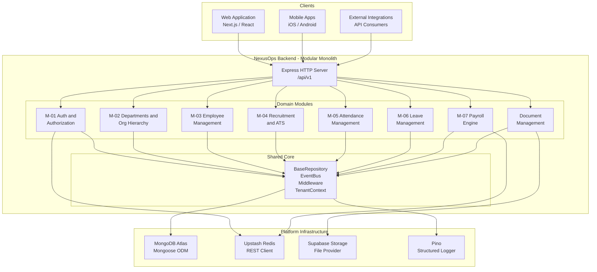
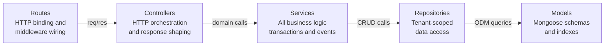

# NexusOps — System Architecture Overview

## Purpose

This document is the entry point for any engineer onboarding to the **NexusOps Enterprise Workforce Management Platform** backend. It maps the overall system structure before you read any domain-specific documentation.

## Architectural Overview

NexusOps is a **Modular Monolith** built on Node.js (ES Modules) with Express v5 and MongoDB Atlas. Every organization is an isolated tenant. All business functionality is partitioned into independent domain modules, each owning its own models, repositories, services, controllers, and routes. Modules share a common `core` and `platform` layer but never import each other's internal repositories directly.

## System Context

*All client traffic enters through a single Express gateway. Domain modules are independently routable but run in the same process. Infrastructure is accessed exclusively through abstraction layers.*

## Strict Layered Architecture

Every domain module enforces a **four-layer dependency chain**. Skipping a layer is an architectural violation.

| Layer | Owns | Hard Rules |
|---|---|---|
| **Routes** | URL paths, middleware chain | Zero business logic; no DB calls |
| **Controllers** | Request parsing, response formatting | No raw DB; delegates everything to services |
| **Services** | All domain rules, ACID transactions, cache writes | No direct Mongoose model usage; calls repos only |
| **Repositories** | MongoDB queries, pagination, tenant scoping | Must extend `BaseRepository`; no business logic |
| **Models** | Schema definitions, indexes, virtuals | No business methods that belong in services |

## Shared Core Package Map

| Package | Path | Purpose |
|---|---|---|
| `BaseRepository` | `src/core/repositories/` | Automatic `organizationId` injection on every query |
| `EventBus` | `src/core/events/` | In-memory domain event broker (Node.js EventEmitter) |
| `TenantContext` | `src/core/context/` | AsyncLocalStorage tenant propagation per request |
| `TransactionContext` | `src/core/context/` | Defers domain events until after ACID commit |
| `authenticate` | `src/core/middleware/auth.js` | JWT verification + session liveness check |
| `requireTenant` | `src/core/middleware/tenant.js` | Injects `organizationId` into ALS context |
| `hasPermission` | `src/core/middleware/hasPermission.js` | RBAC atomic capability enforcement |
| `CacheService` | `src/platform/cache/` | Upstash Redis with in-memory fallback |
| `StorageService` | `src/platform/storage/` | File I/O abstraction (Supabase / local) |
| Pino Logger | `src/platform/logger/` | Structured JSON logging; no `console.log` allowed |

## Module Status

| Module | Status | Description |
|---|---|---|
| M-01 | **FROZEN** | Authentication, Multi-Tenancy, RBAC, Role Delegation |
| M-02 | **FROZEN** | Departments, Org Hierarchy, Designations, Shifts, Locations |
| M-03 | **FROZEN** | Employee Lifecycle, Onboarding, Status Transitions |
| M-04 | **FROZEN** | Recruitment, Job Requisitions, ATS Pipeline, Offers |
| M-05 | **FROZEN** | Attendance Clock-in/out, Policies, Reconciliation |
| M-06 | **FROZEN** | Leave Requests, Balances, Accruals, Approvals |
| M-07 | **FROZEN** | Payroll Cycles, Salary Structures, Payslip Generation |
| Documents | Active | File upload, ACL-based access control |

## Key Architectural Principles

1. **Tenant isolation is enforced at the data layer.** `BaseRepository._scopeFilter()` automatically appends `organizationId` to every query. A query without `organizationId` throws a fatal security exception.
2. **Domain events decouple modules.** `EventBus.emit()` allows `OrganizationService` to fire `TENANT_PROVISIONED` without knowing which modules will react.
3. **Events are deferred until after transaction commit.** The `TransactionContext` queues events inside a running transaction and flushes them only after the MongoDB session commits — preventing phantom events from rolled-back operations.
4. **RBAC authorization never checks role names.** Permission checks evaluate atomic capability strings (e.g., `payroll.run`) computed from the union of all assigned roles' permission arrays.
5. **All routes mount under `/api/v1`.** No internal service-to-service HTTP calls exist.
