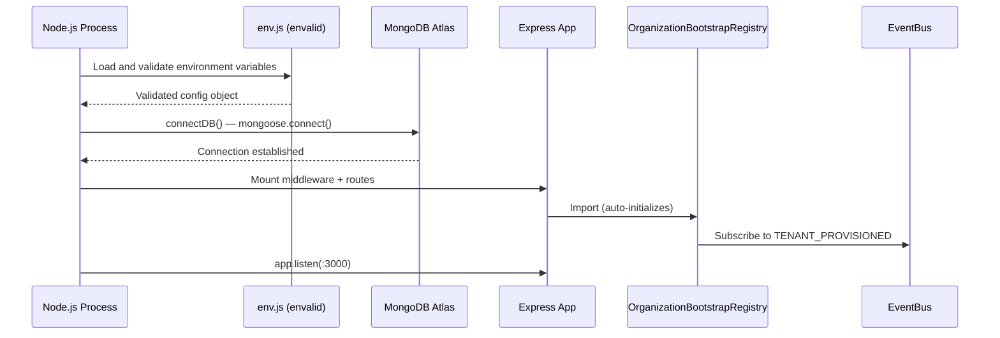
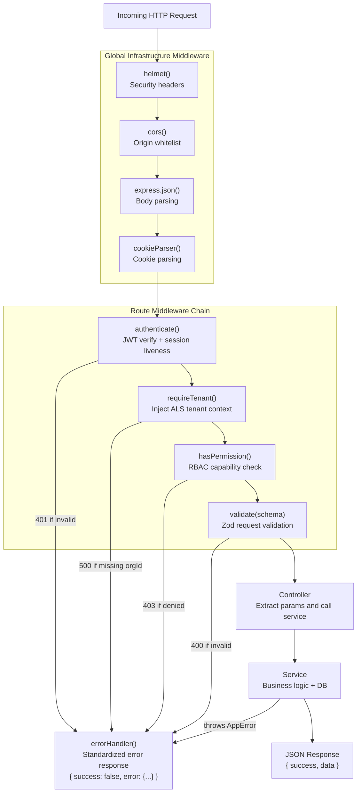
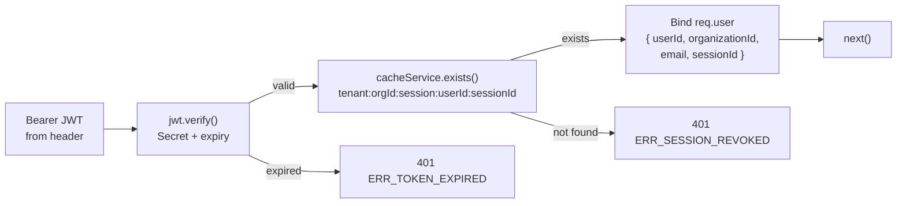
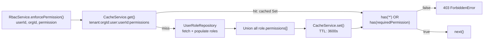

# Request Lifecycle & Middleware Pipeline

## Purpose

This document describes exactly what happens from the moment an HTTP request arrives at the server to the moment a response is returned. It covers the Express application bootstrap, middleware pipeline, routing, and error handling.

## Architectural Overview

Every request passes through a sequential middleware pipeline before reaching a controller. The pipeline enforces security, tenant isolation, and permission checks in a fixed order. Bypassing any layer is architecturally impossible — each middleware calls `next()` only if its invariant is satisfied.

## Application Bootstrap Sequence



*The process startup is strictly sequential: config → database → app + event subscriptions → HTTP listener. A failure at any step aborts the process.*

## Request Pipeline



*The middleware chain is ordered by security priority: authentication before authorization, authorization before business validation. Any failure short-circuits to the global error handler.*

## Middleware Responsibilities

### `authenticate` — Identity Verification



Session liveness is checked on **every request**. A logout or admin suspension immediately invalidates the session key in Redis, making subsequent requests fail even if the JWT has not yet expired.

### `requireTenant` — Zero-Trust Isolation Guard

Extracts `organizationId` from `req.user` (set by `authenticate`) and binds it to:
1. `req.tenantContext.organizationId` — for controller/service parameter passing
2. **AsyncLocalStorage via `TenantContext.run()`** — the ALS context becomes the safety net inside `BaseRepository._validateTenantScope()`. If any service or repository uses a different `organizationId` than the one in ALS context, a fatal security exception is thrown.

### `hasPermission(permission)` — RBAC Enforcement



## Error Handler

The global `errorHandler` (mounted last on Express) normalizes all exceptions — operational domain errors, Mongoose driver errors, JWT errors, Zod validation failures — into a consistent JSON envelope:

```json
{
  "success": false,
  "error": {
    "code": "ERR_VALIDATION",
    "message": "Input payload validation failed.",
    "status": 400,
    "timestamp": "2026-07-08T10:00:00.000Z",
    "path": "/api/v1/employees",
    "details": [{ "field": "workEmail", "message": "Invalid email" }]
  }
}
```

| Error Type | Status | Code |
|---|---|---|
| Mongoose duplicate key (E11000) | 409 | `ERR_CONFLICT` |
| Mongoose schema validation | 400 | `ERR_VALIDATION` |
| Mongoose CastError (bad ObjectId) | 400 | `ERR_INVALID_ID` |
| Zod validation error | 400 | `ERR_VALIDATION` |
| JWT expired | 401 | `ERR_TOKEN_EXPIRED` |
| JWT invalid | 401 | `ERR_UNAUTHORIZED` |
| AppError (operational) | varies | Custom error code |
| Unhandled exception | 500 | `ERR_INTERNAL_SERVER` |

Stack traces are included in the error response only in `NODE_ENV=development`.

## Key Takeaways

- The middleware pipeline is immutable — you cannot reorder `authenticate → requireTenant → hasPermission`.
- Session revocation is **real-time**: deleting the Redis session key immediately blocks that session on the next request.
- The global error handler is the single point of truth for error formatting. Controllers must never manually write error responses.
- Every `500`-level error is logged with full stack trace via Pino; every `4xx` error is logged at `warn` level with correlation context.
