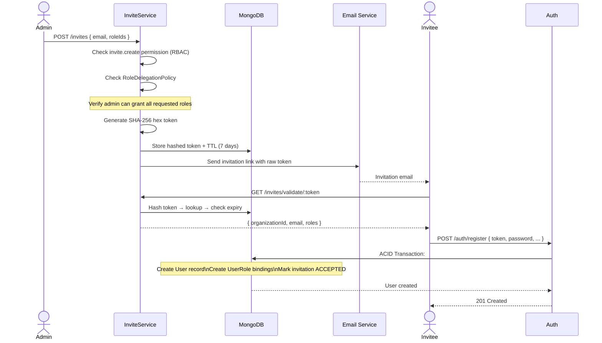
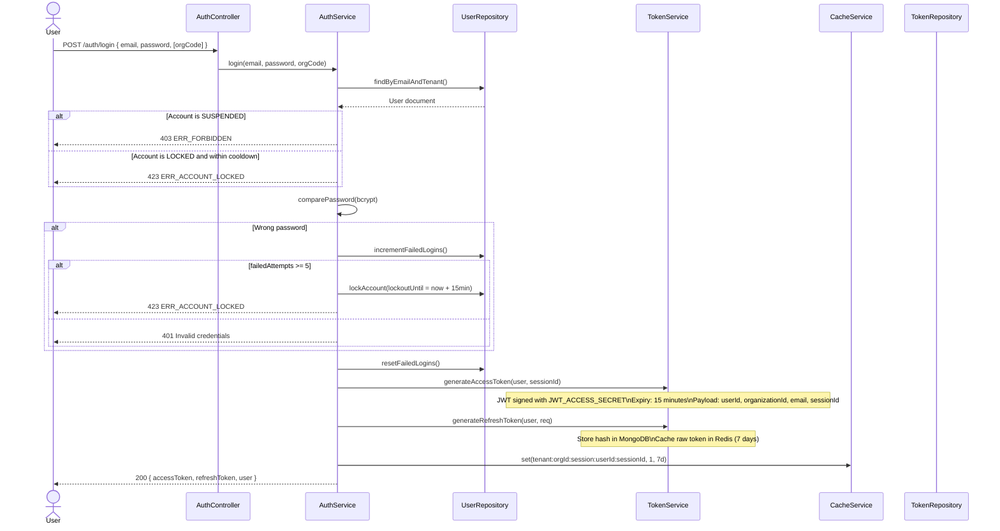
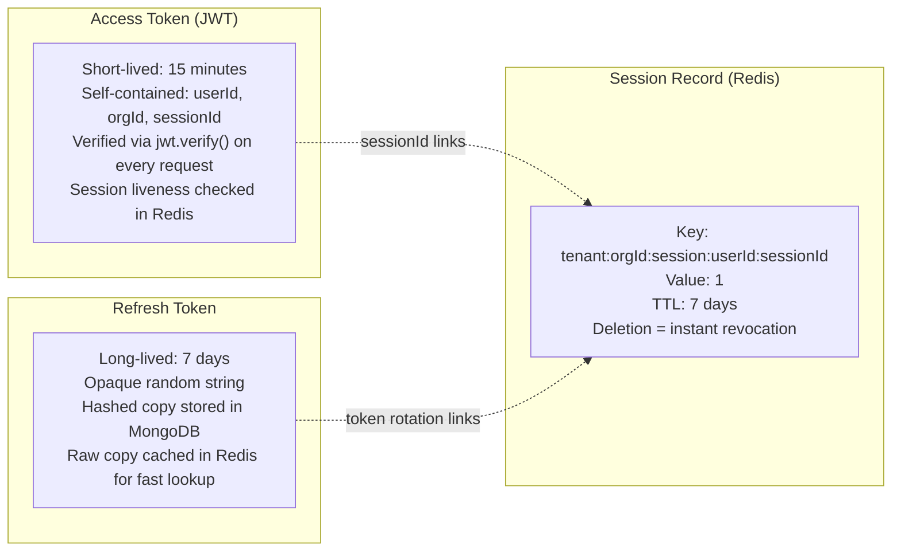
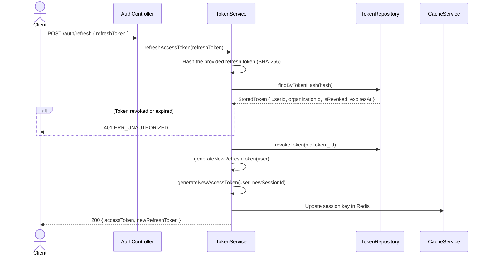
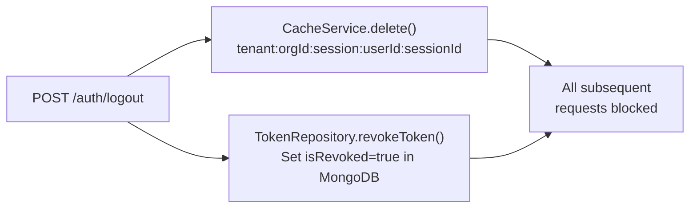
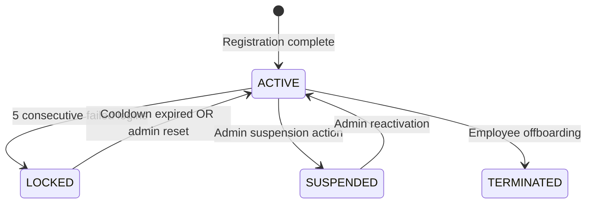

# Authentication & Session Management

## Purpose

This document covers the complete authentication lifecycle: how users register via invitation, how they log in and receive tokens, how sessions are maintained across requests, how tokens are refreshed, and how logout works. It also covers brute-force protection and account lockout.

## Architectural Overview

Authentication is handled by `AuthService` and `TokenService` inside the `auth` module. The system uses short-lived **JWT access tokens** (stateless, verified on every request) paired with long-lived **refresh tokens** (stateful, stored in MongoDB and cached in Redis). Session state is maintained in Redis under a compound key. This allows instant session revocation without waiting for the JWT to expire.

## Registration via Invitation

Users are never self-registered. The only entry point into the platform is a cryptographic invitation link.

## Login Flow

## Token Architecture

## Token Refresh

*Refresh token rotation: each refresh issues a new token and revokes the old one. A stolen refresh token can only be used once.*

## Logout & Session Revocation

## Account Security States

## Key Takeaways

- **Invitations are the only user creation path.** No public self-registration endpoint exists.
- **Session liveness is checked on every request in Redis.** A 15-minute JWT is not enough to maintain access if the Redis session key has been deleted.
- **Brute-force protection is automatic.** Five consecutive wrong passwords trigger a 15-minute account lockout stored in MongoDB.
- **Token rotation prevents refresh token replay attacks.** Each use of a refresh token invalidates the previous one.
- **`revokeAllSessions(userId)` exists for bulk revocation.** Called during employee suspension or termination workflows.
