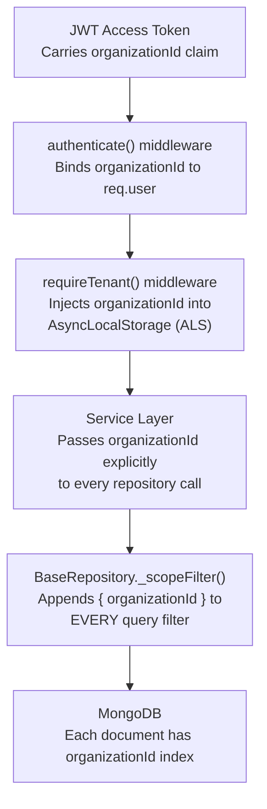
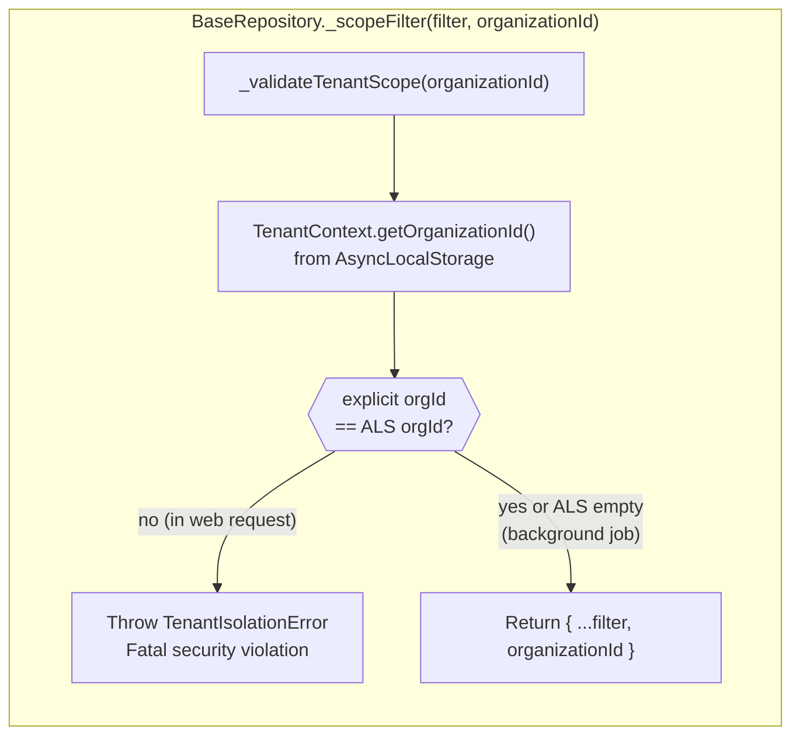
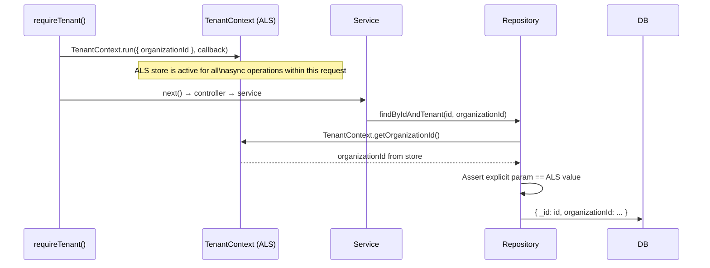
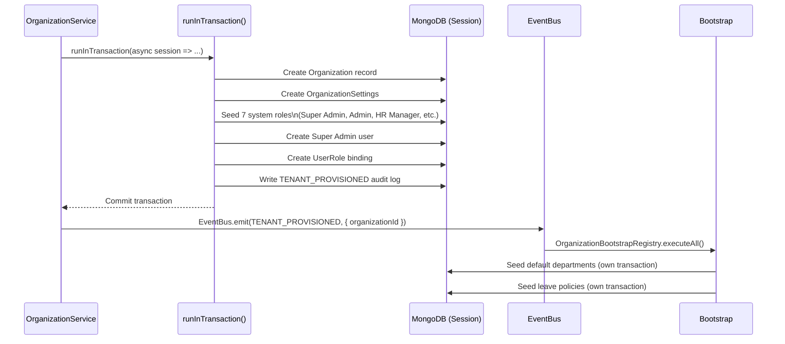

# Multi-Tenancy & Data Isolation

## Purpose

This document explains how NexusOps enforces strict per-tenant data isolation across all database operations, how tenant context is propagated through the request lifecycle, and what prevents cross-tenant data leakage.

## Architectural Overview

NexusOps implements **shared-schema multi-tenancy**: all tenants coexist in the same MongoDB database and collections, with an `organizationId` field on every tenant-scoped document acting as the isolation boundary. Rather than relying on application code to remember to filter by tenant, this filtering is enforced automatically at the repository layer through `BaseRepository`.

## The Isolation Stack

*Isolation is enforced at three independent checkpoints: the JWT payload, the ALS context, and the repository query filter. All three must agree.*

## BaseRepository: The Isolation Enforcement Engine

The `BaseRepository` class is the foundation of multi-tenancy. Every domain repository inherits from it and gets automatic tenant scoping.

Every method on `BaseRepository` — `find`, `findOne`, `findByIdAndTenant`, `createScoped`, `updateByIdAndTenant`, `deleteByIdAndTenant` — calls `_scopeFilter()` before touching MongoDB. There is no bypass path.

## AsyncLocalStorage (ALS) Safety Net

`TenantContext` uses Node.js `AsyncLocalStorage` to propagate the tenant context across the asynchronous call chain of a single HTTP request — without passing it through every function parameter.

**Why both explicit parameter AND ALS?** ALS alone could be spoofed in background jobs where no HTTP context exists. Explicit parameters alone rely on developers always passing the right value. Using both creates a cross-check: if a service accidentally passes the wrong `organizationId`, the ALS mismatch throws a fatal error rather than silently leaking data.

## Tenant Provisioning

A new organization is provisioned atomically inside a single ACID transaction.

*Domain events are deferred until after the transaction commits via `TransactionContext`. If the transaction rolls back, no spurious events are emitted.*

## URL Design: No Tenant ID in URLs

Tenant IDs are **never** exposed in public URL paths. There is no `/api/v1/:orgId/employees` pattern. The tenant is resolved exclusively from the authenticated JWT payload. This prevents enumeration attacks and keeps URLs clean and portable.

## Key Takeaways

- **No query escapes tenant isolation.** `BaseRepository` wraps every Mongoose call with `organizationId` appended to the filter. A query without `organizationId` throws a fatal exception — it never silently returns cross-tenant data.
- **ALS acts as a double-check, not a primary mechanism.** Explicit `organizationId` parameters remain mandatory in every repository call; ALS is the safety net that catches mismatches.
- **Tenant provisioning is fully atomic.** The organization, settings, roles, admin user, and audit log are created in a single MongoDB ClientSession transaction. A partial failure rolls back everything.
- **Background jobs bypass ALS safely.** When `TenantContext.getOrganizationId()` returns null (no active ALS), the mismatch check is skipped, and the explicit parameter is trusted.
