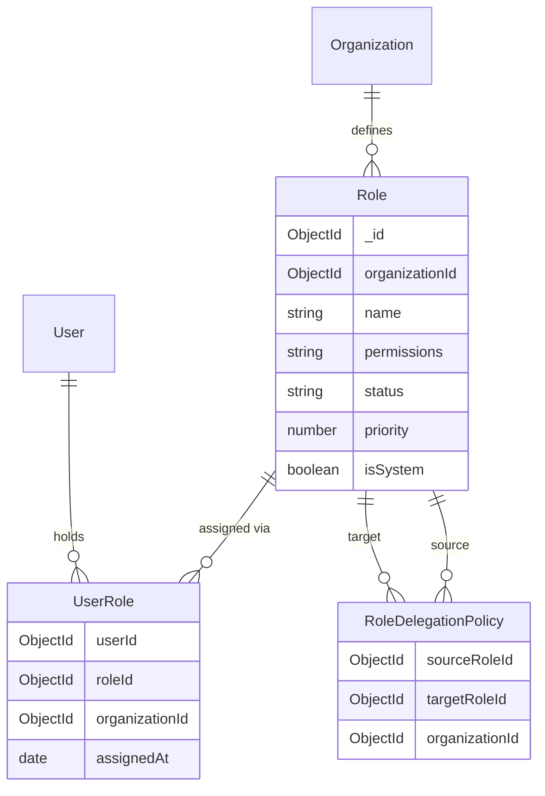
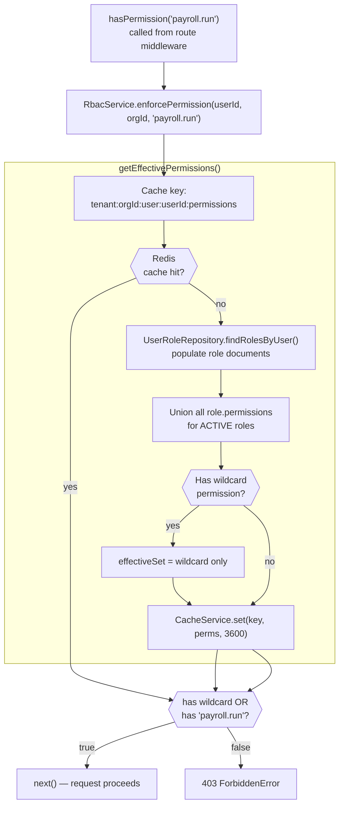
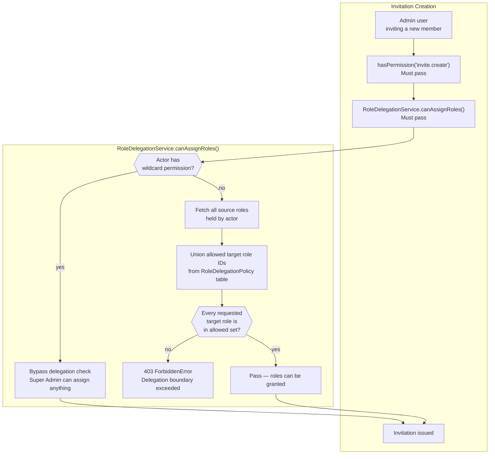
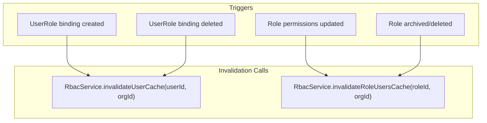

# RBAC & Permission System

## Purpose

This document explains the Role-Based Access Control engine: how roles are structured, how permissions are evaluated, how they are cached, and how the Role Delegation Policy prevents unauthorized privilege escalation.

## Architectural Overview

NexusOps implements a **dynamic RBAC engine** with no hardcoded role names in application logic. Authorization is evaluated exclusively against **atomic permission strings** (e.g., `payroll.run`, `user.create`). Roles are tenant-customizable containers of permission strings. A user can hold multiple roles simultaneously; their effective permissions are the union of all assigned roles.

## Data Model

## Permission Evaluation Flow

*Permissions are cached per user per tenant with a 1-hour TTL. Any role modification or assignment change immediately invalidates the affected user's cache.*

## Permission Namespace Catalog

| Namespace | Permissions | Description |
|---|---|---|
| `org.*` | `org.manage` | Tenant settings and branding |
| `user.*` | `user.create`, `user.read`, `user.update`, `user.delete`, `user.read_self` | User profile management |
| `role.*` | `role.create`, `role.read`, `role.update`, `role.delete`, `role.assign` | RBAC role management |
| `invite.*` | `invite.create`, `invite.revoke` | Invitation lifecycle |
| `attendance.*` | `attendance.mark`, `attendance.approve` | Clock-in/out and regularization |
| `leave.*` | `leave.apply`, `leave.approve`, `leave.override` | Leave request workflow |
| `payroll.*` | `payroll.run`, `payroll.lock`, `payroll.view_salary` | Payroll execution and viewing |
| `ai.*` | `ai.use`, `ai.execute_tool`, `ai.admin` | AI Co-Pilot access |

The `'*'` wildcard is reserved for Super Admins and bypasses all permission checks.

## Role Delegation Policy

The RBAC system answers *"can this user do X?"*. The Role Delegation Policy answers *"can this user grant role Y to someone else?"*. These are independent checks — both must pass during invitation and role assignment workflows.

### Default Seeded Delegation Boundaries

| Source Role | Can Grant |
|---|---|
| Super Admin | All roles |
| Administrator | Manager, Employee, Intern |
| Department Manager | Employee, Intern |
| HR Manager | Employee, Intern |

Delegation policies are cached in Redis (`roleDelegation:orgId:roleId`, TTL 24h) and invalidated on policy edits.

## Cache Invalidation Strategy

## Key Takeaways

- **Role names are never checked in code.** All authorization logic evaluates atomic permission strings — you can rename any role without breaking any permission check.
- **Multiple roles are additive.** A user with both `HR Manager` and `Department Manager` gets the union of both roles' permissions.
- **Wildcard `'*'` bypasses everything.** Super Admins skip both permission checks and delegation boundary checks.
- **Delegation is a separate concern from permissions.** Having `role.assign` permission does not mean you can assign any role — delegation policy constraints still apply.
- **Cache invalidation is synchronous.** When a role assignment changes, the affected user's Redis cache is deleted in the same service call before the response is returned.
