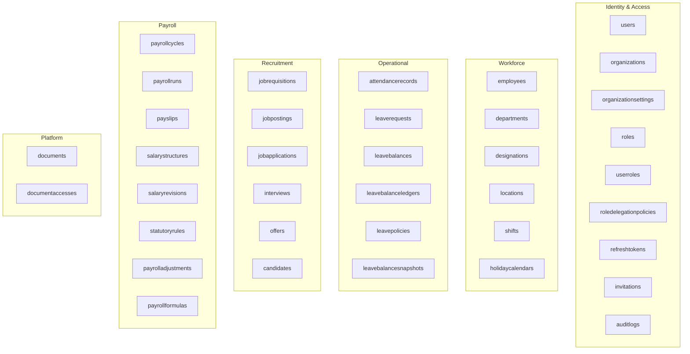
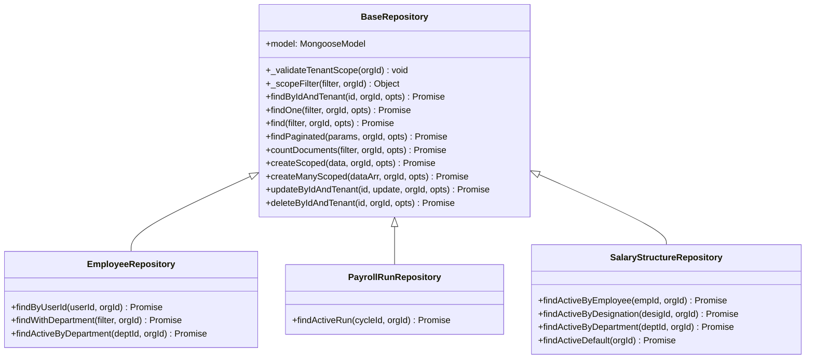
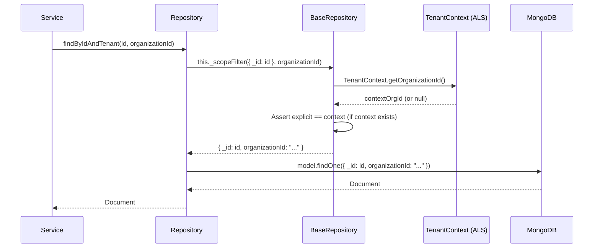
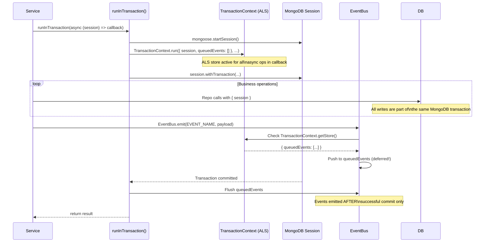

# Database Architecture & Repository Layer

## Purpose

This document describes the MongoDB data architecture, how the `BaseRepository` pattern enforces consistent, safe, and tenant-isolated database access, and how ACID transactions are managed.

## Architectural Overview

NexusOps uses **MongoDB Atlas** as its primary database with **Mongoose** as the ODM layer. All database access is mediated through domain repositories that extend `BaseRepository`. Services never import Mongoose models directly. Transactions are managed via a `runInTransaction()` utility that wraps operations in a MongoDB ClientSession and defers domain events until after a successful commit.

## Collection Landscape



## BaseRepository Pattern

`BaseRepository` is the single point of control for all MongoDB queries. Domain repositories extend it and gain automatic tenant isolation, pagination, and transaction support.



*Specialized repositories add domain-specific query methods on top of the inherited CRUD. They never bypass `_scopeFilter()`.*

## Query Lifecycle



## ACID Transactions

Multi-document operations use the `runInTransaction()` helper which wraps a MongoDB ClientSession and correctly integrates with the domain event system.



**The critical guarantee:** Domain events are only emitted after a successful transaction commit. If the transaction rolls back (e.g., a duplicate key error on step 3 of 5), no events are emitted and no downstream side effects occur.

## Pagination Standard

All list endpoints use `BaseRepository.findPaginated()` which returns a standardized response:

```json
{
  "data": [...],
  "pagination": {
    "total": 150,
    "page": 2,
    "limit": 20,
    "totalPages": 8
  }
}
```

Limits are capped at 100 records per page. Default sort is `{ createdAt: -1 }`.

## Key Indexes

Critical indexes enforced across collections:

| Collection | Index | Purpose |
|---|---|---|
| `users` | `{ email: 1, organizationId: 1 }` unique | Login uniqueness per tenant |
| `userroles` | `{ userId: 1, organizationId: 1 }` | Fast permission lookups |
| `payrollruns` | `{ payrollCycleId: 1, organizationId: 1 }` partial unique (active status) | Concurrency guard — one active run per cycle |
| `attendancerecords` | `{ employeeId: 1, workDate: 1, organizationId: 1 }` | Daily attendance lookup |
| `auditlogs` | `{ organizationId: 1, createdAt: -1 }` | Tenant audit trail queries |
| `salarystructures` | `{ targetType, targetId, organizationId, status }` | Hierarchical salary resolution |

## Key Takeaways

- **Services never touch Mongoose models directly.** Any code that imports a model and calls `.find()` on it directly is a violation. All DB interaction goes through repositories.
- **`{ returnDocument: 'after' }` is the standard** for all mutation queries that return the updated document. The deprecated `{ new: true }` option is not used.
- **Every document carries `organizationId` as a required indexed field.** Collections without `organizationId` are system-level (e.g., `organizations` itself).
- **Transactions fall back gracefully.** On standalone MongoDB (non-replica-set local dev), `runInTransaction()` catches the "replica set required" error and executes the callback sequentially without a session.
