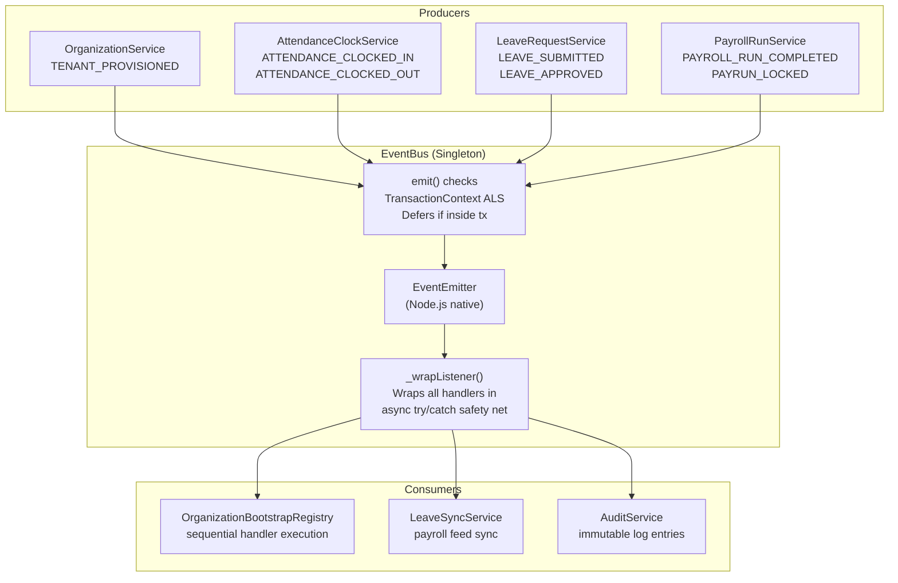
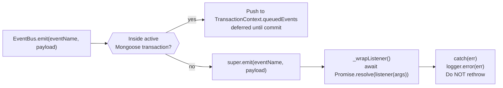
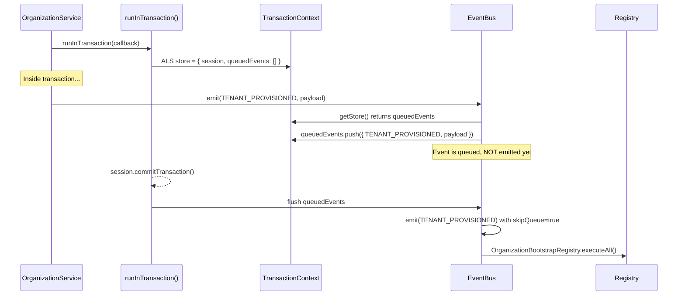
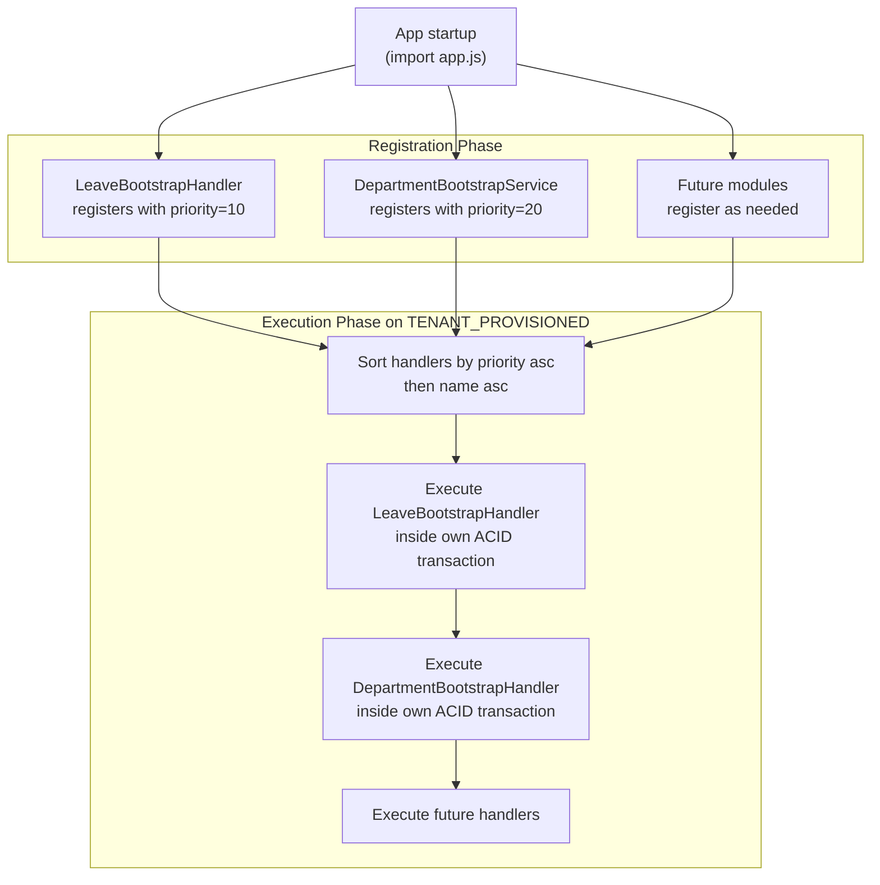

# Event-Driven Architecture & Bootstrap System

## Purpose

This document explains the in-memory domain event system (`EventBus`), how it decouples modules, how domain events are safely deferred within ACID transactions, and how the tenant bootstrap registry enables extensible onboarding without modifying frozen modules.

## Architectural Overview

NexusOps uses an **in-memory domain event bus** built on Node.js `EventEmitter`. It is not a message queue — events are synchronous in-process dispatches. Its purpose is to **decouple domain modules**: a module emits an event without knowing which other modules react to it. This allows `OrganizationService` (frozen) to trigger side effects in `LeaveBootstrapHandler` or a future `PayrollBootstrapHandler` simply by emitting `TENANT_PROVISIONED`.

## EventBus Architecture

## Safe Async Listener Execution

Every listener attached to the `EventBus` is automatically wrapped in an async-safe `try/catch`:

**Critical property:** A failing event listener can never crash the HTTP request handler. The error is logged at `error` severity but execution continues. This means event consumers must be idempotent and not relied upon for critical request-path logic.

## Transaction-Deferred Event Emission

If the transaction rolls back at any point before commit, `queuedEvents` is discarded with the session — no spurious bootstrap operations are triggered.

## Tenant Bootstrap Registry

The `OrganizationBootstrapRegistry` enables any domain module to hook into the tenant provisioning lifecycle without modifying `OrganizationService` (which is frozen). Each module registers a handler during app startup.

Each handler executes in its own independent `runInTransaction()` call. A failure in one handler is logged and skipped — subsequent handlers still execute. This prevents a single bad seed from blocking the entire tenant onboarding.

## Domain Event Catalog

| Event | Module | Payload |
|---|---|---|
| `TENANT.PROVISIONED` | Organization | `{ organizationId, adminUserId }` |
| `ATTENDANCE.CLOCKED_IN` | Attendance | `{ employeeId, organizationId, record }` |
| `ATTENDANCE.CLOCKED_OUT` | Attendance | `{ employeeId, organizationId, record }` |
| `ATTENDANCE.REGULARIZATION_APPROVED` | Attendance | `{ regularizationId, organizationId }` |
| `ATTENDANCE.RECONCILIATION_DONE` | Attendance | `{ organizationId, cycleStart, cycleEnd }` |
| `EMPLOYEE.CREATED` | Employees | `{ employeeId, organizationId }` |
| `EMPLOYEE.STATUS_CHANGED` | Employees | `{ employeeId, status, organizationId }` |
| `LEAVE.SUBMITTED` | Leave | `{ requestId, employeeId, organizationId }` |
| `LEAVE.APPROVED` | Leave | `{ requestId, organizationId }` |
| `LEAVE.REJECTED` | Leave | `{ requestId, organizationId }` |
| `PAYROLL.RUN_COMPLETED` | Payroll | `{ runId, cycleId, organizationId }` |
| `PAYROLL.LOCKED` | Payroll | `{ cycleId, organizationId }` |

## Key Takeaways

- **Events are in-process, not distributed.** There is no Kafka, RabbitMQ, or SQS. If the process restarts mid-event, handlers that haven't executed will not retry. For critical operations, use ACID transactions with direct service calls rather than relying on event handlers.
- **Event handlers must never throw unhandled errors.** The `_wrapListener` wrapper catches all exceptions and logs them. Business-critical side effects should be executed inside the transaction, not as event reactions.
- **The bootstrap registry is the extension point for new modules.** Future modules (e.g., Payroll default rules, Asset inventory seeds) must register handlers here — they must not modify `OrganizationService`.
- **All event name strings come from `src/core/constants/events/index.js`.** Hardcoded string literals in event producers or consumers are prohibited.
