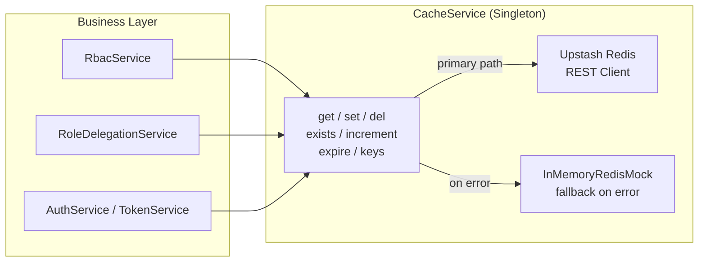
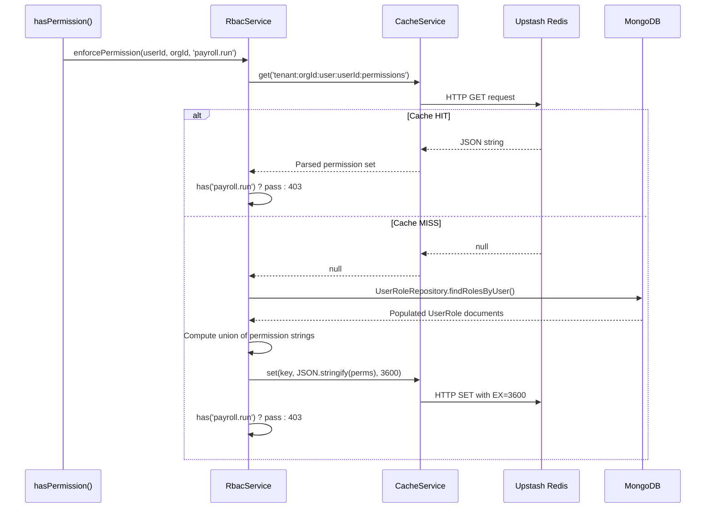
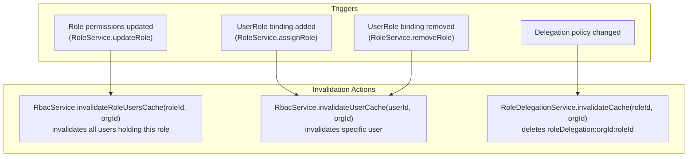
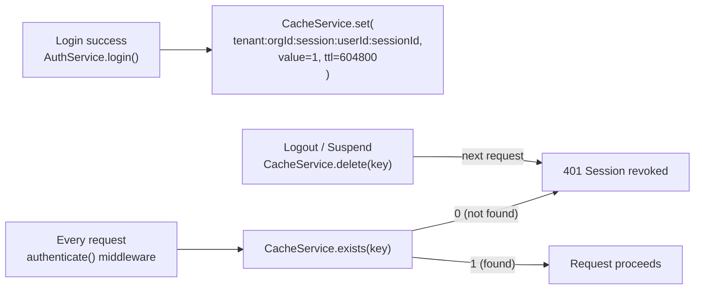

# Caching Strategy

## Purpose

This document describes how the platform uses Upstash Redis for caching, what data is cached and why, the cache key naming conventions, TTL policies, and how cache invalidation is coordinated with business operations.

## Architectural Overview

NexusOps uses **Upstash Redis** (REST-based serverless client) as its cache layer, accessed through a `CacheService` abstraction. The cache is used exclusively for **derived or temporary data** — it never stores primary business records. Every cached item has a defined TTL and a corresponding invalidation path triggered by business mutations. If Redis is unavailable, `CacheService` falls back to an in-memory mock.

## CacheService Architecture

## Cache Namespace Catalog

All cache keys follow a **hierarchical namespace** pattern to enable deterministic invalidation:

| Namespace Pattern | Owner | TTL | Contents |
|---|---|---|---|
| `tenant:orgId:session:userId:sessionId` | AuthService | 7 days | Session liveness flag (value: `1`) |
| `tenant:orgId:user:userId:permissions` | RbacService | 1 hour | JSON array of effective permission strings |
| `roleDelegation:orgId:roleId` | RoleDelegationService | 24 hours | JSON array of allowed target role IDs |
| `roleAssignment:orgId:roleId` | RoleDelegationService | 24 hours | Alias for backward compatibility |
| `refreshToken:tokenId` | TokenService | 7 days | Refresh token metadata |

## Cache Read Path (RBAC example)

## Cache Invalidation Strategy

Invalidation is **proactive and synchronous** — it happens in the same service call that mutates the data, before the response is returned.

## Session Cache Operations

Sessions use the cache as the **source of truth for liveness**, not MongoDB. This makes revocation instantaneous.

## Fallback Behavior

`CacheService` wraps every Redis operation in `try/catch`. If Upstash returns an error (network timeout, rate limit), the operation falls back to an `InMemoryRedisMock` — a simple JavaScript `Map` with TTL tracking. This prevents Redis outages from taking down the API, at the cost of losing distributed session state (multiple server instances would have separate in-memory caches during an outage).

## Key Takeaways

- **Cache is never the primary data store.** If Redis is completely wiped, the system degrades gracefully — the next cache miss triggers a database query and re-warms the cache.
- **All keys are namespaced by tenant (`orgId`).** This prevents key collisions between tenants and makes bulk invalidation by tenant straightforward.
- **Invalidation is pull-based, not push-based.** There is no separate invalidation worker — mutations directly delete the relevant cache keys in the same request.
- **Never cache primary business entities.** Employees, leave requests, payroll records, and documents are not cached — only derived computed values (permissions, session flags, delegation rules).
- **Increment operations support rate limiting.** `CacheService.increment(key)` supports atomic counter increments which can be used for rate-limiting patterns (e.g., login attempt counting).
