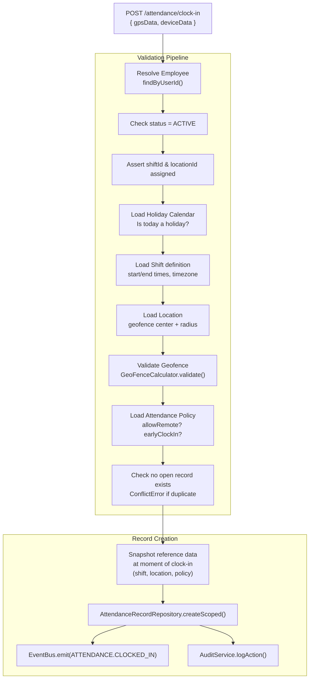
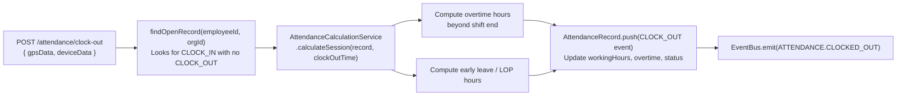
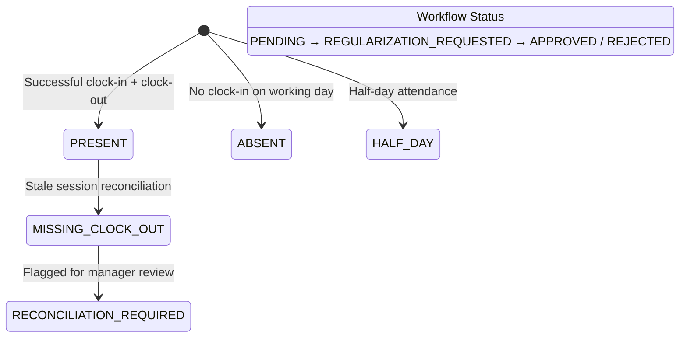
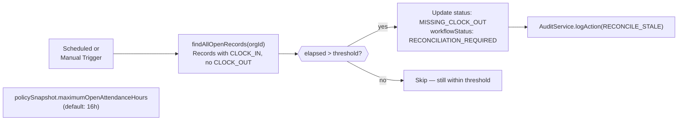
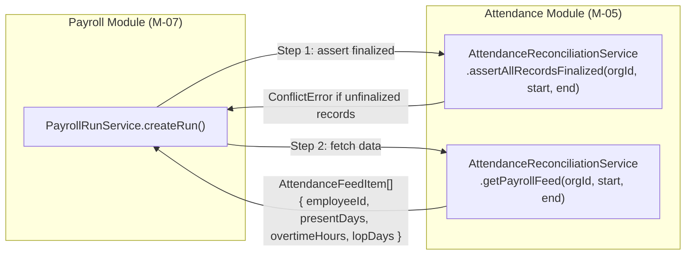
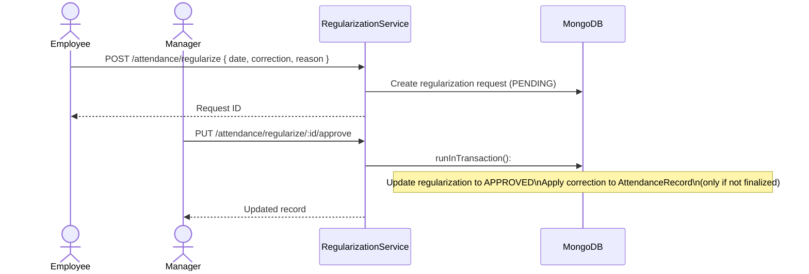

# Attendance Management Module (M-05)

## Purpose

This document describes the Attendance module architecture: how clock-in/out operations work, how attendance policies are enforced, how geofencing is validated, how stale sessions are reconciled, and how the module feeds finalized data to Payroll.

## Architectural Overview

The Attendance module (M-05) owns the employee clock-in/out lifecycle from raw timestamps to payroll-ready finalized records. It is composed of six focused services:

| Service | Responsibility |
|---|---|
| `AttendanceClockService` | Clock-in/out pipeline, geofence, shift validation |
| `AttendancePolicyService` | Policy definition and lookup per employee |
| `AttendanceCalculationService` | Pure math: working hours, overtime, LOP calculation |
| `AttendanceReconciliationService` | Stale session cleanup, period finalization, payroll feed |
| `AttendanceRegularizationService` | Employee-submitted correction requests and approvals |
| `AttendanceDashboardService` | Read-model aggregations for dashboards |

## Clock-In Pipeline

*Snapshot principle: all reference data (shift times, location, policy) is embedded in the `AttendanceRecord.policySnapshot` and `shiftSnapshot` at the time of clock-in. Future changes to the shift or policy do not retroactively affect existing records.*

## Clock-Out Pipeline

*Night shift support: clock-out uses `findOpenRecord()` (looks for any open record) rather than a date-based query. This correctly handles records that span midnight.*

## Attendance Record State Machine

## Reconciliation: Stale Session Cleanup

## Payroll Feed Contract

The Attendance module exposes a **stable payroll feed contract** to the Payroll module. This is the data boundary between M-05 and M-07.

Payroll cannot execute if any attendance record in the cycle period is not in `FINALIZED` status. The Attendance module owns the finalization state; the Payroll module is a consumer, not a mutator.

## Regularization Workflow

## Key Takeaways

- **Data snapshots at clock-in.** Shift, location, and policy data is frozen into the record at creation time. This makes each record self-contained and audit-proof.
- **Night shifts work correctly.** Clock-out finds the open record by status, not by date — preventing "wrong day" lookup failures.
- **Payroll is blocked by unfinalized attendance.** `assertAllRecordsFinalized()` is a hard gate that payroll cannot bypass. This prevents payroll runs on incomplete attendance data.
- **Stale session reconciliation is a safety mechanism.** It flags forgotten clock-outs without deleting data, enabling managers to correct records via regularization.
- **Regularization is transactional.** The approval and record update happen atomically in a single MongoDB session.
