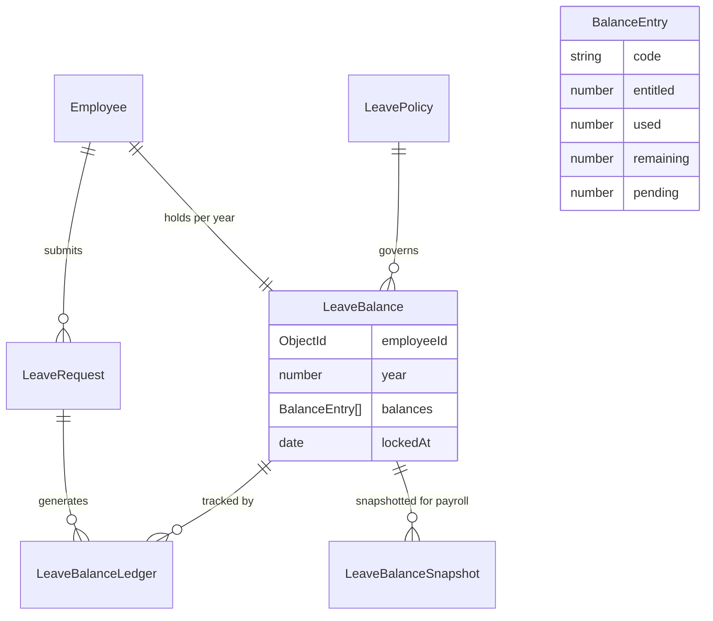
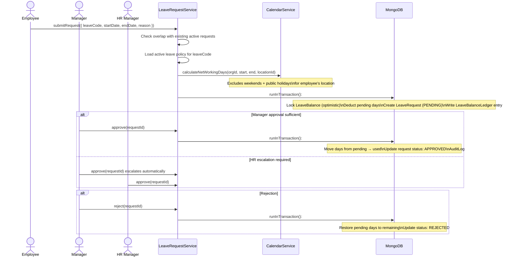
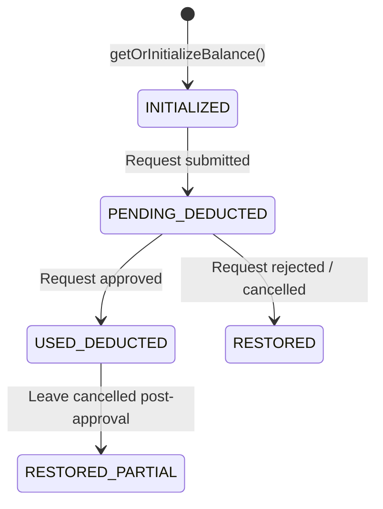
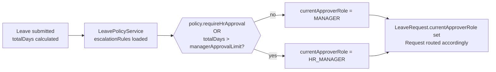
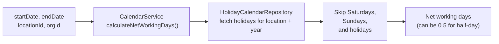
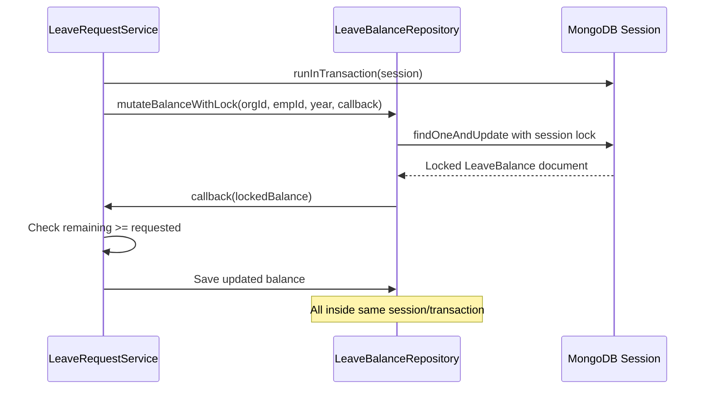
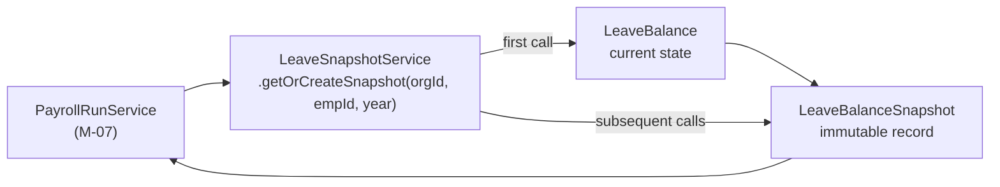

# Leave Management Module (M-06)

## Purpose

This document describes the Leave module architecture: how leave balances are initialized and tracked, how requests flow through the approval lifecycle, how the calendar module contributes to net day calculation, and how leave data integrates with payroll.

## Architectural Overview

The Leave module (M-06) manages leave accruals, balance tracking, request submission, multi-tier approval workflows, and payroll-ready snapshots. It is composed of five services:

| Service | Responsibility |
|---|---|
| `LeaveRequestService` | Submit, approve, reject, cancel requests; ledger mutations |
| `LeaveBalanceService` | Balance initialization, accrual, and lock-based mutations |
| `LeavePolicyService` | Policy definition per organization |
| `LeaveSnapshotService` | Point-in-time balance snapshots for payroll |
| `LeaveReportService` | Aggregation read models |

## Leave Data Model

## Leave Request Lifecycle

## Leave Balance State Machine

## Approval Escalation Logic

The approval tier is determined at submission time based on the leave policy and total days requested:

## Net Working Days Calculation

The Leave module uses `CalendarService` to calculate the actual number of working days in a leave period, excluding weekends and public holidays specific to the employee's location.

## Leave Balance Mutation Safety

Leave balance mutations use **optimistic locking** to prevent concurrent requests from double-spending the same leave balance. The `mutateBalanceWithLock()` method fetches the balance document inside a MongoDB session and applies changes atomically.

## Payroll Integration: Leave Snapshots

At the time of payroll execution, the leave module provides a **point-in-time balance snapshot** for each employee to ensure the payroll calculation reflects the exact leave state at the cycle's close.

## Key Takeaways

- **Balance mutations are always transactional.** Submit, approve, reject, and cancel all operate inside `runInTransaction()` with a MongoDB session. There is no non-transactional path to modify a leave balance.
- **Net working days depend on the employee's location.** Two employees in different offices on the same dates may have different net days due to location-specific holidays.
- **Approval tier is determined at submission, not approval.** The `currentApproverRole` field on the request records who should next act on it, routing the approval correctly without any enum checks in middleware.
- **Leave balance snapshots are immutable once created.** Payroll receives a snapshot that cannot be changed retroactively after payroll locks.
- **Policy is looked up from the live policy record, not embedded.** This means policy changes apply to new requests immediately, but not to existing requests already in flight.
