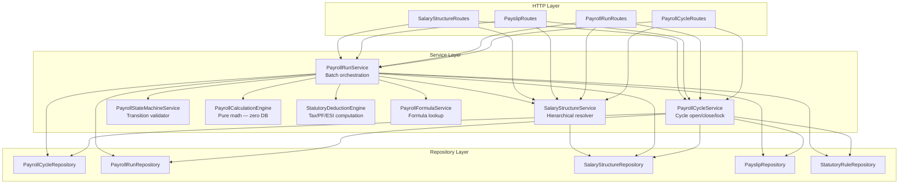
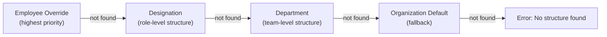
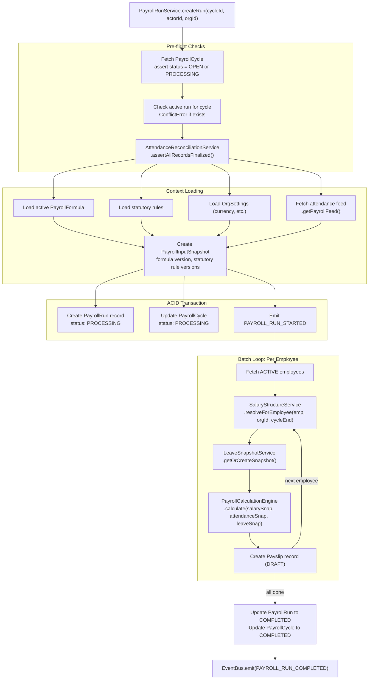
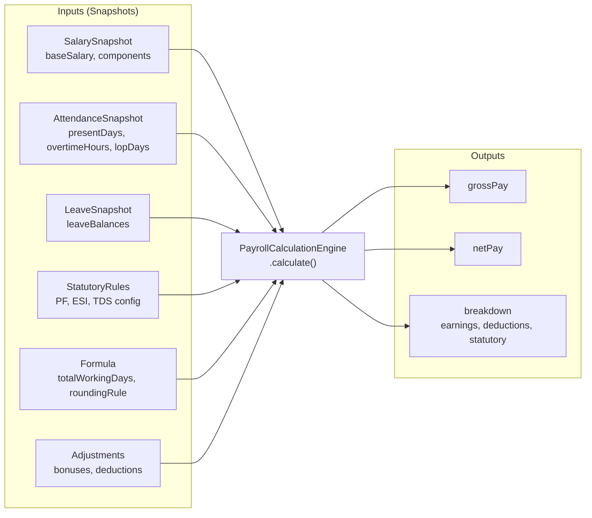
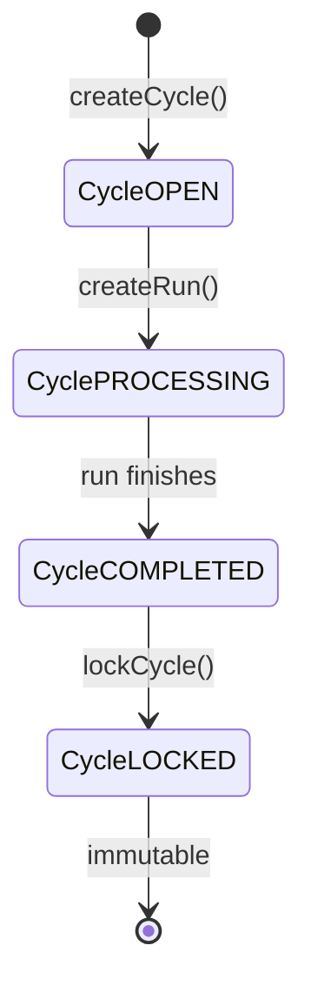
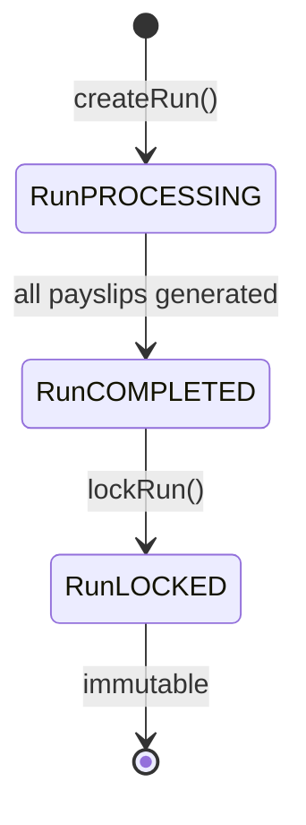
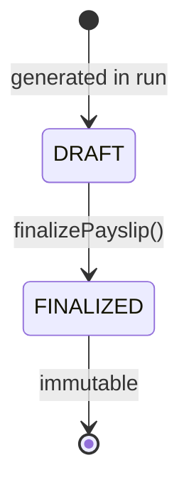

# Payroll Engine (M-07)

## Purpose

This document describes the Payroll module architecture: how payroll cycles work, how salary structures are versioned and hierarchically resolved, how a payroll run executes batch payslip generation, how the state machine enforces lifecycle transitions, and how concurrency protection prevents duplicate runs.

## Architectural Overview

The Payroll module (M-07) is the most complex domain in the system. It coordinates data from five other modules (Attendance, Leave, Employees, Organization Settings, and Statutory Rules) to produce finalized, immutable payslips. The architecture separates **data orchestration** (PayrollRunService) from **pure mathematical computation** (PayrollCalculationEngine and StatutoryDeductionEngine) to enable deterministic, testable salary calculations.

## Core Components



## Salary Structure: Hierarchical Resolution

Salary structures are resolved in a **waterfall pattern** — the most specific level wins:



## Salary Structure: Point-in-Time Versioning

Salary structures are **immutable and versioned**. When a salary change is required, a new `SalaryStructure` document is created with a new `effectiveFrom` date, and the previous version's `effectiveTo` is updated.

The resolution query for a payroll cycle uses `cycle.cycleEnd` as the cut-off point: the structure where `effectiveFrom <= cycleEnd` is selected. This means:

- A salary effective **January 1** is used for a cycle covering January 1–31.
- A salary effective **July 15** is NOT used for a cycle covering July 1–14; the previous version is used instead.
- The rule is **whole-month, version-as-of-cycle-end**: whichever salary version was in effect on the last day of the cycle is used for the entire cycle.

This is deterministic — re-running payroll for any past cycle always resolves the same salary version.

**Cycle End Date Rule:** `effectiveFrom <= cycleEnd` — the structure effective on the last day of the cycle applies to the whole cycle.

## Payroll Run: Batch Execution Pipeline



## PayrollCalculationEngine: Pure Math

The `PayrollCalculationEngine` is a **stateless, pure function** — it takes JSON input snapshots and returns a deterministic `PayrollResult`. It makes **zero database calls**.



Computation steps:
1. Calculate Loss of Pay (LOP) deduction: `(baseSalary / totalWorkingDays) × lopDays`
2. Calculate overtime: `(baseSalary / totalWorkingDays / 8) × 1.5 × overtimeHours`
3. Evaluate component earnings (FIXED + PERCENTAGE_OF_BASE with cap limits)
4. Compute gross pay
5. Apply statutory deductions (PF, ESI, TDS) via `StatutoryDeductionEngine`
6. Apply manual adjustments (bonuses, one-time deductions)
7. Compute net pay; apply rounding rule

## State Machine Transitions







`PayrollStateMachineService.validateTransition()` is called before every status update. An illegal transition (e.g., `LOCKED → PROCESSING`) throws a `400 AppError` immediately.

## Concurrency Guard

MongoDB enforces **exactly one active payroll run per cycle** via a partial unique index:

```javascript
// PayrollRun model index
{ organizationId: 1, payrollCycleId: 1 },
{ unique: true, partialFilterExpression: {
    status: { $in: ['DRAFT', 'PROCESSING', 'COMPLETED', 'LOCKED'] }
}}
```

If Manager A and Manager B simultaneously click "Run Payroll" for the same cycle:
- Manager A's request creates the run record (succeeds)
- Manager B's request hits the unique index violation (MongoDB E11000 → `409 ConflictError`)

The service-level check (`findOne` for active runs) provides an early-exit before the DB insert, but the index is the hard enforcement layer.

## Key Takeaways

- **Computation is separated from orchestration.** `PayrollCalculationEngine` can be unit-tested with plain JSON without any database or mock setup.
- **Payslips are generated from snapshots, not live data.** Salary structures, attendance, and leave balances are all snapshotted at run time, making payslips fully reproducible.
- **The Cycle End Date Rule is deterministic.** Salary structure resolution for any past cycle will always return the same structure version, regardless of when the query runs.
- **Concurrency is enforced at the database layer.** The partial unique index on `PayrollRun` is a hard guarantee — no application-level locking scheme can be bypassed.
- **Finalized payslips are immutable.** Once a payslip transitions to `FINALIZED`, it cannot be modified. Corrections require creating a new payroll run.
