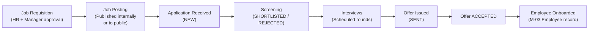
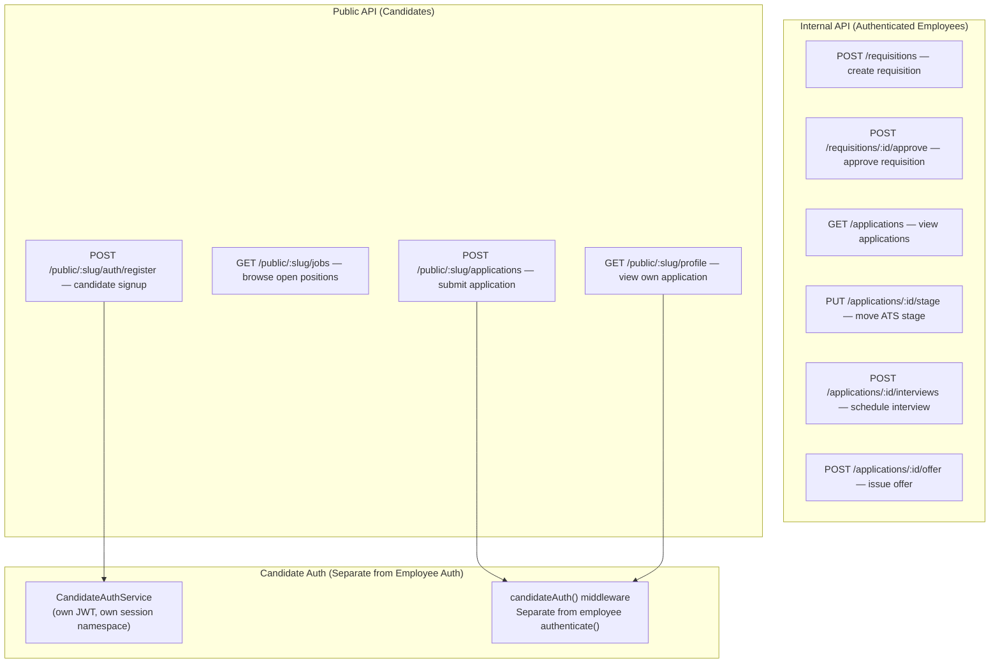
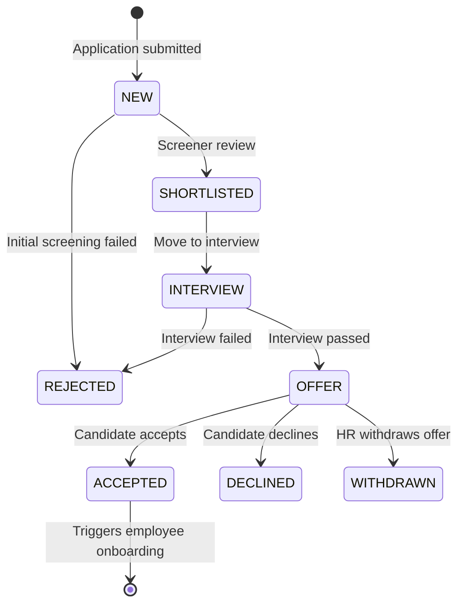
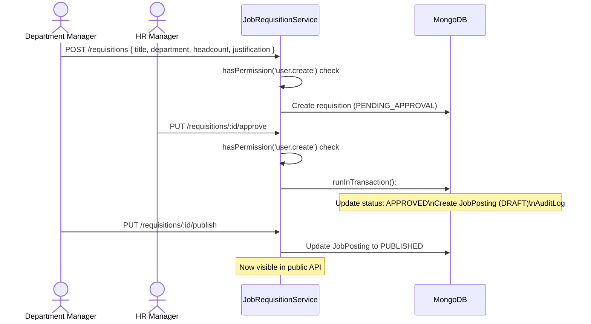
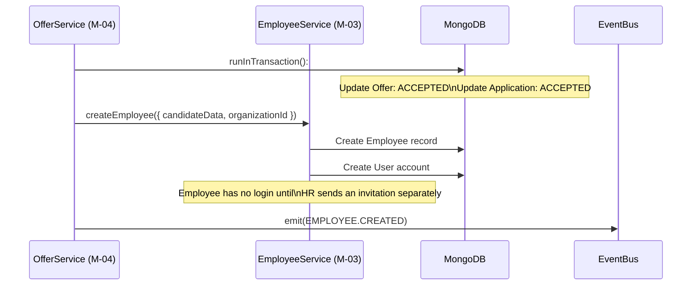

# Recruitment & ATS Module (M-04)

## Purpose

This document describes the Recruitment module architecture: how job requisitions are created and approved, how job postings reach candidates via a public API, how candidates apply and move through the ATS pipeline, and how the offer-to-onboarding handoff works.

## Architectural Overview

The Recruitment module (M-04) implements a complete Applicant Tracking System (ATS). It has two distinct API surfaces: an **internal API** for HR and managers, and a **public API** for candidates who authenticate separately via their own session system.

| Service | Responsibility |
|---|---|
| `JobRequisitionService` | Create, approve, and manage headcount requests |
| `JobPostingService` | Publish open positions; manage visibility |
| `JobApplicationService` | Candidate applications; initial screening |
| `AtsApplicationService` | Move applications through pipeline stages |
| `InterviewService` | Schedule and record interview rounds |
| `OfferService` | Generate, send, and track offer letters |

## Recruitment Pipeline

## Dual API Surface

*The public API routes use a `:slug` parameter (organization slug) to identify the tenant — this is the only exception to the "no tenant ID in URLs" rule, because candidates authenticate independently and don't carry a JWT with `organizationId`.*

## ATS Application Pipeline Stages

## Job Requisition Approval Flow

## Offer-to-Onboarding Handoff

When a candidate accepts an offer, the system creates an employee record via an internal service call — this is a cross-module interaction between M-04 and M-03.

## Key Takeaways

- **Candidates have their own authentication system.** The `candidateAuth` middleware and `CandidateAuthService` are completely separate from the employee authentication stack. Candidate JWTs cannot be used to call internal APIs.
- **Organization slug in the URL is the only exception to the no-tenant-in-URL rule.** It is necessary because candidates don't carry an authenticated `organizationId` in their JWT before they register.
- **The ATS pipeline is state-machine driven.** Invalid stage transitions (e.g., moving directly from `NEW` to `OFFER`) are rejected at the service layer.
- **Offer acceptance triggers cross-module employee creation.** This is a direct service call (not an event) to ensure the employee record is created atomically within the same transaction as the offer acceptance.
- **Job postings decouple requisitions from public visibility.** A requisition can be approved without being publicly visible. Publishing is a separate explicit action.
