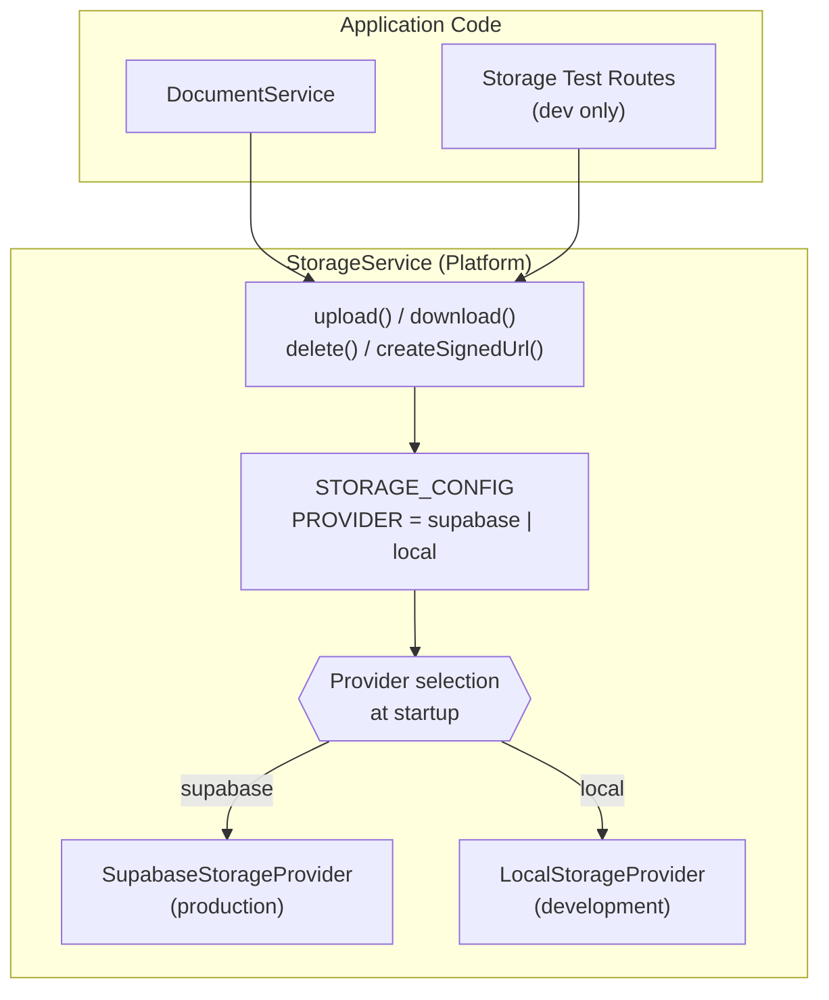
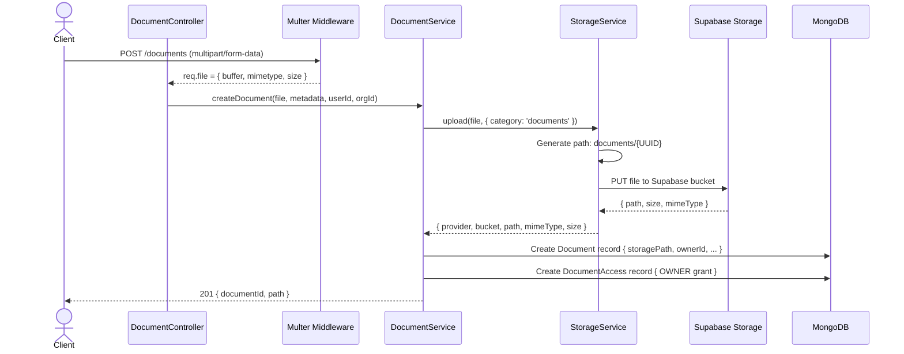
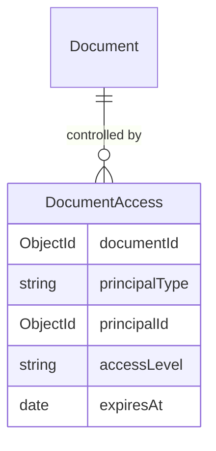
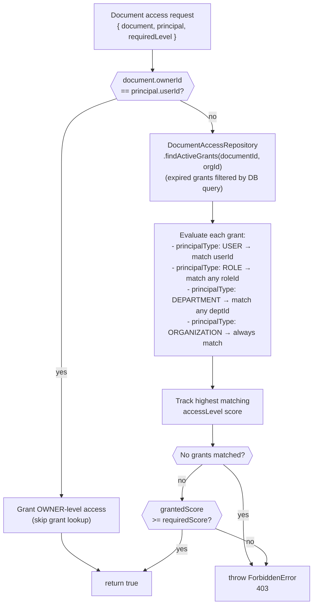
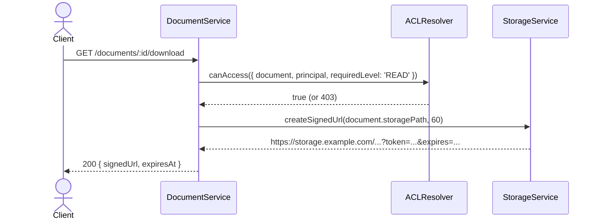

# Storage & Document Management

## Purpose

This document describes how file uploads are handled, how the storage provider abstraction works, and how the Document module enforces fine-grained access control via its ACL system.

## Architectural Overview

NexusOps uses a two-layer architecture for file handling:

1. **`StorageService` (Platform layer)** — A provider-agnostic file I/O abstraction. Uploads, downloads, deletions, and signed URL generation are handled through a common interface regardless of the underlying provider (Supabase in production, local filesystem in development).

2. **Document Module (Application layer)** — A domain layer built on top of `StorageService` that adds ownership, metadata, and fine-grained ACL-based access control to every uploaded file.

## Storage Provider Architecture

## File Upload Flow

## Document ACL Model

The Document module implements a **deny-by-default, multi-principal ACL** system. Access to a document is controlled by `DocumentAccess` grants that can be attached to users, roles, departments, teams, or the entire organization.

Access levels form a hierarchy:

| Level | Score | Can Do |
|---|---|---|
| `OWNER` | 50 | Everything, including revoking grants |
| `SHARE` | 40 | Share the document with others |
| `DELETE` | 30 | Delete the document |
| `WRITE` | 20 | Edit metadata, upload new version |
| `READ` | 10 | View and download |

## ACL Resolution

*When multiple grants match (e.g., a user has both a USER grant at `READ` and a ROLE grant at `WRITE`), the highest-scoring grant wins. This implements a "most-permissive matching grant" conflict resolution policy.*

## Signed URL Generation

Documents are stored privately. Access is provided via **time-limited signed URLs** — direct public URLs to storage are never exposed.

Default URL expiry: 60 seconds. The client must use the signed URL immediately; it cannot be shared or bookmarked.

## Key Takeaways

- **`StorageService` is provider-agnostic.** Switching from Supabase to AWS S3 requires only a new `S3StorageProvider` class that implements the `StorageProvider` interface — no application code changes.
- **File paths are UUID-based and unpredictable.** A file stored at `documents/{UUID}` cannot be guessed or enumerated.
- **Document ownership is implicit.** The user who uploads a document is automatically granted `OWNER` access via a `DocumentAccess` record created at upload time.
- **ACL resolution is deny-by-default.** A document with no grants is inaccessible to everyone except the owner. There is no "public by default" state.
- **Time-limited signed URLs prevent hotlinking.** Files are never directly accessible by URL; access always requires a fresh signed URL issued by the API after ACL verification.
