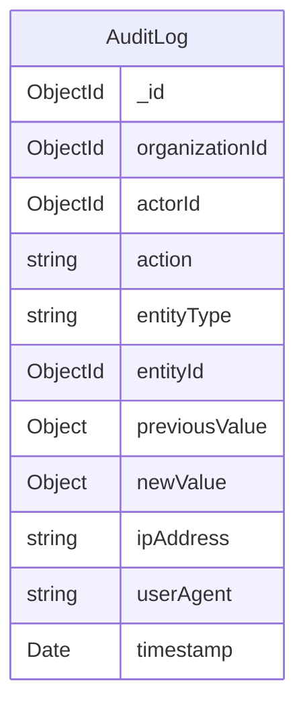
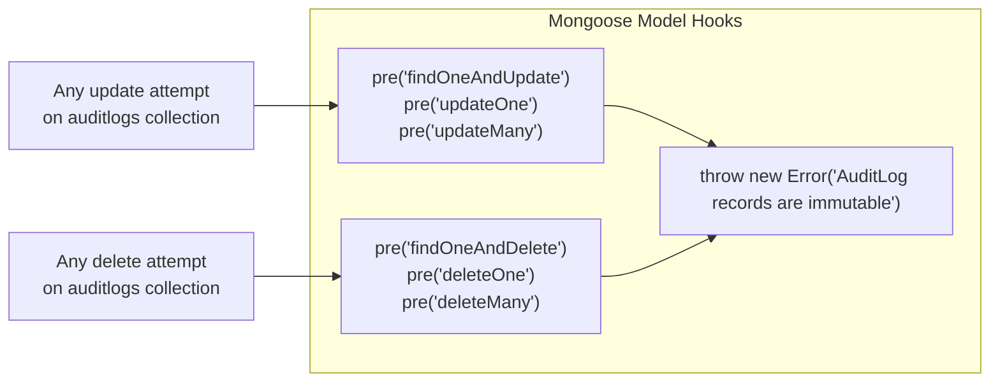
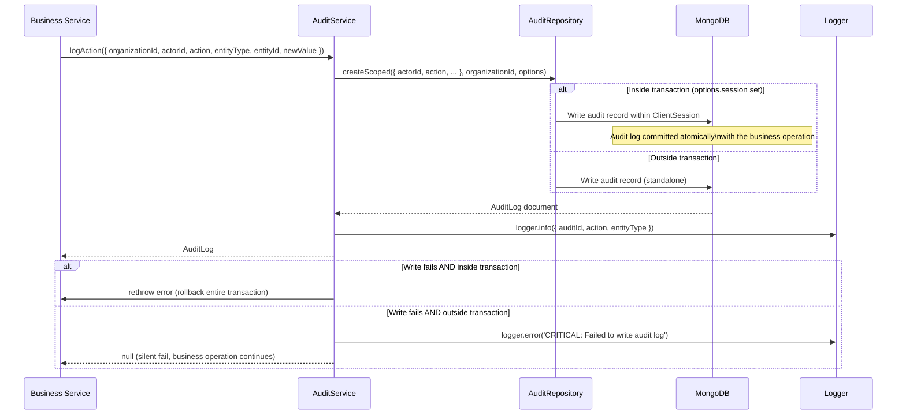

# Audit Logging & Compliance Ledger

## Purpose

This document describes the immutable audit log system: what triggers audit entries, how immutability is enforced at the database level, and how audit logs serve as the compliance ledger for administrative actions across the platform.

## Architectural Overview

Every sensitive administrative and security action in NexusOps writes an entry to the `auditlogs` collection via `AuditService`. The schema is designed as a **tamper-evident ledger** — once written, audit records cannot be modified or deleted by any application code. Mongoose pre-hooks enforce this at the model level.

## Audit Log Schema



## Immutability Enforcement



*Immutability is enforced at the ODM layer, not just the application layer. Even a developer who directly imports the `AuditLog` model and calls `.deleteOne()` will receive an exception.*

## AuditService Write Flow



*When executed inside a transaction, audit log failures are fatal (the whole operation rolls back). Outside a transaction, audit failures are logged urgently but do not disrupt the business workflow — the alternative would be blocking every business operation on a logging system failure.*

## Audit Event Catalog

| Action | Triggered By | Entity Type |
|---|---|---|
| `TENANT_PROVISIONED` | OrganizationService | Organization |
| `INVITATION_CREATED` | InviteService | Invitation |
| `INVITATION_REVOKED` | InviteService | Invitation |
| `INVITATION_ACCEPTED` | AuthService (register) | Invitation |
| `ROLE_CREATED` | RoleService | Role |
| `ROLE_UPDATED` | RoleService | Role |
| `ROLE_ASSIGNED` | RoleService | UserRole |
| `ROLE_DELEGATION_CREATED` | RoleDelegationService | RoleDelegationPolicy |
| `EMPLOYEE_ONBOARDED` | EmployeeService | Employee |
| `EMPLOYEE_STATUS_CHANGED` | EmployeeService | Employee |
| `ATTENDANCE_CLOCKED_IN` | AttendanceClockService | AttendanceRecord |
| `ATTENDANCE_CLOCKED_OUT` | AttendanceClockService | AttendanceRecord |
| `RECONCILE_STALE_ATTENDANCE` | AttendanceReconciliationService | AttendanceRecord |
| `LEAVE_REQUEST_SUBMITTED` | LeaveRequestService | LeaveRequest |
| `LEAVE_REQUEST_APPROVED` | LeaveRequestService | LeaveRequest |
| `LEAVE_REQUEST_REJECTED` | LeaveRequestService | LeaveRequest |

## Query Access

Audit logs are queryable by authorized users (typically Administrators and Super Admins) via:

```
GET /api/v1/organizations/:id/audit-logs?entityType=Role&from=2026-01-01&page=1
```

`AuditService.getTenantLogs()` delegates to `AuditRepository.findLogsByTenant()`, which applies the standard `BaseRepository` tenant scoping. Administrators can never query audit logs from other organizations.

## Key Takeaways

- **Immutability is enforced at the Mongoose model, not just the service layer.** No application path — no matter how it is called — can bypass the pre-hook guards.
- **Audit records are written inside transactions when possible.** This guarantees that if an audit log cannot be written, the associated business operation also rolls back — maintaining the invariant that every sensitive operation has an audit trail.
- **`previousValue` and `newValue` capture the before/after state** for changes to sensitive records (role permissions, employee status, etc.), enabling full diff-based audit review.
- **Audit logs are tenant-scoped.** `organizationId` is required and indexed. Cross-tenant audit log access is impossible via the repository layer.
- **IP address and user agent are captured** from the HTTP request for all logged actions, enabling forensic investigation of potentially malicious activity.
