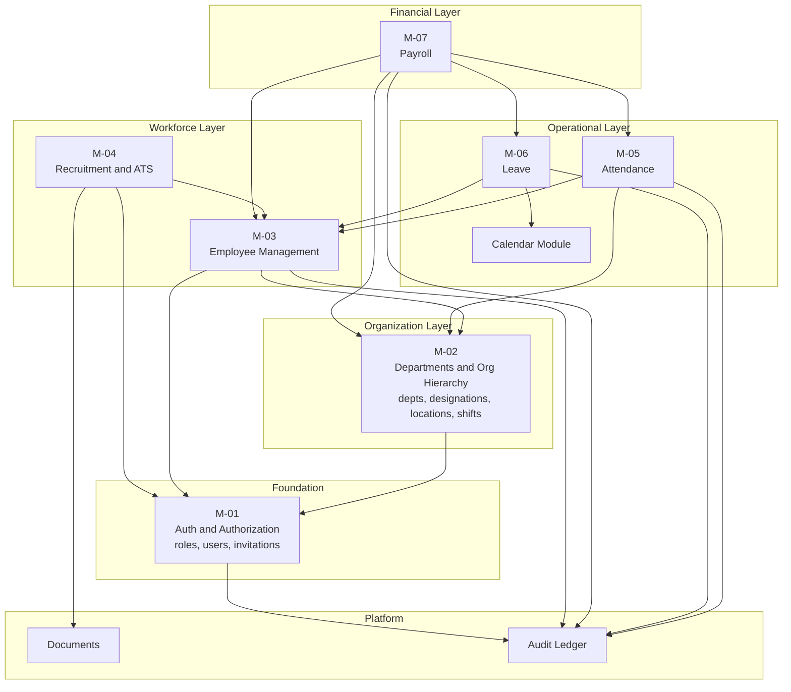
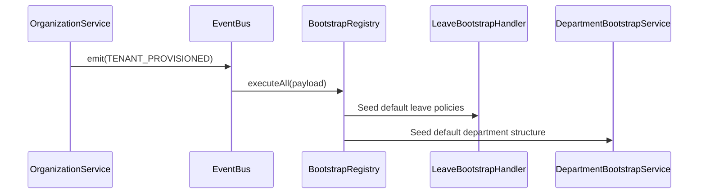
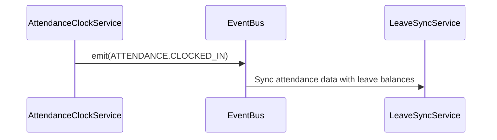
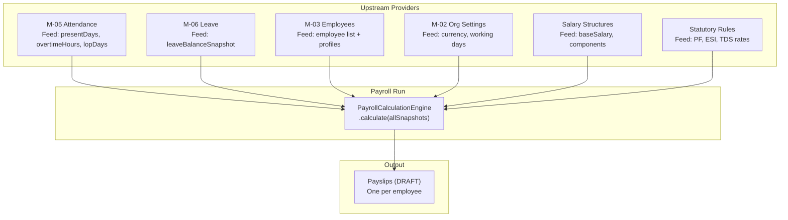

# Module Interaction Map

## Purpose

This document shows how the domain modules interact with each other — which modules call which, in which direction, and for what purpose. It helps engineers understand the cross-module data dependencies before modifying any module.

## Module Dependency Graph

## Cross-Module Call Matrix

This matrix documents every cross-module service call (direct imports), separated from event-based decoupling.

| Consumer | Dependency | Reason |
|---|---|---|
| M-03 Employee | M-01 UserRepository | Create user account on employee onboarding |
| M-03 Employee | M-02 DepartmentRepository | Validate department assignment |
| M-04 Recruitment | M-03 EmployeeService | Create employee on offer acceptance |
| M-05 Attendance | M-03 EmployeeRepository | Resolve employee from userId on clock-in |
| M-05 Attendance | M-02 ShiftRepository | Load shift definition for clock-in validation |
| M-05 Attendance | M-02 LocationRepository | Load geofence for clock-in validation |
| M-05 Attendance | M-02 HolidayCalendarRepository | Check if clock-in date is a public holiday |
| M-06 Leave | M-05 *(none direct)* | Decoupled via CalendarService |
| M-06 Leave | CalendarService | Calculate net working days |
| M-07 Payroll | M-05 AttendanceReconciliationService | Assert finalized records + fetch payroll feed |
| M-07 Payroll | M-06 LeaveSnapshotService | Fetch point-in-time leave balance snapshot |
| M-07 Payroll | M-03 EmployeeRepository | Fetch active employees for batch run |
| M-07 Payroll | M-02 OrganizationSettingsRepository | Fetch currency and org-level defaults |
| All modules | AuditService | Write immutable audit log entries |

## Event-Based (Decoupled) Interactions

These interactions cross module boundaries without direct imports — through the EventBus:

## Payroll Data Dependency Map

Payroll (M-07) is the most data-intensive module, consuming finalized data from three upstream modules before it can execute.

## Stability Contracts

These cross-module contracts must not be broken without a versioned migration:

| Contract | Owner | Consumer | Type |
|---|---|---|---|
| Attendance payroll feed schema | M-05 | M-07 | Data shape |
| Leave balance snapshot schema | M-06 | M-07 | Data shape |
| `EmployeeRepository.findByUserId()` | M-03 | M-05 | Method signature |
| `TENANT_PROVISIONED` event payload | M-01 | All bootstrap handlers | Event payload |
| `ATTENDANCE.CLOCKED_IN` payload | M-05 | LeaveSyncService | Event payload |

## Key Takeaways

- **The dependency hierarchy flows downward.** Higher-layer modules (Payroll, Leave) depend on lower-layer modules (Attendance, Employee) — but not vice versa. No circular dependencies exist.
- **Payroll is intentionally downstream of everything.** It reads finalized, immutable snapshots from all other modules. This is by design — payroll must be deterministic and reproducible.
- **The Audit module has no upward dependencies.** `AuditService` is consumed by all modules but depends on nothing except its own repository. It is the platform's compliance sink.
- **Event-based interactions prevent circular imports.** `OrganizationService` does not import `LeaveBootstrapHandler`. The EventBus decouples the two, allowing future handlers to be added without modifying `OrganizationService`.
- **The Calendar module is a shared utility.** It is not a "domain module" in the M-01 through M-07 sense — it is a utility layer used by Leave and potentially by Attendance for holiday calculations.
